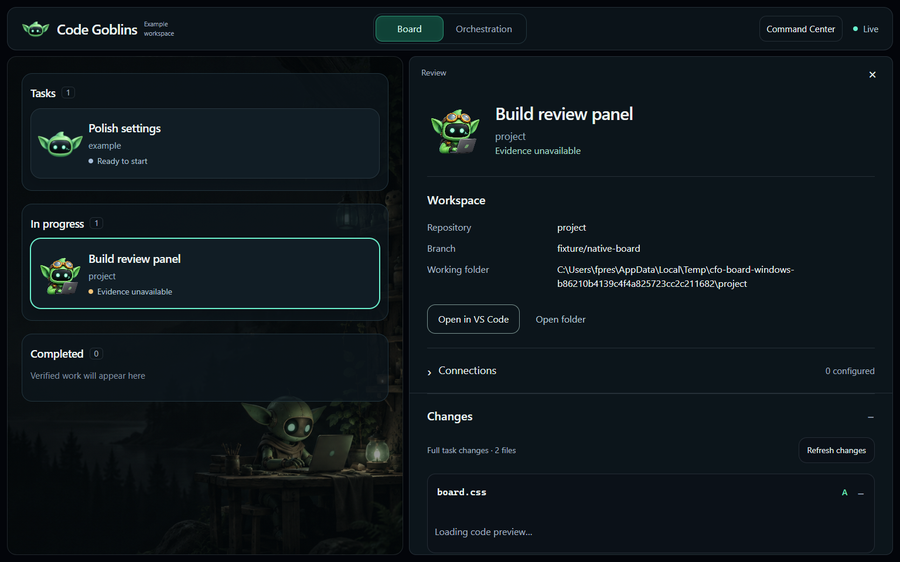
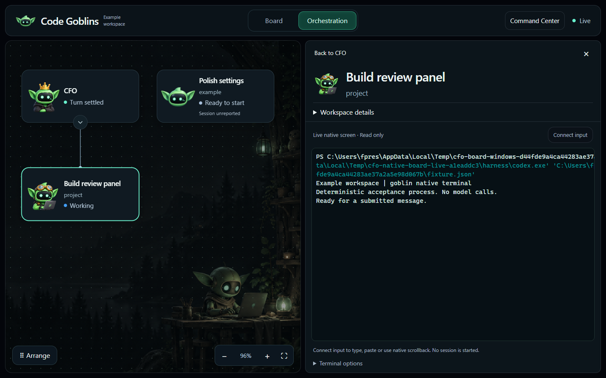
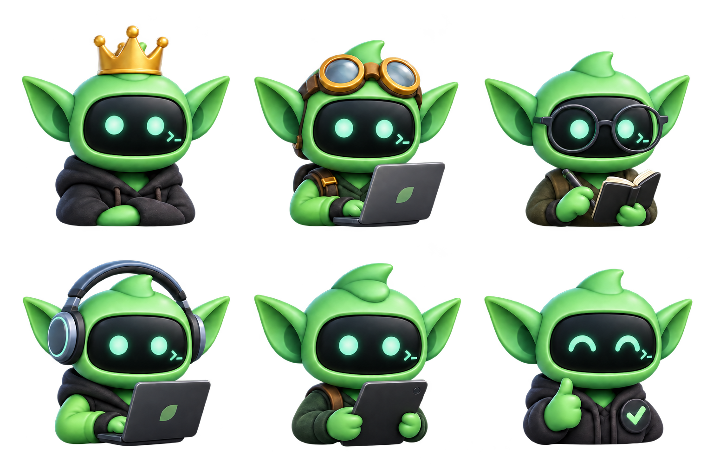
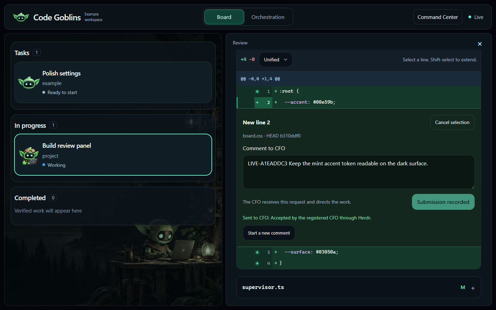
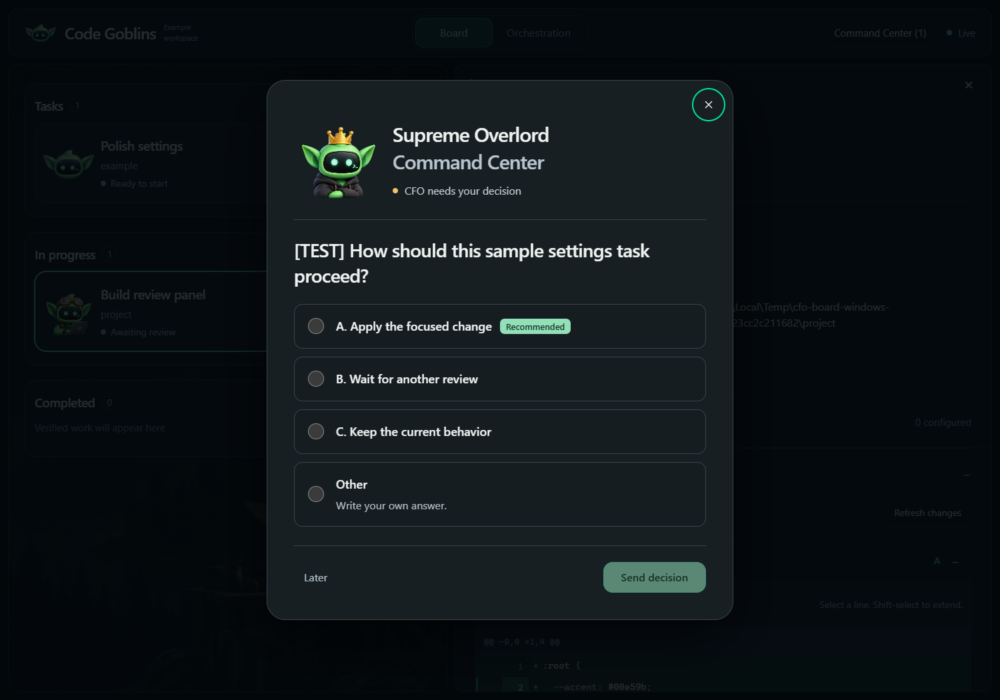

<h1 align="center">Code Goblins</h1>

<p align="center"><strong>Talk to one agent. Ship with a crew.</strong></p>

<p align="center">
  A Windows-native control plane for autonomous coding agents.<br/>
  One CFO coordinates Claude Code, Codex, Pi, and Kimi workers in isolated git worktrees, supervises them to completion, validates the result, and hands you finished work.
</p>

<p align="center">
  
  
  
</p>

<p align="center">
  
</p>

## Why Code Goblins

Most coding-agent tools make you manage more agents. Code Goblins is built to do the opposite.

You talk to one supervisor: the **CFO**. The CFO decomposes the objective, dispatches specialized **goblins** in parallel, gives each worker an isolated git worktree, watches for failures and blocked work, switches harnesses when necessary, runs the delivery pipeline, and brings decisions back to you only when human judgment is actually required.

The goal is not maximum agent count. The goal is **minimum human intervention per production-ready change**.

```text
                              YOU
                               │
                        one conversation
                               │
                               ▼
                     ┌──────────────────┐
                     │       CFO        │
                     │ plan · dispatch  │
                     │ supervise · ship │
                     └────────┬─────────┘
                              │
              ┌───────────────┼───────────────┐
              ▼               ▼               ▼
        ┌───────────┐   ┌───────────┐   ┌───────────┐
        │ Goblin A  │   │ Goblin B  │   │ Goblin C  │
        │ worktree  │   │ worktree  │   │ worktree  │
        │ Claude    │   │ Codex     │   │ Pi / Kimi │
        └─────┬─────┘   └─────┬─────┘   └─────┬─────┘
              └───────────────┼───────────────┘
                              ▼
                  review → test → lint → CI
                              │
                              ▼
                     PR / local delivery
```

## What makes it different

### One supervisor, not a wall of terminals

The CFO is the only human-facing control plane. Goblins report outcomes, questions, and failures into a durable wake queue; the CFO supervises and steers them without requiring you to poll every terminal.

### Native Windows orchestration

The fleet core is a compiled Go binary (`cfo.exe`). Goblins run as real Windows sessions in [Herdr](https://herdr.dev), avoiding a shell-script orchestration layer on the hot path.

### Isolated work by default

Every goblin receives its own in-repository git worktree at `<project>/.worktrees/gb-<id>`. Parallel workers do not edit the same checkout, and cleanup refuses to destroy unlanded work.

### Harness-agnostic workers

A task can run through Claude Code, Codex, Pi, or Kimi. `cfo switch` can change the harness, model, or effort level in-place while retaining the task identity, pane, worktree, and a handoff when native session resumption is unavailable.

### Restart-proof supervision

Task metadata, fleet state, and wake events live on disk. Closing the supervisor does not erase what the fleet was doing.

`cfo serve` runs the native supervisor and an embedded React board at `http://127.0.0.1:4310`.
Native lifecycle hooks, durable actions, task evidence, code review previews, and reported session lineage remain independent of browser lifetime.
See [the native board guide](docs/native-board.md) for hook setup, build requirements, evidence rules, and terminal limitations.

### Production-oriented gates

The `no-mistakes` path owns review, bounded repair cycles, tests, lint, documentation, push, PR creation, and CI. Review budgets are frozen per task so changing global policy cannot silently weaken an in-flight job.

The production-proof layer is intentionally fail-closed: delivery evidence must come from machine-readable PR state and terminal checks rather than a worker merely claiming that the task is finished.

### Project-scoped credentials

Projects declare the services they need. `cfo auth` probes them before dispatch, validates project identity where configured, and keeps credentials namespaced outside repositories. A blocking authentication failure prevents normal dispatch rather than stranding a worker halfway through a task.

### Recovery instead of babysitting

`cfo watch`, hooks, `cfo reap`, durable wake events, harness health, and explicit task states are designed around unattended operation. The system detects work that needs intervention and wakes the CFO instead of making the user stare at terminals.

## Quick start

Code Goblins is a standalone repository. Clone this repository directly; no upstream checkout or synchronization step is required.

```powershell
git clone https://github.com/fpresta0607/code-goblins.git
cd code-goblins
powershell -NoProfile -ExecutionPolicy Bypass -File install.ps1 -Bootstrap
cfo install --projects-root <dir>
cfo doctor
```

`install.ps1 -Bootstrap` installs or builds the Code Goblins binary and scriptable dependencies. `cfo install` wires the CFO into your user environment so a supervisor opened from another project can still manage the fleet.

`--projects-root <dir>` names the folder that holds your checkouts, wherever you keep them.
It is recorded on your machine as `CFO_PROJECTS_ROOT`, beside `CFO_HOME`, and never in this repository, so every adopter's layout stays their own.
With it set, `--project` takes a bare name as well as a path: `--project my-project` is `<dir>\my-project`, matched without regard to case, and the fleet works in that one checkout instead of cloning a second copy.
It is optional: without it every command still takes a path, and `cfo doctor` tells you it is unset.

Then open the project you actually want to build:

```powershell
cd <dir>\my-project
herdr
claude   # or codex / pi / kimi for the CFO session
```

Tell the CFO what outcome you want. It handles the fleet mechanics.

## Using the board

<p align="center">
  
</p>

`cfo serve` runs the native supervisor and serves its board, which is compiled into `cfo.exe`, at `http://127.0.0.1:4310`.
Install the native lifecycle hooks once for each harness you use, then start the supervisor in its own terminal and open the URL it prints:

```powershell
cfo hooks install claude   # repeat for codex or pi
cfo serve                  # --listen 127.0.0.1:0 picks a free loopback port
```

The board is a view, not the engine: tasks keep progressing with every browser closed, and restarting `cfo serve` with the same CFO home recovers its events, actions and lineage.
`cfo serve` takes over from `cfo watch` as the fleet's single supervisor, so a running watcher must finish first.
It listens on loopback only, and Ctrl-C in its terminal stops it.
Hook setup, evidence rules and terminal limits are in [the native board guide](docs/native-board.md).

### Board and Orchestration

The header switches between two views, one at a time, each with a contextual panel on the right.

- **Board** is task review. Real tasks sit in **Tasks**, **In progress** and **Completed**. Only verified delivery reaches Completed; failed work and work awaiting review stay in progress with a plain status. Selecting a card opens its changes, activity and commit history.
- **Orchestration** is the live family tree: the CFO above its goblins and any child sessions they reported. The panel shows the selected session's real native terminal and starts on the CFO. Dragging cards, panning, zooming, **Fit** and **Arrange** change only the layout, because parentage comes from native session evidence. A brief pulse along a connector marks a real accepted message.

<p align="center">
  
</p>

Each card's goblin is chosen from the task's work, such as builder, reviewer, tester or planner, and the crowned goblin is the CFO:

<p align="center">
  
</p>

### The goblin panel

Clicking a card opens its panel on one continuous surface: the task and its project, then **Workspace** with the repository, branch and exact working folder.
**Connections** lists the MCP servers the task is configured with; configured is not the same as connected, and no secret values are shown.
On Board the panel continues with **Changes**, **Activity** and **History**.
In Orchestration it holds the native terminal, which stays read-only until you choose **Connect input**; **Shift+Escape** hands the keyboard back.

### Sending a diff comment to the CFO

<p align="center">
  
</p>

Open **Changes**, expand a file and click a line number; Shift-click extends the selection to a range.
Write your comment in the form that opens beside the selection and choose **Send to CFO**.
The comment reaches the verified CFO session with its exact file, side, lines, HEAD and diff fingerprint, and the CFO decides how to direct the goblin; the board never sends it to the goblin itself.
If the registered CFO session is not live, the comment is refused and nothing is queued.
Retrying an unchanged comment keeps its request ID, so a retry cannot deliver the same comment twice.

### Supreme Overlord Command Center

<p align="center">
  
</p>

When the CFO needs a decision only you can make, it publishes the question with `cfo question` and the Command Center opens as a modal.
Choices are labelled A, B and C with the CFO's recommendation marked, and **Other** takes a written answer.
Nothing is preselected, **Later** keeps the question and your draft, and the **Command Center** menu in the header brings the question back.
Your answer goes to the same verified CFO session, never to a goblin, and it never approves a gate or merges anything.
The same menu carries nonblocking notices, such as a review ready in Lavish, with **Open review** and **Keep in background**; neither pauses work.

### Open in VS Code

**Open in VS Code** opens the selected goblin's own isolated worktree, the folder it is actually editing, in your installed VS Code, and **Open folder** opens it in File Explorer.
The supervisor resolves that folder from task metadata and starts the program directly; the browser never supplies a path or a command.
A missing editor or a folder that no longer exists is reported instead of guessed.

## Typical autonomous delivery loop

```text
1. User gives the CFO an objective and constraints.
2. CFO resolves the project and writes explicit acceptance criteria.
3. cfo auth preflights required project services.
4. CFO spawns one or more goblins into isolated worktrees.
5. Goblins implement, investigate, test, and report through the wake queue.
6. CFO steers blocked work or switches harnesses when useful.
7. no-mistakes performs bounded independent review and repair.
8. Tests, lint, documentation and CI produce machine evidence.
9. CFO presents the finished outcome or the smallest unresolved decision.
10. Approved work is merged; unlanded work is never silently destroyed.
```

## Core commands

```text
cfo doctor
cfo auth <project> [--check|--fix] [--env]
cfo install [--projects-root <dir>] [--uninstall]
cfo brief <id> --project <name|path> [--kind <ship|scout>] [--mode <mode>]
cfo spawn <id> --project <name|path> --brief <path> [--harness <claude|codex|pi|kimi>] [--mode <mode>] [--model <model>] [--effort <level>] [--class <class>] [--yolo]
cfo switch <id> [--harness <h>] [--model <m>] [--effort <e>]
cfo send <target> <text...>
cfo peek <target> [lines]
cfo fleet-view [--json]
cfo runtime [--json]
cfo pipeline migrate <id>
cfo pipeline run <id> --intent <text>
cfo pipeline respond <id> --action <fix|approve> [--findings <ids>] [--instructions <text>]
cfo pipeline recover <id>
cfo pr check <id> <url>
cfo pr merge <url> [--method <merge|squash|rebase>] [--delete-branch]
cfo cleanup <id>
cfo reap [--dry-run|--apply]
cfo drain
```

Run `cfo doctor` after installation for the current dependency and harness health report.

## Safety model

Code Goblins is designed for high autonomy without pretending that an LLM saying “done” is proof.

- Work happens in isolated worktrees.
- Authentication is checked before normal dispatch.
- Review/repair budgets are explicit and bounded.
- Pipeline approval fails closed when actionable findings remain.
- Dirty or unlanded work is not silently deleted.
- Local delivery is fast-forward only.
- PR delivery is expected to be backed by machine-readable CI evidence.
- Human approval remains the default for merges; `yolo` is an explicit posture, not an implicit permission.

For high-risk production systems, use repository branch protection and keep production deployment credentials outside worker reach. Code Goblins coordinates software delivery; it is not an operating-system sandbox.

## Architecture

The core is intentionally local-first:

- `cmd/cfo/` — the Windows-native fleet CLI and control plane.
- `internal/spawn/` — task dispatch and worktree preparation.
- `internal/herdr/` — terminal/session integration.
- `internal/fleet/` — fleet truth, targeting, steering and inspection.
- `internal/supervise/` / `internal/watch/` — unattended supervision and recovery.
- `internal/pipeline/` — durable validation policy and decision gates.
- `internal/auth/` — project-scoped credential preflight and injection.
- `internal/state/` / `internal/wake/` — restart-proof task and event state.
- `internal/supervisor/` - native event ingestion, durable actions and the local board API behind `cfo serve`.
- `frontend/` - the board's React/TypeScript source; Vite compiles it into `internal/boardweb/dist`, which is embedded in `cfo.exe`.
- `.agents/skills/` — reusable capabilities exposed to the supported harnesses, including `lavish`, the CFO's review surface over the third-party `lavish-axi` CLI.

The control plane is local. Your coding harnesses may still call their model providers according to their own configuration.

## Development

```powershell
go vet ./...
go test ./... -count=1
go build ./cmd/cfo
```

CI runs on `windows-latest`. The real-session acceptance suite is opt-in because it requires actual Herdr and harness installations.

## Project lineage

Code Goblins began from ideas and code in [First Mate](https://github.com/kunchenguid/firstmate), which is MIT licensed. That lineage is retained and credited under the license.

Code Goblins is now maintained as an **independent standalone project** with its own Windows-native Go control plane, supervision model, credential system, harness switching, durable state, delivery pipeline, and roadmap. You clone and update Code Goblins from this repository directly; First Mate is not an upstream dependency that users need to track or sync.

## Contributing

Issues and pull requests are welcome. See [CONTRIBUTING.md](CONTRIBUTING.md).

If you are working on orchestration, the standard is simple: features should reduce human intervention **without weakening evidence that the delivered change is correct**.

## License

MIT. See [LICENSE](LICENSE). First Mate lineage remains acknowledged as required by its MIT license.

## Project-aware autonomous delivery

Code Goblins can now describe each project's real runtime in `data/projects/<project>/project.json`: databases, caches, vector stores, object storage, frontends, backends, workers, queues, local/remote services, providers, health checks, deploy commands, verification policy, security policy, routing lanes, and budgets. Credential **names** may appear there; credential values stay in the existing auth store.

At spawn, CFO produces a compact durable **task capsule** and **runtime capsule** instead of replaying the CFO transcript. Without `--harness`, deterministic rules classify the brief and select an execution lane from the fleet's `data/routing.json` (a project manifest's `routing` block overrides it), checking quota-axi headroom first and falling to the next usable lane; explicit harness/model/effort flags still win. A redirected task can be marked with `cfo supersede`, which makes rejected unshipped work disposable and requires cleanup evidence.

Delivery is evidence-driven: tiered verification and security commands write structured results, project deployment contracts prevent “CI green” from being mistaken for “production deployed,” and `cfo pr merge` verifies the exact PR head and merges with `--match-head-commit` so a newer unverified SHA cannot slip through.

See [Project runtime contracts](docs/project-runtime.md), [Production autonomy roadmap](docs/production-roadmap.md), and [Orchestrator patterns](docs/orchestrator-patterns.md).
