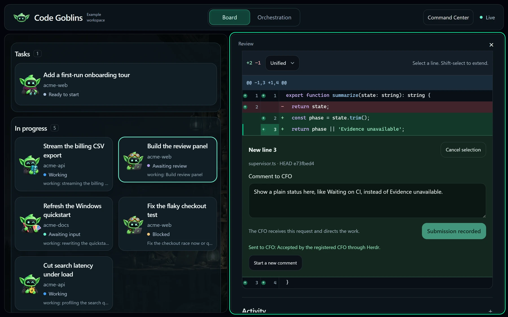
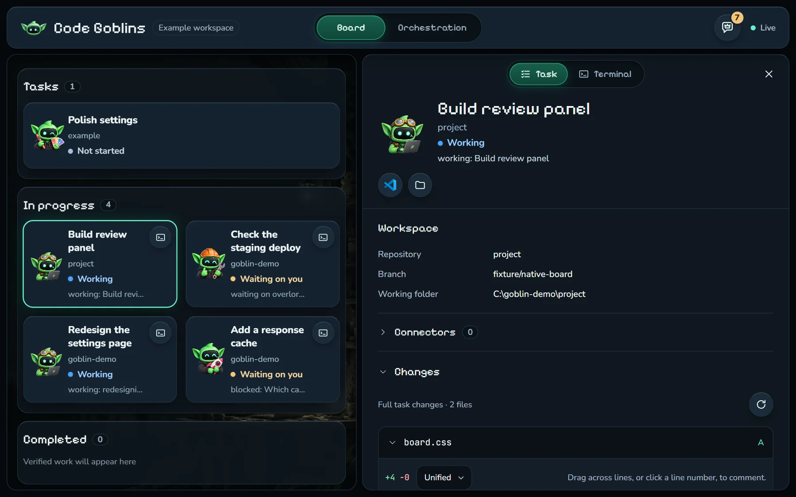
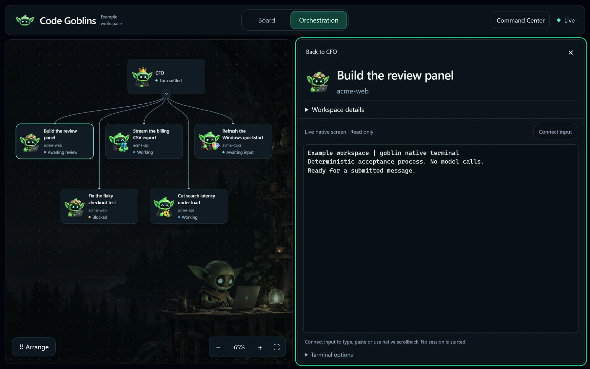
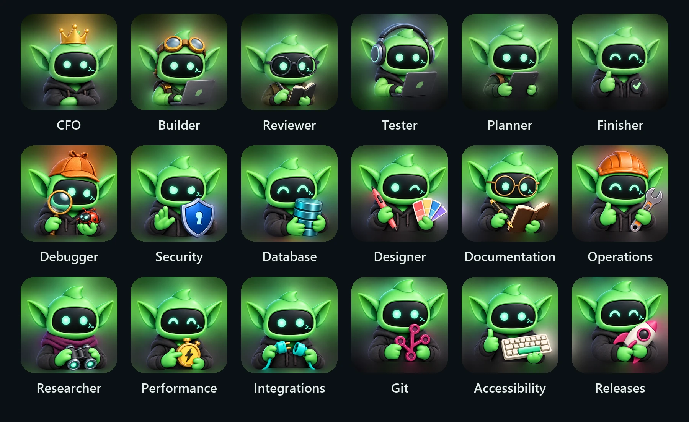
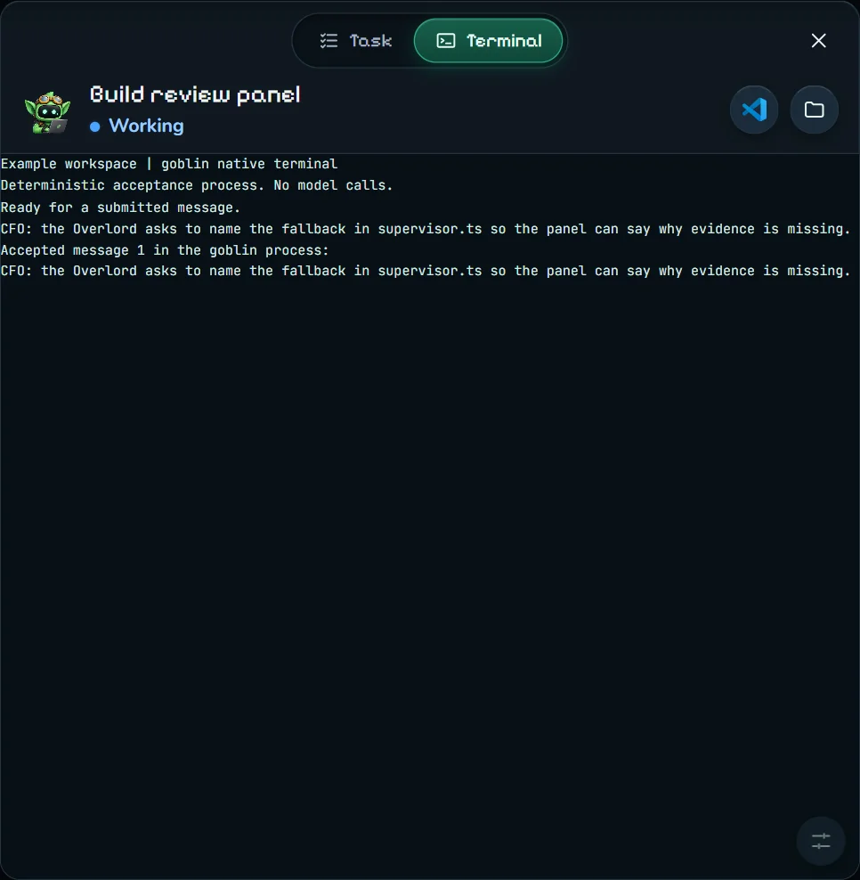
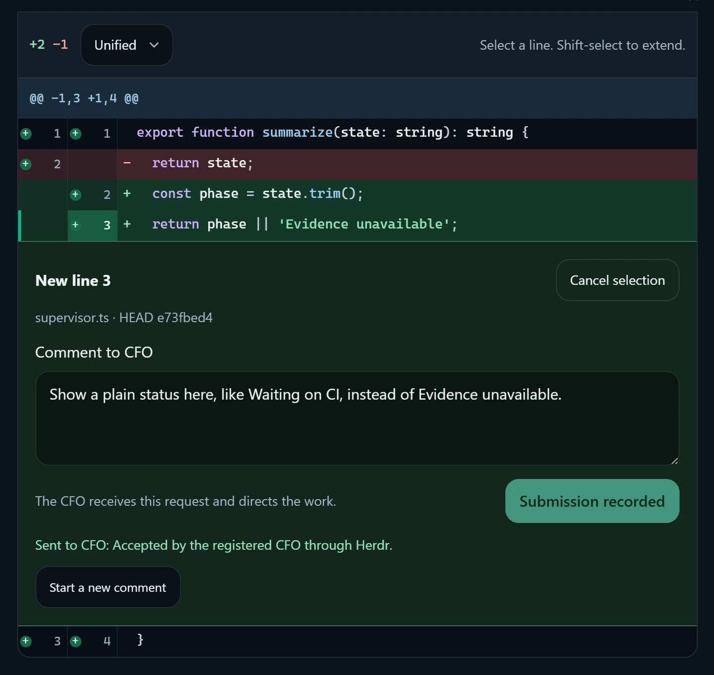
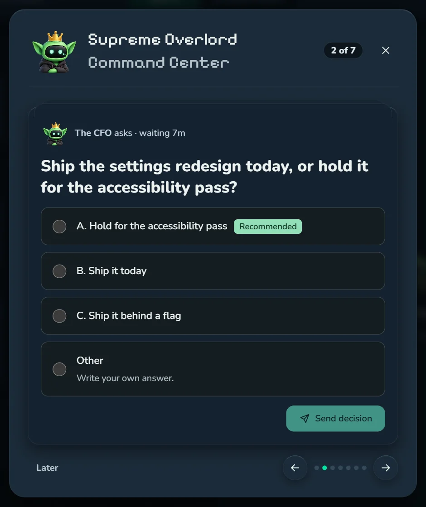
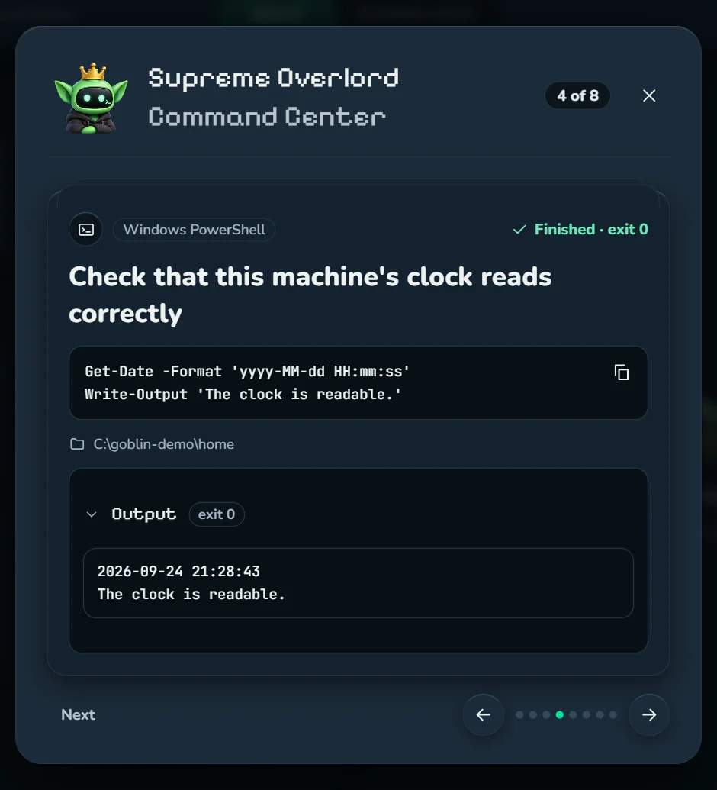

<h1 align="center">Code Goblins</h1>

<p align="center"><strong>Talk to one agent. Ship with a team.</strong></p>

<p align="center">
  A Windows-native control plane for autonomous coding agents.<br/>
  One CFO coordinates Claude Code, Codex, Pi, and Kimi workers in isolated git worktrees, supervises them to completion, validates the result, and hands you finished work.
</p>

<p align="center">
  
  
  
</p>

<p align="center">
  
  <br />
  <sub>Screenshots show the example workspace, <code>cfo serve --example</code> on an isolated home, staged with demo goblins.</sub>
</p>

## Why Code Goblins

Most coding-agent tools make you manage more agents. Code Goblins is built to do the opposite.

You talk to one supervisor: the **CFO**. The CFO decomposes the objective, dispatches specialized **goblins** in parallel, gives each worker an isolated git worktree, watches for failures and blocked work, switches harnesses when necessary, runs the delivery pipeline, and brings decisions back to you only when human judgment is actually required.

The goal is not maximum agent count. The goal is **minimum human intervention per production-ready change**.

```text
                              YOU
                               │
                        one conversation
                               │
                               ▼
                     ┌──────────────────┐
                     │       CFO        │
                     │ plan · dispatch  │
                     │ supervise · ship │
                     └────────┬─────────┘
                              │
              ┌───────────────┼───────────────┐
              ▼               ▼               ▼
        ┌───────────┐   ┌───────────┐   ┌───────────┐
        │ Goblin A  │   │ Goblin B  │   │ Goblin C  │
        │ worktree  │   │ worktree  │   │ worktree  │
        │ Claude    │   │ Codex     │   │ Pi / Kimi │
        └─────┬─────┘   └─────┬─────┘   └─────┬─────┘
              └───────────────┼───────────────┘
                              ▼
                  review → test → lint → CI
                              │
                              ▼
                     PR / local delivery
```

## What makes it different

### One supervisor, not a wall of terminals

The CFO is the only human-facing control plane. Goblins report outcomes, questions, and failures into a durable wake queue; the CFO supervises and steers them without requiring you to poll every terminal.

### Native Windows orchestration

The fleet core is a compiled Go binary (`cfo.exe`). Goblins run as real Windows sessions in [Herdr](https://herdr.dev), avoiding a shell-script orchestration layer on the hot path.

### Isolated work by default

Every goblin receives its own in-repository git worktree at `<project>/.worktrees/gb-<id>`. Parallel workers do not edit the same checkout, and cleanup refuses to destroy unlanded work.

### Harness-agnostic workers

A task can run through Claude Code, Codex, Pi, or Kimi. `cfo switch` can change the harness, model, or effort level in-place while retaining the task identity, pane, worktree, and a handoff when native session resumption is unavailable.

### Restart-proof supervision

Task metadata, fleet state, and wake events live on disk. Closing the supervisor does not erase what the fleet was doing.

`cfo serve` runs the native supervisor and an embedded React board at `http://127.0.0.1:4310`.
Native lifecycle hooks, durable actions, task evidence, code review previews, and reported session lineage remain independent of browser lifetime.
See [the native board guide](docs/native-board.md) for hook setup, build requirements, evidence rules, and terminal limitations.

### Production-oriented gates

The `no-mistakes` path owns review, bounded repair cycles, tests, lint, documentation, push, PR creation, and CI. Review budgets are frozen per task so changing global policy cannot silently weaken an in-flight job.

The production-proof layer is intentionally fail-closed: delivery evidence must come from machine-readable PR state and terminal checks rather than a worker merely claiming that the task is finished.

### Project-scoped credentials

Projects declare the services they need. `cfo auth` probes them before dispatch, validates project identity where configured, and keeps credentials namespaced outside repositories. A blocking authentication failure prevents normal dispatch rather than stranding a worker halfway through a task.

### Recovery instead of babysitting

`cfo watch`, hooks, `cfo reap`, durable wake events, harness health, and explicit task states are designed around unattended operation. The system detects work that needs intervention and wakes the CFO instead of making the user stare at terminals.

## Quick start

### Install

There are two ways in.

To use Code Goblins, run this in any PowerShell window, then type `goblins`; it needs no clone and no Go:

```powershell
irm https://raw.githubusercontent.com/fpresta0607/code-goblins/main/install.ps1 | iex
goblins
```

To work on Code Goblins itself, clone it and install from the clone, which needs Go:

```powershell
git clone https://github.com/fpresta0607/code-goblins.git
cd code-goblins
.\install.cmd -Dev
```

Both put `cfo` and `goblins` on your PATH, install the tools, skills and hooks the fleet needs, and end with `goblins doctor`; run either again at any time to update.
Your data lives in the CFO home, `%LOCALAPPDATA%\CodeGoblins` for the one-line install and the clone itself for `-Dev`, outside every project repository, and `goblins uninstall` keeps it.
[docs/install.md](docs/install.md) has the details: what each step does, what it needs, and the projects folder.

### Everyday commands

`goblins` and `cfo` are one program under two names: `goblins` is the one you type, the CFO and its scripts use `cfo`, and every command works under either.

```powershell
goblins              # start the supervisor if needed, show the board's link and the fleet, then open the CFO
goblins --native     # the same, but start a new CFO in a native terminal shown here instead of in Herdr
goblins --board      # start the supervisor if needed and open the board, with no CFO in this terminal
goblins attach       # show the CFO's native terminal here, or name another; Ctrl-] leaves it running
goblins status       # whether the supervisor runs: the board's link, the fleet and its pid
goblins stop         # stop the supervisor; --force ends it when it does not stop
goblins doctor       # check every tool and harness the fleet needs
goblins serve        # run the supervisor in this terminal instead
goblins fleet-view   # every goblin: under way, queued or done
goblins uninstall    # undo the install; the home folder and its data stay
```

`goblins` on its own finds the supervisor, or starts it in the background with a hidden console of its own when none is running, so no window opens, with its output in `state\serve.log` in the CFO home.
It prints the banner, the board's link (`http://127.0.0.1:4310`, or a free port when another program already listens there) and one line on what the CFO and the goblins are doing and how much waits on you, and opens the board in your browser the first time.
The board is only a view, so closing the browser stops nothing, and a supervisor started this way keeps running after the terminal closes.
Then it takes you to the CFO: a CFO whose registration names a live process is brought to the front, and otherwise it starts Claude Code as the CFO in Herdr in a fresh `cfo` tab, in the project this terminal is in or one you pick from your projects folder, closing an idle old `cfo` tab or renaming a busy one to `shell`.
It then attaches the terminal to Herdr with the CFO in front; run inside Herdr, it only brings the CFO to the front.
A CFO registered in a native terminal is shown in this terminal instead, and `goblins --native` starts a new CFO that way: Claude Code runs in a native terminal of its own, so closing any window leaves it running, and `goblins attach` shows it again.
With no CFO registered, a CFO already running in native terminal `cfo`, which may not have registered yet, is shown rather than started again.
`goblins --board` finds or starts the supervisor the same way and opens the board in your browser every time, and starts or shows no CFO in the terminal.
In an attached terminal every key goes to the CFO, Ctrl-C included, and Ctrl-] leaves the terminal running.
`goblins serve` runs the supervisor in its own terminal instead, where Ctrl-C stops it.
`goblins status` prints the board's link, the same status line and the supervisor's pid, and exits 1 when no supervisor runs, so a script can test for one.
`goblins stop` asks the supervisor to stop, as Ctrl-C would, whichever way it was started, and waits up to 30 seconds for it to finish.
`goblins stop --force` ends the supervisor and everything it started instead, for one that does not stop when asked.
`goblins uninstall` removes the hooks, the board's native hooks and the environment the install set, and keeps the home folder, with its state and data, until you delete it.

### Start the CFO

Run `goblins` in the project you actually want to build, or anywhere to pick one from your projects folder: it starts Claude Code as the CFO there, in Herdr, and brings you to it.
Only a CFO in Claude Code is woken by the fleet today, through its Stop hook: a CFO run in Codex or pi learns what goblins finished or asked only when you next prompt it.

Tell the CFO what outcome you want.
It handles the fleet mechanics.
When it needs you, it asks on the board: a decision, a page to review, or a command to run with one click; [Using the board](#using-the-board) shows how.

## Using the board

<p align="center">
  
</p>

`cfo serve` runs the native supervisor and serves its board, which is compiled into `cfo.exe`, at `http://127.0.0.1:4310`.
Install the native lifecycle hooks once for each harness you use (the install does this for every harness it finds), then start the supervisor in its own terminal and open the URL it prints:

```powershell
cfo hooks install claude   # repeat for codex or pi
cfo serve                  # --listen 127.0.0.1:0 picks a free loopback port
```

The board is a view, not the engine: tasks keep progressing with every browser closed, and restarting `cfo serve` with the same CFO home recovers its events, actions and lineage.
`cfo serve` takes over from `cfo watch` as the fleet's single supervisor, so a running watcher must finish first.
It listens on loopback only, and Ctrl-C in its terminal, or `goblins stop` from any terminal, stops it.
Hook setup, evidence rules and terminal limits are in [the native board guide](docs/native-board.md).

### Board and Orchestration

The header switches between two views, one at a time, each with a contextual panel on the right.

- **Board** is task review. Real tasks sit in **Tasks**, **In progress** and **Completed**. Only verified delivery reaches Completed; failed work and work awaiting review stay in progress with a plain status. Selecting a card opens its changes (only the changed lines for a file over 256 KiB), activity and commit history. The CFO is pinned above the columns: its bar says what it needs from you, the first question or review waiting and how many more, or else how many goblins it supervises, and **Open terminal** opens its terminal. A goblin waiting on you says Waiting on the CFO, since the CFO brings every question to you, until your answer reaches it.
- **Orchestration** is the live family tree: the CFO above its goblins and any child sessions they reported. The panel shows the selected session's real native terminal and starts on the CFO, whose terminal is shown from its host when the CFO runs in a native terminal. Dragging cards, panning, zooming, **Fit** and **Arrange** change only the layout, because parentage comes from native session evidence. A brief pulse along a connector marks a real accepted message.

<p align="center">
  
</p>

Each card shows the task's short title on at most two lines and one muted line with its repo and status; the goblin's own words are in its panel.
Each card's goblin is chosen from the task's work, and the crowned goblin is the CFO.
The whole crew:

<p align="center">
  
</p>

### The goblin panel

Clicking a card or a node opens the same goblin panel from either view: who the goblin is, what it is doing in plain words, its own latest status line, and icon buttons to open its worktree in VS Code or File Explorer and to open its pull request.
A pill at the top switches between the **Task** view and the **Terminal** view in one tap.
A live goblin's card also carries a terminal button, shown on hover or keyboard focus, that opens its panel straight on the Terminal view.
The Task view shows **Workspace** with the repository, branch and exact working folder, **Connectors** with a mark for every harness, model provider, MCP server and credential (configured is not the same as connected, and no secret values are shown), then **Changes**, **Activity** and **History**.
The Terminal view is the goblin's live terminal, edge to edge.
A goblin in a native terminal (`cfo spawn --backend native`) is drawn from its terminal's own output at the panel's size, in a 20 px font: type straight into it, scroll its history with the wheel, and use **Ctrl+Plus**, **Ctrl+Minus** and **Ctrl+0** to change the font size, which gives the terminal fewer or more columns rather than shrinking what it shows.
Opening it replays the terminal's history out of sight and shows it once its screen is whole, so it never opens blank or half drawn, and a full-pane state shows while it connects.
A program's redraw appears as one frame, the way a native terminal shows it, and while the board's own connection is down the last screen stays in place with a Reconnecting note.
Every terminal you open stays live while the board is open, and the list beside the terminal switches between them, the CFO first and then each goblin with a terminal.
**Ctrl+Alt+Up** and **Ctrl+Alt+Down** step through that list and **Ctrl+Alt+1** to **Ctrl+Alt+9** jump to an entry, from anywhere on the board; a switch hands the keyboard to the terminal it shows, and one you opened before appears at once, already drawn.
Drag the divider between the board and the panel to size the panel, or use the maximize button to give it the whole window; both are remembered in this browser.
A goblin still in Herdr shows its Herdr pane at the pane's own size, with the same full-pane state while it connects.
Hold **Ctrl+Shift+Space** to dictate into the terminal that has the keyboard: the browser's own speech recognition listens while the keys are held, and releasing them types what it heard as one line, which **Enter** sends.
In both, drag to select and the selection is copied, and **Shift+Escape** moves the keyboard back out.

<p align="center">
  
</p>

### Sending a diff comment to the CFO

<p align="center">
  
</p>

Open **Changes**, expand a file and click a line number, where a comment icon appears on hover; Shift-click extends the selection to a range.
Dragging across diff lines opens the same comment box for the lines it covers, and a double-click or triple-click still just selects text to copy.
A comment box floats beside the selection: type, press **Enter** to send (**Shift+Enter** for a new line, **Escape** to cancel), and it shrinks to a chip whose two check marks mean the CFO accepted it.
The comment reaches the verified CFO session with its exact file, side, lines, HEAD and diff fingerprint, and the CFO decides how to direct the goblin; the board never sends it to the goblin itself.
If the registered CFO session is not live, the comment is refused and nothing is queued.
Retrying an unchanged comment keeps its request ID, so a retry cannot deliver the same comment twice.

### Supreme Overlord Command Center

<p align="center">
  
</p>

When the CFO needs a decision only you can make, it publishes the question with `cfo question` and the Command Center opens as a modal.
The question reads as plain body text across a wide card: its first sentence is the question, details follow as bullets, and only what the asker marked, such as the verdict or the blocking item, is bold.
Choices are labelled A, B and C with the CFO's recommendation marked, and **Other** takes a written answer; a goblin's own A), B), C) labels are dropped, so each choice shows one letter.
Review items share the stack: a goblin's image review, a review page, or a goblin waiting on you.
A review page shows as a preview you click to open it (**Open review**); a page the board watches is answered on the page itself, and its card finishes when you send or end the review there.
Other items, a plain link included, are answered in writing with **Send answer**, and any item closes with **Clear**.
A document the CFO or a goblin delivers with `cfo deliver` shows its file type, name and size with **Download**, and **Open** when the browser can show it or it has a link; opening or downloading it moves it to History.
A new review item or command appears in a banner at the bottom right for a few seconds and stays under the badge, and the browser tab's title counts what is waiting on you.
A goblin's item closes by itself once nobody waits on it: a wait when the goblin reports again or the CFO answers it, any item but a delivered document when its goblin finishes or is cleaned up, and the CFO can clear a stale one with a reason.
Several items stack up one card at a time, the CFO's first and then goblins by longest wait: each card's action row has **Back**, its place such as 2 of 4, and **Next** on the left and its answer on the right, and you can swipe; closing keeps every item for later.
The moment you send, a check draws with **Sent** and the next open item follows by itself while the answer is delivered in the background; the last one ends on **You're all done** and the Command Center closes.
An answer the board refused comes back on its card with what went wrong, and **Retry** sends it again.
An answer whose delivery failed or went unconfirmed comes back on its card with its warning.
Clicking outside the Command Center, or outside its inbox, closes it.
Nothing is preselected, drafts are kept, and the **Command Center** icon in the header, whose badge counts what is waiting on you, opens an inbox of what is waiting on you, the live pages (review pages and browser walkthroughs) and a History of what you answered, cleared or ran.
A goblin waiting on you offers **Answer** in its panel, which opens the stack at its item.
A question with images shows a thumbnail per choice that opens a full-size, swipeable, zoomable gallery.
An answer to the CFO goes to the same verified CFO session, and an answer to a goblin goes to that goblin's own pane, each exactly once; no answer approves a gate or merges anything.
Each live page offers **Open review** or **Open page** and **Keep in background**; neither pauses work.
A command the CFO needs you to run arrives as a run card with its shell, an **Admin** badge when it runs elevated, the exact command with a copy button, and one **Run** button; the card then shows its exit code and output.

<p align="center">
  
</p>

### Open in VS Code

**Open in VS Code** opens the selected goblin's own isolated worktree, the folder it is actually editing, in your installed VS Code, and **Open folder** opens it in File Explorer.
The supervisor resolves that folder from task metadata and starts the program directly; the browser never supplies a path or a command.
A missing editor or a folder that no longer exists is reported instead of guessed.

## Typical autonomous delivery loop

```text
1. User gives the CFO an objective and constraints.
2. CFO resolves the project and writes explicit acceptance criteria.
3. cfo auth preflights required project services.
4. CFO spawns one or more goblins into isolated worktrees.
5. Goblins implement, investigate, test, and report through the wake queue.
6. CFO steers blocked work or switches harnesses when useful.
7. no-mistakes performs bounded independent review and repair.
8. Tests, lint, documentation and CI produce machine evidence.
9. CFO presents the finished outcome or the smallest unresolved decision.
10. Approved work is merged; unlanded work is never silently destroyed.
```

## Core commands

```text
cfo doctor
cfo auth <project> [--check|--fix] [--env]
cfo install [--projects-root <dir>] [--uninstall]
cfo uninstall
cfo serve [--listen <loopback-address>]
cfo hooks install <claude|codex|pi>
cfo brief <id> --project <name|path> [--kind <ship|scout>] [--mode <mode>]
cfo spawn <id> --project <name|path> --brief <path> [--harness <claude|codex|pi|kimi>] [--mode <mode>] [--model <model>] [--effort <level>] [--class <class>] [--backend <herdr|native>] [--yolo]
cfo switch <id> [--harness <h>] [--model <m>] [--effort <e>]
cfo send <target> <text...>
cfo peek <target> [lines]
cfo fleet-view [--json]
cfo runtime [--json]
cfo pipeline migrate <id>
cfo pipeline run <id> --intent <text>
cfo pipeline respond <id> --action <fix|approve> [--findings <ids>] [--instructions <text>]
cfo pipeline recover <id>
cfo pr check <id> <url>
cfo pr merge <url> [--method <merge|squash|rebase>] [--delete-branch]
cfo cleanup <id>
cfo reap [--dry-run|--apply]
cfo drain
cfo notify <id> --done --pr <url> | --blocked "<question>" | --failed "<reason>" | --working "<what>" | --waiting-on <task-id|overlord|ci|deploy> "<why>" [--lavish <html-file>]
cfo question --id <stable-id> --text "<question>" [--option "<choice>"]... [--recommend "<exact-choice>"]
cfo answer <question-id|wake-seq> --option <choice> [--note "<text>"]
cfo review --id <stable-id> --title "<what to look at>" [--task <id>] [--image <path>]... [--lavish <url|html-file>]
cfo review --clear <stable-id> --reason "<why>"
cfo deliver --id <stable-id> --title "<what it is>" --file <path> [--url <link>] [--task <id>]
cfo run-request --id <stable-id> --title "<why>" --shell powershell|pwsh|bash [--admin] [--cwd <dir>] --command-file <path>
```

Run `cfo doctor` after installation for the current dependency and harness health report.

## Safety model

Code Goblins is designed for high autonomy without pretending that an LLM saying “done” is proof.

- Work happens in isolated worktrees.
- Authentication is checked before normal dispatch.
- Review/repair budgets are explicit and bounded.
- Pipeline approval fails closed when actionable findings remain.
- Dirty or unlanded work is not silently deleted.
- Local delivery is fast-forward only.
- PR delivery is expected to be backed by machine-readable CI evidence.
- Human approval remains the default for merges; `yolo` is an explicit posture, not an implicit permission.

For high-risk production systems, use repository branch protection and keep production deployment credentials outside worker reach. Code Goblins coordinates software delivery; it is not an operating-system sandbox.

## Architecture

The core is intentionally local-first:

- `cmd/cfo/` — the Windows-native fleet CLI and control plane.
- `internal/spawn/` — task dispatch and worktree preparation.
- `internal/herdr/` — terminal/session integration.
- `internal/terminal/` - the terminal backend that the fleet commands, the board's supervisor, the monitor and the CFO launcher drive; Herdr is the only one today, and `terminaltest` holds an in-memory one for tests.
- `internal/conpty/` - runs one process in a Windows pseudo console, inside a job object that ends its whole tree, for the native terminal host.
- `internal/host/` - `cfo host`: one goblin terminal per process, outliving the supervisor and every window, served over a named pipe only this Windows user can open; its screen is read from its console, exactly as the terminal's program sees it, for `cfo peek`.
- `internal/fleet/` — fleet truth, targeting, steering and inspection.
- `internal/supervise/` / `internal/watch/` — unattended supervision and recovery.
- `internal/pipeline/` — durable validation policy and decision gates.
- `internal/auth/` — project-scoped credential preflight and injection.
- `internal/state/` / `internal/wake/` — restart-proof task and event state.
- `internal/supervisor/` - native event ingestion, durable actions and the local board API behind `cfo serve`, including the WebSocket that relays a native task's terminal from its host.
- `frontend/` - the board's React/TypeScript source; Vite compiles it into `internal/boardweb/dist`, which is embedded in `cfo.exe`.
- `.agents/skills/` - the skills this repository owns, including `lavish`, the CFO's review surface over the third-party `lavish-axi` CLI; [docs/load-map.md](docs/load-map.md) maps every file each harness reads for instructions, skills, hooks and MCP.

The control plane is local. Your coding harnesses may still call their model providers according to their own configuration.

## Development

```powershell
go vet ./...
go test ./... -count=1
go build ./cmd/cfo
```

CI runs on `windows-latest`. The real-session acceptance suite is opt-in because it requires actual Herdr and harness installations.

## Project lineage

Code Goblins began from ideas and code in [First Mate](https://github.com/kunchenguid/firstmate), which is MIT licensed. That lineage is retained and credited under the license.

Code Goblins is now maintained as an **independent standalone project** with its own Windows-native Go control plane, supervision model, credential system, harness switching, durable state, delivery pipeline, and roadmap. You clone and update Code Goblins from this repository directly; First Mate is not an upstream dependency that users need to track or sync.

## Contributing

Issues and pull requests are welcome. See [CONTRIBUTING.md](CONTRIBUTING.md).

If you are working on orchestration, the standard is simple: features should reduce human intervention **without weakening evidence that the delivered change is correct**.

## License

MIT. See [LICENSE](LICENSE). First Mate lineage remains acknowledged as required by its MIT license.

## Project-aware autonomous delivery

Code Goblins can now describe each project's real runtime in `data/projects/<project>/project.json`: databases, caches, vector stores, object storage, frontends, backends, workers, queues, local/remote services, providers, health checks, deploy commands, verification policy, security policy, routing lanes, and budgets. Credential **names** may appear there; credential values stay in the existing auth store.

At spawn, CFO produces a compact durable **task capsule** and **runtime capsule** instead of replaying the CFO transcript. Without `--harness`, deterministic rules classify the brief and select an execution lane from the fleet's `data/routing.json` (a project manifest's `routing` block overrides it), checking quota-axi headroom first and falling to the next usable lane; explicit harness/model/effort flags still win. A redirected task can be marked with `cfo supersede`, which makes rejected unshipped work disposable and requires cleanup evidence.

Delivery is evidence-driven: tiered verification and security commands write structured results, project deployment contracts prevent “CI green” from being mistaken for “production deployed,” and `cfo pr merge` verifies the exact PR head and merges with `--match-head-commit` so a newer unverified SHA cannot slip through.

See [Project runtime contracts](docs/project-runtime.md), [Production autonomy roadmap](docs/production-roadmap.md), and [Orchestrator patterns](docs/orchestrator-patterns.md).
