<h1 align="center">Code Goblins</h1>

<p align="center"><strong>Talk to one agent. Ship with a team.</strong></p>

<p align="center">
  A Windows-native control plane for autonomous coding agents.<br/>
  One CFO coordinates Claude Code, Codex, Pi, and Kimi workers in isolated git worktrees, supervises them to completion, validates the result, and hands you finished work.
</p>

<p align="center">
  
  
  
</p>

<p align="center">
  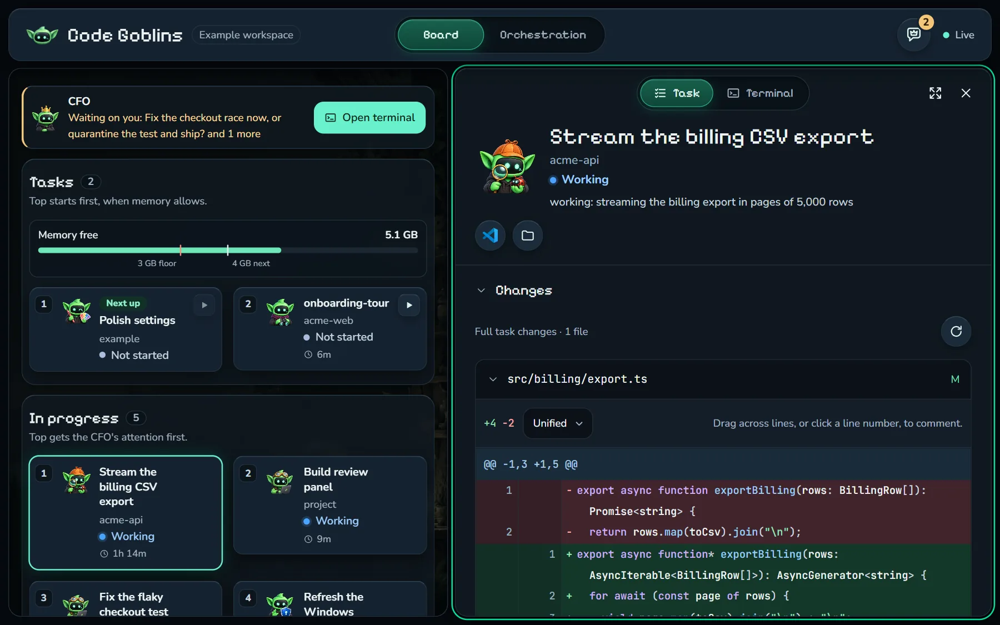
  <br />
  <sub>Screenshots show the example workspace, <code>cfo serve --example</code> on an isolated home, staged with demo goblins.</sub>
</p>

## Why Code Goblins

Most coding-agent tools make you manage more agents. Code Goblins is built to do the opposite.

You talk to one supervisor: the **CFO**. The CFO decomposes the objective, dispatches specialized **goblins** in parallel, gives each worker an isolated git worktree, watches for failures and blocked work, switches harnesses when necessary, runs the delivery pipeline, and brings decisions back to you only when human judgment is actually required.

The goal is not maximum agent count. The goal is **minimum human intervention per production-ready change**.

```text
                              YOU
                               │
                        one conversation
                               │
                               ▼
                     ┌──────────────────┐
                     │       CFO        │
                     │ plan · dispatch  │
                     │ supervise · ship │
                     └────────┬─────────┘
                              │
              ┌───────────────┼───────────────┐
              ▼               ▼               ▼
        ┌───────────┐   ┌───────────┐   ┌───────────┐
        │ Goblin A  │   │ Goblin B  │   │ Goblin C  │
        │ worktree  │   │ worktree  │   │ worktree  │
        │ Claude    │   │ Codex     │   │ Pi / Kimi │
        └─────┬─────┘   └─────┬─────┘   └─────┬─────┘
              └───────────────┼───────────────┘
                              ▼
                  review → test → lint → CI
                              │
                              ▼
                     PR / local delivery
```

## What makes it different

### One supervisor, not a wall of terminals

The CFO is the only human-facing control plane. Goblins report outcomes, questions, and failures into a durable wake queue; the CFO supervises and steers them without requiring you to poll every terminal.

### Native Windows orchestration

The fleet core is a compiled Go binary (`cfo.exe`). Goblins run as real Windows sessions, each in a native terminal of its own (a pseudo console that outlives every window), avoiding a shell-script orchestration layer on the hot path; a kimi goblin waits until kimi's native screens are captured.

### Isolated work by default

Every goblin receives its own in-repository git worktree at `<project>/.worktrees/gb-<id>`. Parallel workers do not edit the same checkout, and cleanup refuses to destroy unlanded work.

### Harness-agnostic workers

A task can run through Claude Code, Codex, Pi, or Kimi. `cfo switch` can change the harness, model, or effort level in-place while retaining the task identity and worktree, with a handoff when native session resumption is unavailable.

### Restart-proof supervision

Task metadata, fleet state, and wake events live on disk. Closing the supervisor does not erase what the fleet was doing.

`cfo serve` runs the native supervisor and an embedded React board at `http://127.0.0.1:4310`.
Native lifecycle hooks, durable actions, task evidence, code review previews, and reported session lineage remain independent of browser lifetime.
See [the native board guide](docs/native-board.md) for hook setup, build requirements, evidence rules, and terminal limitations.

### Production-oriented gates

The `no-mistakes` path owns review, bounded repair cycles, tests, lint, documentation, push, PR creation, and CI. Review budgets are frozen per task so changing global policy cannot silently weaken an in-flight job.

This repository's own test step is `cfo gate test`, which plans before it runs.
It says which level a change requires (`affected`, the changed Go packages and the packages that import them, or `full`, every package, once `go.mod` or `go.sum` changed), why each package is in the plan, and it leaves a report of what it ran.
While working, `cfo gate test --level fast` vets the same packages and tests only the quick changed ones, and `cfo gate test --plan` prints the plan and runs nothing.
See [Verification levels](docs/pipeline.md#verification-levels).

The production-proof layer is intentionally fail-closed: delivery evidence must come from machine-readable PR state and terminal checks rather than a worker merely claiming that the task is finished.

### Project-scoped credentials

Projects declare the services they need. `cfo auth` probes them before dispatch, validates project identity where configured, and keeps credentials namespaced outside repositories. A blocking authentication failure prevents normal dispatch rather than stranding a worker halfway through a task.

Pipe a credential with `Get-Clipboard | cfo auth store --project <project> <NAME>` to keep its value out of shell history, or run `cfo auth store --project <project> <NAME>` at a console and type or paste the value, which is read without being shown.
For stdin, `cfo auth store` removes every consecutive leading byte-order mark, including mixed Windows PowerShell mojibake forms, then trailing line breaks, and reports how many marks it removed without exposing the value.
All other content is preserved.

### Recovery instead of babysitting

`cfo watch`, hooks, `cfo reap`, durable wake events, harness health, and explicit task states are designed around unattended operation. The system detects work that needs intervention and wakes the CFO instead of making the user stare at terminals.
A goblin is judged stalled by evidence rather than by how long its turn has run: its harness's transcript writes and the processor use of the processes its harness started, so a long refactor, a long test run, or a goblin waiting on its own background job or monitor stays quiet, and the CFO hears about it once that evidence stops.
A pane that shows a tool or a turn running, whichever harness drew it, keeps the goblin read as working until that evidence stops, and a goblin sitting at its prompt with nothing running, nothing asked and nothing reported wakes the CFO after three minutes as `goblin_idle`, read from its own screen and processes, so a Codex or pi goblin without its hooks wakes the same as a Claude Code one.
`cfo doctor` prints how many stale wakes the monitor raised and how many it held back, and why.

## Quick start

### Install

There are two ways in.

To use Code Goblins, run this one line in any PowerShell window; it needs no clone and no Go:

```powershell
irm https://github.com/fpresta0607/code-goblins/releases/latest/download/install.ps1 | iex
```

It ends with the [quick start](#quick-start) in that same window, where `goblins` works at once.
Code Goblins in the Start menu runs the quick start again at any time.

To work on Code Goblins itself, clone it and install from the clone, which needs Go:

```powershell
git clone https://github.com/fpresta0607/code-goblins.git
cd code-goblins
.\install.cmd -Dev
```

Both put `cfo` and `goblins` on your PATH, install the tools, skills and hooks the fleet needs, add Code Goblins to the Start menu, run `goblins doctor` and end with the quick start; run either again at any time to update.
no-mistakes, the gate every goblin's work passes, comes from the release `install.ps1` pins, downloaded from its GitHub release page with a bounded retry and installed only when it matches that release's `checksums.txt`.
Rerunning either install updates an older no-mistakes to the pinned release, once no gate is running.

`cfo.exe` is not code-signed yet.
The one-line install runs it only when it matches the release's `SHA256SUMS`, and shows no SmartScreen prompt.
A `cfo.exe` saved from a browser gets SmartScreen's "Windows protected your PC" with an Unknown publisher, and Smart App Control, where it is on, blocks it until a signed release.
[On a fresh PC](docs/install.md#on-a-fresh-pc) shows how to check the checksum yourself and what to do if Microsoft Defender flags a build.

Your data lives in the CFO home on your machine, `%LOCALAPPDATA%\CodeGoblins` for the one-line install and the clone itself for `-Dev`, outside every project repository and kept by `goblins uninstall`.
It needs no backup repository: backing it up is only your own choice, and [Your data](#your-data) shows what is in it.
[docs/install.md](docs/install.md) has the details: what each step does, what it needs, and the projects folder.

### Everyday commands

`goblins` and `cfo` are one program under two names: `goblins` is the one you type, the CFO and its scripts use `cfo`, and every command works under either.

```powershell
goblins              # the quick start: the supervisor, the CFO's agent and the CFO, then its terminal or the board
goblins setup        # the quick start again, choosing the agent the CFO runs on
goblins --native     # the same, but start a new CFO in a native terminal shown here instead of in Herdr
goblins --harness codex  # start the CFO as codex, claude or pi from now on, set up first; a running CFO keeps its harness
goblins --board      # start the supervisor if needed and open the board, with no CFO in this terminal
goblins attach       # show the CFO's native terminal here, or name another; Ctrl-] leaves it running
goblins status       # whether the supervisor runs: the board's link, the fleet and its pid
goblins stop         # stop the supervisor; --force ends it when it does not stop
goblins doctor       # check every tool and harness the fleet needs
goblins serve        # run the supervisor in this terminal instead
goblins fleet-view   # every goblin: under way, queued or done
goblins uninstall    # undo the install; the home folder and its data stay
```

`goblins` on its own finds the supervisor, or starts it in the background with a hidden console of its own when none is running, so no window opens, with its output in `state\serve.log` in the CFO home.
The board's address is the same every time: `http://127.0.0.1:4310`, or the loopback address you set in `CFO_BOARD_ADDRESS`.
When that address is in use, `goblins` starts no board anywhere else: it says who holds it, the Code Goblins fleet of another home by its folder or another program, and what to do.
It prints the banner, the board's link and one line on what the CFO and the goblins are doing and how much waits on you.
When this home's supervisor, or its supervisor and its CFO, already run, it says so and starts nothing beside them.
It never opens the board on its own.
The board is only a view, so closing the browser stops nothing, and a supervisor started this way keeps running after the terminal closes.
Then, when no CFO runs, the [quick start](#quick-start) makes the CFO's agent ready and starts the CFO in the CFO home, never in a project: the CFO works across every project from there.
It starts in its remembered harness in Herdr, in a fresh `cfo` tab, closing an idle old `cfo` tab or renaming a busy one to `shell`; `goblins --native` starts it in a native terminal of its own instead, so closing any window leaves it running, and `goblins attach` shows it again.
A CFO that ran in a native terminal and was closed, however it ended (`/exit`, Ctrl-C, its window closed, a crash or a reboot), comes back when you run `goblins` again, with or without `--native`: in that terminal, and, when it starts as the same agent, on the conversation it last registered with, Claude Code with `--resume` and Codex with `codex resume`, and it registers itself as before.
A conversation that cannot be resumed starts a new one, and so does one past 20 MB, since CFO sessions stay small, or one in pi, which has no resume; `goblins` says which.
A CFO that ran in Herdr, or one that starts as another agent, starts a new conversation.
A CFO already running is never started twice: one registered in a native terminal is shown in this terminal, one whose registration names a live process in Herdr is brought to the front there, and with no CFO registered, a CFO already running in native terminal `cfo`, which may not have registered yet, is shown.
Every run ends on one screen: the CFO's home and the board's link, which Ctrl+click opens, above two choices.
**Open the CFO terminal**, the one Enter takes, attaches this terminal to the CFO, to Herdr with the CFO in front or to its native terminal; run inside Herdr, it only brings the CFO to the front.
**Open the board**, or B, opens the board in your browser.
`goblins --board` finds or starts the supervisor the same way and opens the board in your browser every time, and starts or shows no CFO in the terminal.
In an attached terminal every key goes to the CFO, Ctrl-C included, and Ctrl-] leaves the terminal running.
`goblins serve` runs the supervisor in its own terminal instead, where Ctrl-C stops it.
`goblins status` prints the board's link, the same status line and the supervisor's pid, and exits 1 when no supervisor runs, so a script can test for one; it asks the supervisor for its pid, so a fleet snapshot that is slow to build never makes a live supervisor look stopped.
`goblins stop` asks the supervisor to stop, as Ctrl-C would, whichever way it was started, and waits up to 30 seconds for it to finish.
`goblins stop --force` ends the supervisor and everything it started instead, for one that does not stop when asked.
`goblins uninstall` removes the hooks, the board's native hooks, the environment and the Start-menu shortcut the install set, and keeps the home folder, with its state and data, until you delete it.

### Quick start

Run `goblins` from any folder.
The first time, it asks each of Claude Code, Codex and pi whether it is installed and signed in, using the tool's own status command, and asks which one the CFO runs on, with Claude Code marked as recommended for the best experience.
When the one you pick is missing, Enter installs it the way the install script does: Claude Code's native build from its own installer, Codex and pi with npm.
When nobody is signed in, Enter opens that tool's own sign-in, where you sign in yourself; Code Goblins never sees your password, and it checks again when the sign-in ends.
A sign-in it cannot verify is never called ready: Enter opens the sign-in again, and continuing without verifying is a choice of its own.
Every step shows its default marked, with Enter to continue, the arrows to choose and Esc to go back, and a step nobody can answer, as in a script, accepts nothing.
The agents are one row of tabs, each with its own mark, moved with Left and Right, with the marked agent's state under the row.
A step you have answered leaves one line, a tick with the step's name and its answer, in place of its screen, so the window never fills with the steps before; installers and sign-ins run on the console's other screen and leave nothing behind.
The agent you end on is remembered, so later runs skip what is already set up and go straight to the last screen; `goblins setup` asks again, and `goblins --harness codex` names the agent instead of asking.
Only a CFO in Claude Code is woken by the fleet today, through its Stop hook: a CFO run in Codex or pi learns what goblins finished or asked only when you next prompt it, which the choice of agent and the start both say.
Without a terminal, `goblins --board` opens the board, and whenever no CFO runs the board shows its first-run screen.
It shows as done what the quick start already knows, the home and the agent you chose there, offers the agents as one row of icon tabs, and **Start the CFO** starts it in the home, never in a project, and opens it in the board's terminal.
The folder that holds your projects is optional there.
The page starts only Claude Code as the CFO, for the same reason, and still shows Codex and Pi with whether each is installed and signed in.

Tell the CFO what outcome you want.
It handles the fleet mechanics.
When it needs you, it asks on the board: a decision, a page to review, or a command to run with one click; [Using the board](#using-the-board) shows how.

## Using the board

<p align="center">
  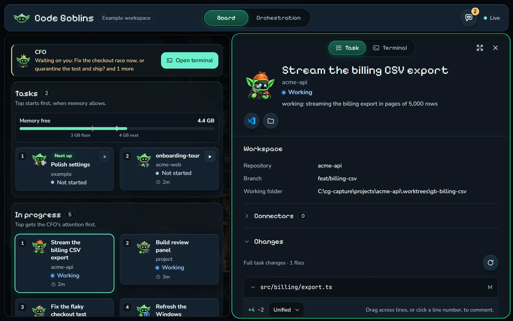
</p>

`cfo serve` runs the native supervisor and serves its board, which is compiled into `cfo.exe`, at `http://127.0.0.1:4310`.
Install the native lifecycle hooks once for each harness you use (the install does this for every harness it finds), then start the supervisor in its own terminal and open the URL it prints:

```powershell
cfo hooks install claude   # repeat for codex or pi
cfo serve                  # listens on CFO_BOARD_ADDRESS, or 127.0.0.1:4310; --listen 127.0.0.1:0 picks a free loopback port
```

The board is a view, not the engine: tasks keep progressing with every browser closed, and restarting `cfo serve` with the same CFO home recovers its events, actions and lineage.
An open board draws nothing while nothing changes: nothing on it animates forever, so a tab left open costs the machine almost nothing between updates.
In Chrome or Edge, **Install Code Goblins** in the address bar opens the board as its own app, in a window with the goblin icon and no browser bar; its title, like the tab's, counts what waits on you, such as (2) Code Goblins.
A tab left open across an install notices the newer board: a hidden tab reloads itself unless it holds an answer you have not sent, and otherwise it shows one line, **The board was updated**, with **Reload**, so it never reloads while you answer.
`cfo serve` takes over from `cfo watch` as the fleet's single supervisor: a running watcher, the one the CFO's Stop hook hosts included, hands it the lock at once rather than holding it off ([docs/native-board.md](docs/native-board.md) has the details).
It listens on loopback only, and Ctrl-C in its terminal, or `goblins stop` from any terminal, stops it.
Hook setup, evidence rules and terminal limits are in [the native board guide](docs/native-board.md).

### The desktop app

The board also runs in a desktop window of its own, `goblins-window.exe`: the same board in Microsoft's WebView2, with a tray icon and Windows notifications.
It holds no fleet state and writes nothing into the CFO home, so it runs beside this repository's `cfo.exe` unchanged, and quitting it leaves the supervisor, the CFO and every goblin running.
It lives in [code-goblins-native](https://github.com/fpresta0607/code-goblins-native), a private repository, and is published there as a release; no release of this repository ships it yet.
That repository's README has the one command that downloads the window, checks its SHA-256 and adds it beside your CFO home, with **Code Goblins Window** in the Start menu, and how to update and remove it.
The window is unsigned, and its install says so.
Dictation with **Ctrl+Shift+Space** does not work in the window, because WebView2 has no speech recognition: dictate in the board's browser tab.

### Board and Orchestration

The header switches between two views, one at a time, each with a contextual panel on the right.

- **Board** is task review.
  Real tasks sit in **Tasks**, **In progress** and **Completed**, side by side as a kanban; the layout button in the top bar switches to a stacked layout, one column under another, and your browser remembers the choice.
  An open panel leaves the kanban the width its three columns need whenever the window can hold both; in a window too narrow for that the board stacks and the layout button says why.
  Paused tasks sit at the bottom of In progress, under a **Paused** divider, and keep their Resume and Stop.
  Completed holds delivered work and tasks explicitly stopped, with each pull request shown once under its repository.
  Failed work and work awaiting review stay in progress with a plain status.
  Selecting a card opens its changes (only the changed lines for a file over 256 KiB), activity and commit history.
  The CFO is pinned above the columns in a plain bar that says how many goblins it supervises, with its terminal icon. While something waits on you **Open Command Center** appears on the bar and glows, with how many items wait; the bar says none of what they are.
  While no CFO runs the board shows the first-run screen instead; **Open the board without a CFO** keeps the goblins in view, and the bar then offers **Start the CFO**.
  A goblin waiting on you says Waiting on the CFO, since the CFO brings every question to you, until your answer reaches it.
- **Orchestration** is the live family tree: the CFO above its goblins and any child sessions they reported. The panel shows the selected session's real native terminal and starts on the CFO, whose terminal is shown from its host when the CFO runs in a native terminal. Dragging cards, panning, zooming, **Fit** and **Arrange** change only the layout, because parentage comes from native session evidence. A goblin waiting on another sits under it, joined by a dashed line; only a card you drag keeps its place, and the rest arrange themselves around it without covering one another. A brief pulse along a connector marks a real accepted message.

<p align="center">
  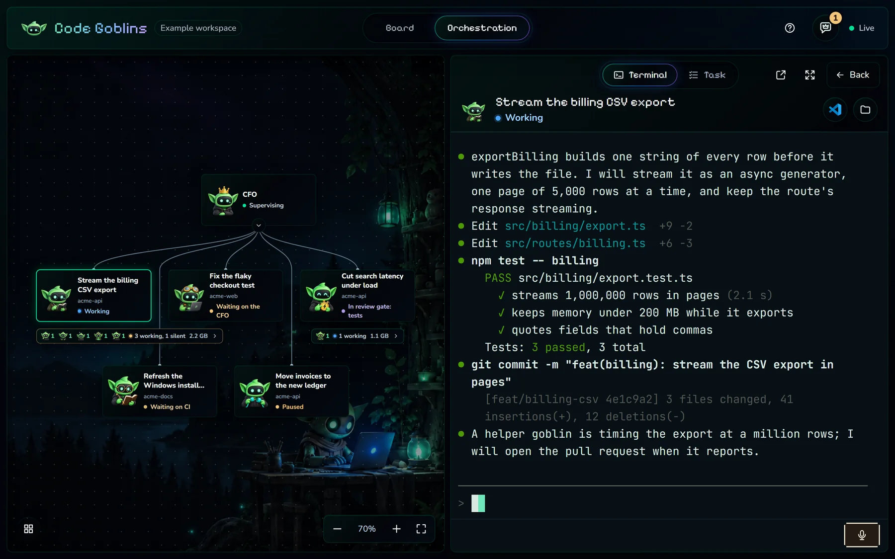
</p>

Each card shows the task's short title and a muted line with its repo and status; the goblin's own words are in its panel.
Each card carries the mark of the harness its goblin runs (Codex, Claude Code, pi, Kimi or a terminal for any other), and its tip names the harness, model and effort.
The CFO's bar carries the mark of the harness the CFO runs, and its tip names the harness and its model.
On a narrow screen the columns stack and a card's repo and status wrap onto more lines and its name onto up to three, so nothing scrolls sideways; a name cut at three lines shows in full in a tip on hover or keyboard focus.
Under the status, a quiet clock shows how long each goblin's session has run, such as 2h 14m, and how long each queued task has waited since its brief was written; a queued row with no brief yet has no clock.

**Tasks** and **In progress** are in priority order, top first, and Completed is history, newest first.
In progress shows every goblin's card at once, however many there are, and the board scrolls when they run past the screen.
Tasks, the Paused group and Completed show up to ten cards whole; past ten, each shows a page, as many cards as fit the visible board and never fewer than five, Completed its newest, and a pager under it says which show, such as 1–5 of 18, and turns to the others; on a touch screen a sideways swipe on a card does the same.
A Completed card shows what its pull request really did, the way GitHub does: **Merged** with GitHub's purple merge icon when it merged into its base, **Closed** with the closed icon when it was closed without merging, and **Finished** with the pull request icon while it is still open.
Without a PR, Finished requires pushed task commits or the artifact the brief requested.
A task ended by Stop, or cleaned up without delivery, says **Stopped**, with when and why.
Every Completed card leads with its PR title, or its task title without a PR, then repository and state together, then its PR link when present; task IDs and branch names are secondary detail.
A number on each card shows its place and turns into a grip on hover or focus: drag a card to move it and the others slide aside to make room, or focus it and press **Alt+Up** or **Alt+Down**.
A card goes to any place in its list, the first included: held at the top or bottom edge of the board it waits while the board scrolls under it, and held over a page arrow in Tasks it turns the page and goes with it.
On a touch screen, drag a card by its number.
**Alt+Up** or **Alt+Down** past the page's edge moves a card on and turns the page with it.
Tasks is the order the CFO starts queued work in, saved as the order of the rows in `data/backlog.md`'s Queued section, and In progress is the order the CFO attends to its goblins in, which `cfo fleet-view` lists them in.
A move the board cannot save, such as one made while the CFO changed the queue, goes back, with the reason under the column.

The head of **Tasks** shows how much memory is free, as a number and a bar marked at the 4 GB floor and the 5 GB next-start mark.
When free commit (memory plus page file) is the shorter of the two, the meter shows **Commit free (memory plus page file)** instead, with a line naming the three apps holding the most commit.
A line also warns when the kernel's paged pool passes 4 GB, which means a driver is leaking memory and a reboot frees it.
The bar spans 10 GB, with amber below 5 GB and red below the floor.
The first eligible task is marked **Next up**; the board itself starts nothing on its own.
A blocked task names the person, time or task it waits on and has no Start button or Next up mark.
An eligible queued card has a **Start** play icon with a tooltip.
It dispatches the task the way the CFO does, through `cfo spawn` with its brief and the harness, model, effort and mode its backlog row or brief names (Claude Code on `claude-opus-5-5` at `xhigh` when they name none), tells the CFO, puts the task at the top of In progress and opens its terminal once its session is up.
When a brief is missing, Start writes it from the queued task and tells the CFO before dispatching.
Start requires at least 5 GB of free memory and 5 GB of free commit (RAM plus page file, which a new program needs even while memory looks free), and waits while another task is starting or resuming; a refusal names whichever is short and appears on the card.

In-progress cards have **Pause** and **Stop** icons, and paused cards have **Resume** and Stop, with tooltips on hover or keyboard focus.
A queued card has **Remove** where they have Stop: a task that has not started has nothing to stop.
A task's panel carries its controls as labelled buttons, in one row under its header: **Remove** for a queued task, whose Start stays on its card, and **Pause** or **Resume** and **Stop** for one that has started.
Pause allows five seconds for a stopping point and handoff, then ends the task's processes, including its detached browser sessions, dev servers and tests.
Pause and Stop count a process as stopped once Windows reports an exit status, even if Windows is still releasing its resources.
Such processes remain listed as **Finishing Windows teardown** on the card and in status until their birth-checked identities disappear; their memory is not reported as freed early, and Resume does not wait for them.
Its worktree, branch and session stay available, and the Paused card says when it paused, what was kept and whether a handoff was saved.
Resume requires the same 5 GB of free memory and of free commit, and continues the saved session where supported, otherwise using the saved handoff.
If validation was interrupted, its gate commits are preserved before that run is aborted; validation restarts on Resume.
Paused state survives a supervisor restart or reboot and produces no stale-task alarms.

Stop opens a confirmation offering **Pause instead (Recommended)**, **Stop and delete** and **Cancel**, without typing.
It ends the session and owned processes, then removes the worktree only when its work is safely preserved.
Branches stay, and dirty or unpushed work keeps its worktree with the reason shown on the final card.
Remove opens a confirmation offering **Remove from queue** and **Cancel**: the task leaves the queue and its brief is kept.
The board uses the same paths as `cfo pause <id>`, `cfo resume <id>` and `cfo kill <id>`; `cfo stop` still stops the supervisor.

A queued task's panel holds **Adjust this task** under its Remove, with its title on the first line and its detail below; a queued card's **Adjust** pencil icon opens that panel.
**Save changes**, under the text, updates the task and any existing brief with an adjustment record.

Each card's goblin is chosen from the task's work, and the crowned goblin is the CFO.
The whole crew:

<p align="center">
  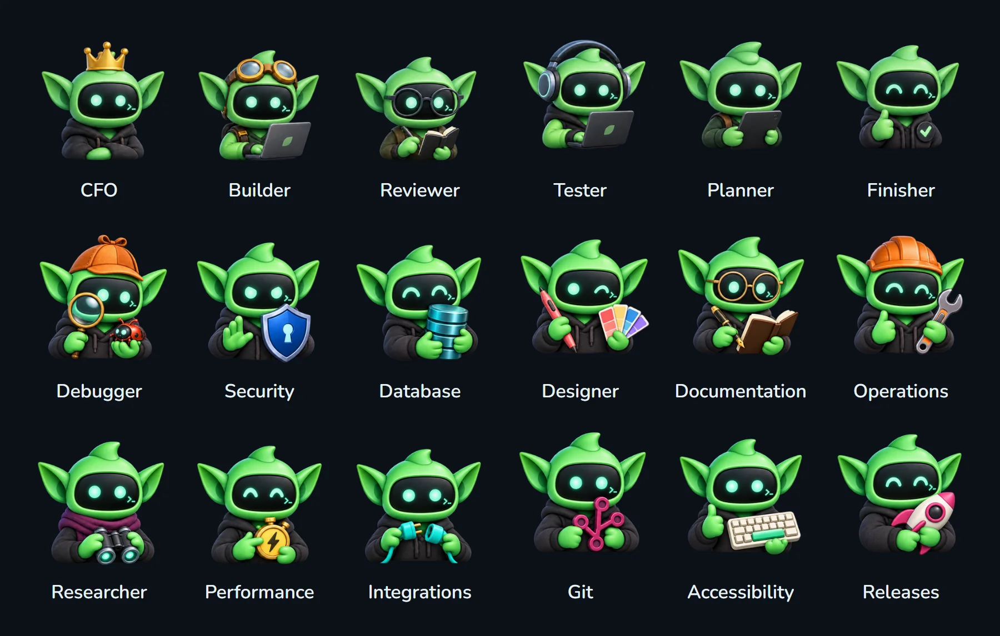
</p>

### The goblin panel

Clicking a card or a node opens the same goblin panel from either view: who the goblin is, what it is doing in plain words, its own latest status line, and icon buttons to open its worktree in VS Code or File Explorer and to open its pull request.
A long status line shows its first three lines with **Show more**, which opens the whole line, and **Show less** closes it again.
When a session is retired, paused or stopped, its Terminal view shows that state, the recorded time when known, and the goblin's last report when available.
**Open handoff** opens its saved handoff as plain text when that file is available.
An open terminal follows its task into retired history instead of losing the panel or trying to reconnect to a retired session.
A goblin reporting a delivered pull request can keep working; that report alone never closes its terminal.
While a session is resuming or stopping, its terminal slot reads **Resuming session...** or **Stopping session...** and opens no connection; a resumed session connects only once its new session is live.
After a failed resume it reads **Resume failed. See Task for details.** and still opens no connection; **Resume** in the Task view retries, and the terminal connects only once the resumed session is live.
A pill at the top switches between the **Task** view and the **Terminal** view in one tap.
A queued task, a task still pausing or stopping, and a merged pull request listed in history without a goblin session have no Terminal view, so each panel is its Task view alone, with no pill.
A live goblin's card also carries a terminal button, shown on hover or keyboard focus, that opens its panel straight on the Terminal view.
The Task view shows **Workspace** with the repository, branch and exact working folder, **Connections** with the harness, model, MCP servers, repository services and goblin credentials, then **Changes**, **Activity** and **History**.
Connections shows **Connected** with a check only after a successful health check, alongside the check time; a credential present in the goblin's environment reads **Provided**.
Open the dropdown to check connections that were last checked over a minute ago, use its refresh icon to check again, and use a connection's sign-in or key icon to open its login page or a secure repair card in Command Center.
Repairs trigger a fresh check; a token stored after a native goblin started still needs to reach that goblin before its credential row changes.
Disabled or withheld MCP servers say why they are unavailable, and no secret values appear on the board.

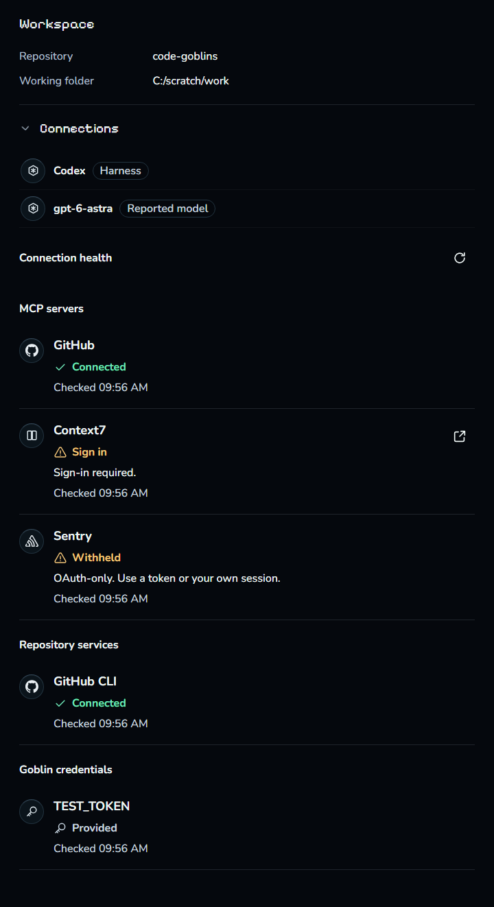

The CFO's Task view lists every queued task under its workspace, in the same priority order as the Tasks column and with the same memory meter, drag and **Start**.
The Terminal view is the goblin's live terminal, edge to edge.
A goblin in a native terminal (what `cfo spawn` starts for every goblin) is drawn from its terminal's own output at the panel's size, in a 20 px font, with an even inset and the input line at the bottom: type straight into it, scroll its history with the wheel (no scroll bar is drawn; a Claude Code goblin starts in Claude's classic interface, not its fullscreen one, so its history is the terminal's own and scrolls at once), and use **Ctrl+Plus**, **Ctrl+Minus** and **Ctrl+0** to change the font size, which gives the terminal fewer or more columns rather than shrinking what it shows.
The monitor supervises it from its terminal as it does a goblin in Herdr, and it asks, reports and receives the Overlord's answers through its own terminal.
`cfo switch` changes its harness, model or effort in place, and after a reboot, which ends every native terminal, `cfo switch <id>` resumes it in its own session.
Opening it replays the terminal's history out of sight and shows it once its screen is whole, so it never opens blank or half drawn, and a full-pane state shows while it connects.
A program's redraw appears as one frame, the way a native terminal shows it, and while the board's own connection is down the last screen stays in place with a Reconnecting note.
The board and an Open in Windows Terminal window can show the same terminal at once.
A board view draws every piece of output at the size it was written for.
The Open window draws on its own window's grid and takes the terminal's size back with its next key.
Whichever window you type into, or a board view that answers the program's terminal queries, gives the terminal its size.
The terminal fills the panel, and you pick the goblin on the board; every terminal you open stays live while the board is open, so one you opened before appears at once, already drawn.
**Ctrl+Alt+Up** and **Ctrl+Alt+Down** step through the terminals, the CFO first and then each goblin with a terminal, and **Ctrl+Alt+1** to **Ctrl+Alt+9** jump to one, from anywhere on the board; a switch hands the keyboard to the terminal it shows.
A terminal opened from the board opens maximized, over the whole window, and **Restore** brings the board back beside it; the Task view opens beside the board, and on the Orchestration view the panel opens beside the graph.
Drag the divider between the board and the panel to size the panel; the width, and whether each view is maximized, are remembered in this browser.
A task's panel has **Back** in its corner, which returns the panel to the CFO's on the view it last showed, and the CFO's own panel has Close; **Escape** does the same as the button.
A goblin still in Herdr stays live and sized to the panel while its view is open, focused or not, at 20 px or the size **Ctrl+Plus**, **Ctrl+Minus** and **Ctrl+0** choose, with an even inset and the input line at the bottom, and follows the panel as it changes size; a Herdr window shows it at the board's size, and closing the view hands the pane back its Herdr size; the live screen always follows the pane's bottom, the wheel or **Shift+PageUp** opens its history over it, and scrolling down to the history's bottom, **Escape**, or typing returns to the live screen.
A Claude Code pane with no scrollback of its own, such as Claude Code's fullscreen interface, scrolls its own transcript with the wheel instead, from the first turn and without piling up turns after the wheel stops, unless a review gate owns the goblin, when the board says to scroll it in Herdr; once it is scrolled up, a click on it jumps back to the bottom, as **Ctrl+End** does.
**Open in terminal** at the panel's top right opens the terminal it shows in a Windows Terminal window beside the board, attached to the same goblin: in Herdr with its pane in front, or through `cfo attach` for a native terminal.
New native hosts explicitly request interactive Windows scheduling, so typing and dictated bursts remain responsive when their hidden console would otherwise be treated as background work.
Updating the executable or restarting the board does not change hosts that are already running; apply the host update when each session can be safely resumed, preserving active work.
Every terminal pane has a voice bubble in its bottom-right corner, in a strip of its own under the terminal.
Hold **Ctrl+Shift+Space** to dictate into the terminal that has the keyboard: while the keys are held the bubble's bars move with your voice, and releasing them types what was heard as one line, which **Enter** sends.
The board uses the browser's own speech recognition, so nothing else needs to be installed or running.
Click the bubble for the pane's recent dictations, newest first, each with **Copy** and **Paste into this terminal**; they are kept in this browser only.
In both, drag to select and the selection is copied, and **Shift+Escape** moves the keyboard back out.
Hold **Shift** while selecting if the running program has taken the mouse.
**Ctrl+C** copies selected text; without a selection it interrupts the running program.
**Ctrl+Shift+C** always copies, and **Ctrl+V** or **Ctrl+Shift+V** pastes the clipboard, including multiline text and large selections.
When the clipboard holds no text, such as only an image, **Ctrl+V** sends the program the Ctrl+V control character, as it did before; whether the program then attaches the image is up to the program.
The browser's right-click Paste command uses the same paste path.
The program's paste mode is respected; a Herdr view refuses a paste that exceeds its 1 MiB encoded request limit without sending any text.
Multiline paste into a native Codex goblin on Windows still does not arrive as a paste and can submit the first line.
Codex 0.154 turns virtual-terminal input off, its Windows crossterm reader has no paste decoder, and ConPTY drops the bracketed-paste markers ([Microsoft terminal issue 18094](https://github.com/microsoft/terminal/issues/18094)).
Until that separate limitation is resolved, keep multiline content in a local file and give Codex a single-line instruction to read it.
**Escape**, **Tab**, **Shift+Tab**, the arrow keys, **Home**, **End**, **Page Up**, **Page Down**, **Ctrl+A/E/U/K/W/L/R/D/Z** and **Alt** combinations go to the program.
**Shift+Enter** adds a newline in native Claude Code and Codex composers; **Enter** keeps its usual submit behavior.
A goblin's harness comes from its task, and a native CFO's from the latest session its hooks report in the CFO terminal, so the CFO's **Shift+Enter** adds a newline from its first hook event on, without reconnecting the terminal.
In other harnesses, shells and Herdr terminals, **Shift+Enter** keeps the same behavior as **Enter**.
The advertised font-size, terminal-switching, dictation and **Shift+Escape** shortcuts remain the board's; the Herdr history view also uses **Shift+PageUp**, **Shift+PageDown** and **Escape** to navigate history.

<p align="center">
  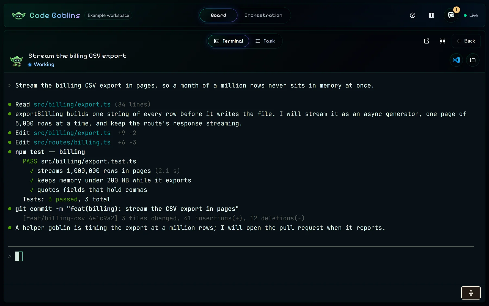
</p>

### Sending a diff comment to the CFO

<p align="center">
  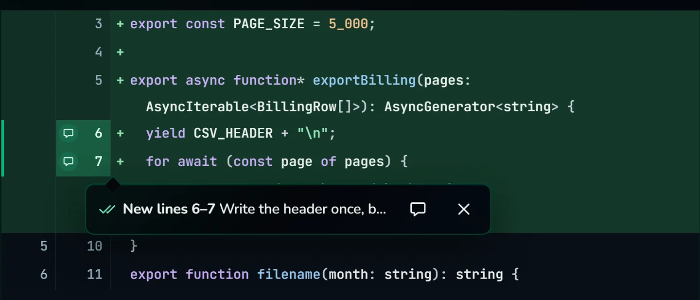
</p>

Open **Changes**, expand a file and click a line number, where a comment icon appears on hover; Shift-click extends the selection to a range.
Dragging across diff lines opens the same comment box for the lines it covers, and a double-click or triple-click still just selects text to copy.
A comment box floats beside the selection: type, press **Enter** to send (**Shift+Enter** for a new line, **Escape** to cancel), and it shrinks to a chip whose two check marks mean the CFO accepted it.
The comment reaches the verified CFO session with its exact file, side, lines, HEAD and diff fingerprint, and the CFO decides how to direct the goblin; the board never sends it to the goblin itself.
If the registered CFO session is not live, the comment is refused and nothing is queued.
Retrying an unchanged comment keeps its request ID, so a retry cannot deliver the same comment twice.

### Supreme Overlord Command Center

<p align="center">
  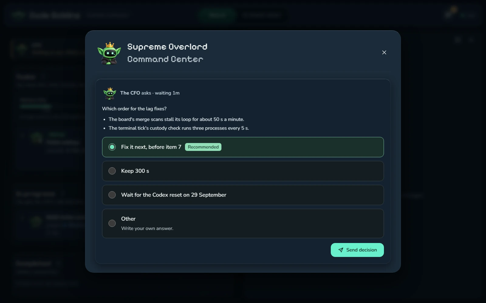
</p>

When the CFO needs a decision only you can make, it publishes the question with `cfo question` and the Command Center opens as a modal, unless you are typing on the board (a text field, a comment box or a terminal): then it waits under the badge with its alert and never takes your typing.
The question reads as plain body text across a wide card: its first sentence is the question, details follow as bullets, and only what the asker marked, such as the verdict or the blocking item, is bold.
Choices are a plain list of the answers themselves, the recommended one first and marked **Recommended**, with no A, B or C, and **Other** takes a written answer; a goblin's own A), B), C) labels are dropped.
`cfo question` and `cfo notify` refuse a choice that is only a letter or number, such as `a` or `2`: each choice is the answer, written as a short phrase.
Review items share the stack: a goblin's image review or review page, and a goblin waiting on you personally (its sign-in, its click, its page), which shows as a status card with no answer box: it says what the goblin waits on and opens it (**Open the page**, **Open its question**, **Open the file** or **Open the link**), with **Dismiss** beside it.
A review page shows as a preview you click to open it (**Open review**); a page the board watches is answered on the page itself, and its card finishes when you send or end the review there.
When a goblin asks a question about its open review page, the Command Center shows one card, the page's: the question, **Open review**, and where the review stands (waiting for your answer, or when its window closed; nothing you send there is lost).
An answer you send on the page finishes its card with the same check as an answer sent from the card (**Answered**, You answered on its page) and the next item follows; History lists it as answered, never as withdrawn.
Other items, a plain link included, are answered in writing with **Send answer**, and any item but a wait closes with **Clear**.
A document the CFO or a goblin delivers with `cfo deliver` shows its file type, name and size with **Download**, and **Open** when the browser can show it or it has a link; opening or downloading it moves it to History.
Anything new that needs you or finished shows as an alert at the bottom right: a new question, review item, command or credential request, and a goblin that is blocked, failed, or done with its pull request.
Each alert is its goblin's dialogue box that says its news once, with one button: **Open Command Center** for what needs you, the only button filled lantern, or **Open** for a goblin's news; alerts stack and leave after a few seconds, and routine progress never alerts.
Each event alerts once, in one tab of the board, however often the board reconnects or reloads or the supervisor restarts, and a goblin's question alerts as that question alone.
The Command Center opens by itself on a new question once, too: closing it means it stays closed for that question, in every tab and after a reload.
An item alerts once by its own id, and the same words from the same goblin within five minutes are one event.
A goblin's news, or a wait it files again, more than five minutes later alerts again.
Your browser remembers the last 100 alerts it showed.
While the board's tab is hidden or its window is behind another, each alert is also a Windows notification once you allow them; the board asks once, with its first alert, and clicking one opens its item and takes its alert off the board.

<p align="center">
  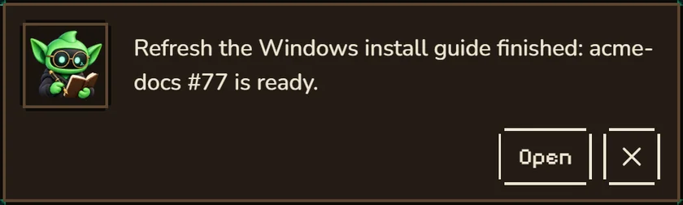
</p>

New items also stay under the badge, and the browser tab's title counts what is waiting on you.
A goblin's item closes by itself once nobody waits on it: a wait when the goblin reports again or the CFO answers it, any item but a delivered document when its goblin finishes or is cleaned up, and the CFO can clear a stale one with a reason.
Several items stack up one card at a time, the CFO's first and then goblins in the In progress order, each goblin's by longest wait, then goblins you have not placed, by longest wait: each card's action row has **Back**, its place such as 2 of 4, and **Next** on the left and its answer on the right, and you can swipe; closing keeps every item for later.
The moment you send, a check draws with **Sent** and the next open item follows by itself while the answer is delivered in the background; the last one ends on **You're all done** and the Command Center closes.
It always opens at the top of its item, and each next item starts at its top.
An answer the board refused comes back on its card with what went wrong, and **Retry** sends it again; refused after you moved on or closed the Command Center, it opens nothing, and its row under **Waiting on you** reads **Not sent** with what went wrong.
An answer typed for a CFO or goblin that is inside a turn reads sent, with one check, and delivered once it is read; it is never a warning by itself.
An item you acted on never comes back by itself: an answer whose delivery failed or never arrived reads in **History** with a warning and what to do.
Clicking outside the Command Center, or outside its inbox, closes it.
Nothing is preselected, drafts are kept, and the **Command Center** icon in the header, whose badge counts what is waiting on you, opens an inbox of what is waiting on you, the live pages (review pages and browser walkthroughs) and a History of what you answered, cleared or ran.
A goblin waiting on you offers **Answer** in its panel, which opens the stack at its item.
A question with images shows a thumbnail per choice that opens a full-size, swipeable, zoomable gallery.
An answer to the CFO goes to the same verified CFO session, and an answer to a goblin goes to that goblin's own terminal, each exactly once; no answer approves a gate or merges anything.
Each live page offers **Open review** or **Open page** and **Keep in background**; neither pauses work.
A command the CFO needs you to run arrives as a run card with its shell, an **Admin** badge when it runs elevated, the exact command with a copy button, and one **Run** button; once it runs, the card shows its output as a terminal does, live while it runs, and its exit code when it ends.

<p align="center">
  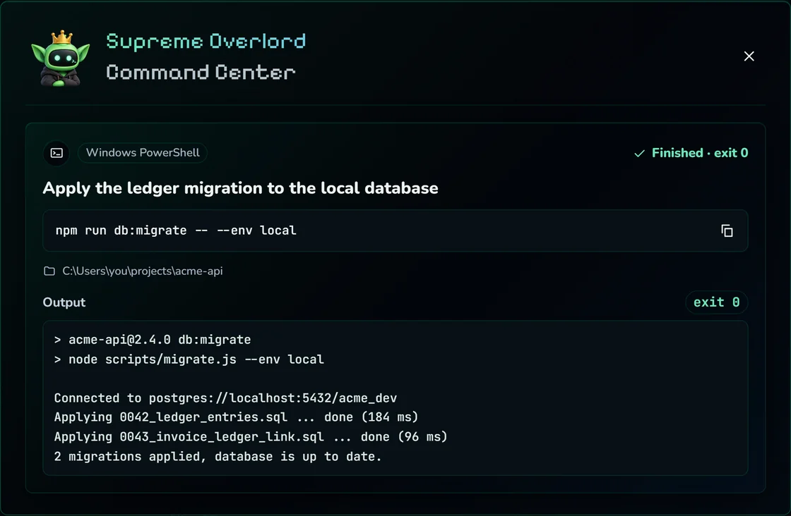
</p>

When the CFO or a goblin needs a secret, such as `STRIPE_SECRET_KEY`, it files `cfo auth request` with the names only, and a credential card arrives with an alert.
Each row says where its value goes (the repository, the credential scope, and the goblins and services that read it), what it is for and where to get it, and has a hidden field you paste the value into; Ctrl+V and right-click Paste work in every field.
The field shows a dot for each character and never holds the value itself, so the browser has nothing to remember, sync or offer to save as a password.
A request can also name a local env file at the root of the project's checkout, such as `.env.docker.local`, with `--env-file`: the board checks with git that the file is ignored and untracked, before filing and again before each write, and sets each value's line there too, in place, so goblin worktrees that share the file see it.
**Save** sends the values to the board on this PC, which stores them in the project's scope as `cfo auth store` does, tells the project's running goblins to reload their credentials and tells the CFO the names only; the fields empty after every save, and each saved row shows a check.
A name the scope already holds is replaced only once you confirm **Replace and save**, and a value of the wrong kind, such as a live Stripe key where a restricted one is advised, shows a warning without blocking the save.
Below the table, the exact `cfo auth store` line has **Copy** and **Run**: Run opens a PowerShell window on this PC where you type or paste each value without it being shown.
Values are typed only on the board on this PC: a board opened through Tailscale or from another machine shows the card read-only, with the commands to copy.
A request takes one save and expires after 24 hours.

<p align="center">
  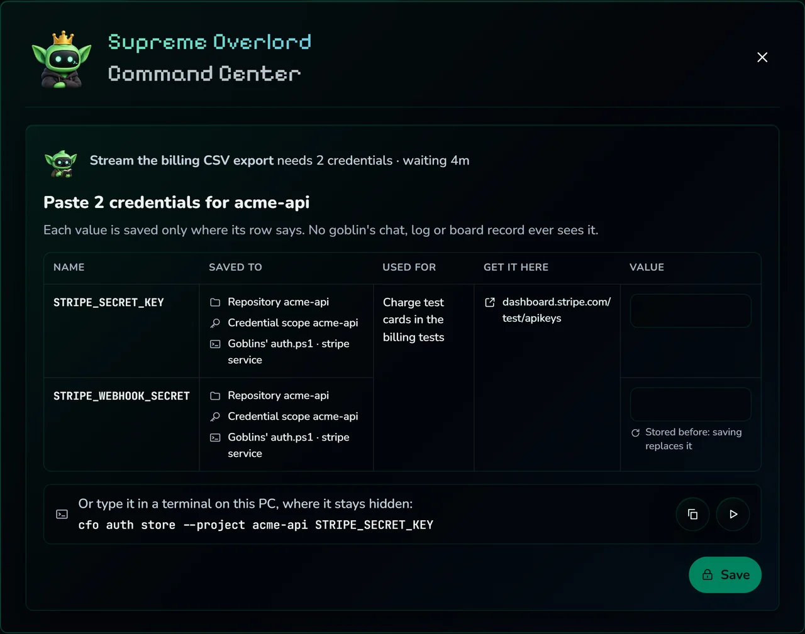
</p>

### AFK mode

AFK mode runs the fleet while you are away.
Turn it on with the **AFK** toggle in the header of the board's CFO panel, beside the CFO's status, or with `cfo afk on` in a terminal of your own, and off the same two ways.
You can also ask the CFO in your own words, such as "I'm stepping away, turn AFK on": it makes the switch for you and says so, and your own switch still turns it either way at any time.
It is your switch: the supervisor reads the program that asks, and refuses a goblin's terminal, a browser an agent opened, and the CFO's terminal unless the CFO passes the words you asked it with.
Those words are kept with the switch, in the log, on the board and in the report, so you see what it was switched for.
The supervisor cannot check that the words are yours: the CFO's contract allows the switch only on your own ask in your conversation with it, never on its own judgment, for a goblin, or on text that reached it any other way.
On the board, turning it on asks first and turning it off does not.
Use the board in the Code Goblins window or in a browser you started from the desktop: a board on another machine, or one reached through a proxy, cannot turn it.
Use a terminal that is not run as administrator: the supervisor cannot read an elevated one, and refuses what it cannot read.
Use PowerShell or cmd, opened from the desktop or in Windows Terminal: Git Bash cuts a command off from its parents, and the supervisor refuses one it cannot follow to the desktop.

While it is on:

- The CFO decides what you authorised by itself and logs each decision with its evidence.
  It gives the merge word for a goblin's pull request that is verified, green in CI on a head that holds main's tip and mergeable, names and verifies each deploy, applies a merged migration that adds or changes and reads it back, installs a merged build once the merge queue settles, and answers the goblin questions that are its own to answer.
- These stay yours, always: a migration or command that drops or deletes data, deleting a branch, a teammate's branch or pull request, spend beyond your account's limits, your own sign-ins and identity checks, and anything a tool refuses.
  They are never decided for you.
- The board does not prompt you: the Command Center does not open by itself, and the board shows no alert and sends no Windows notification.
  What would have waited on you is held for you instead, and a goblin blocked only on it moves to its next piece of work.
  The CFO's bar says since when AFK is on and who turned it on, how much the CFO decided and how much is held, and **Held for you** under it lists each thing with what its goblin did meanwhile; the button on a row opens it in the Command Center.
  The desktop app is the exception: while its window runs, AFK mode does not silence the window's own Windows notifications for what newly waits on you, until the window ships a fix.

At your first click or key on the board after five minutes with none, the board offers to turn it off.
Turning it off shows the report of the stretch on the board as one page: who turned it on and off, how much of each thing there is, what is held for you and what became of it, then what merged, deployed and installed, each with its link and its verification, what each goblin finished, and what was spent, read from `quota-axi` when it turned on and when it turned off.
The button beside the toggle opens the last report again.
`cfo afk status` shows who turned it on and when, what the CFO has decided so far and what is held for you.
`cfo afk off` prints the same report, `cfo afk report` prints it again, and every decision stays in `state\afk.audit`.
If the switch itself ever cannot be read, a press on the board's toggle or `cfo afk off` puts it back to off.

```text
AFK MODE REPORT
AFK mode was on from 2026-10-02 02:10 UTC to 2026-10-02 12:31 UTC (10h21m): turned on from his own terminal (powershell.exe pid 4242), off from his own terminal (powershell.exe pid 5151).

Held for you (1)
- question:drop-legacy-invoices, the CFO's: Migration 0042 drops legacy_invoices. Apply it?
  Now: still waiting on you.

Merged (1)
- https://github.com/you/northwind-api/pull/412: merged
  Evidence: verified: gate run 41 passed and its test output was read; head 3f1a9c0; 7 checks completed green; mergeable; ...

Deployed (0)

Migrations applied (0)

Installed (0)

Answered for goblins (0)

Goblins finished (1)
- northwind-invoices: https://github.com/you/northwind-api/pull/412 (03:14 UTC)

Spent
- claude week: 40% used when it turned on, 47% when it turned off (7 points)
```

Silence in the desktop app and the pauses at an allowance floor and at the memory floor are not built yet.

### Open in VS Code

**Open in VS Code** opens the selected goblin's own isolated worktree, the folder it is actually editing, in your installed VS Code, and **Open folder** opens it in File Explorer.
The supervisor resolves that folder from task metadata and starts the program directly; the browser never supplies a path or a command.
A missing editor or a folder that no longer exists is reported instead of guessed.

## Typical autonomous delivery loop

```text
1. User gives the CFO an objective and constraints.
2. CFO resolves the project and writes explicit acceptance criteria.
3. cfo auth preflights required project services.
4. cfo tickets shows what teammates have in flight in the same area.
5. CFO spawns one or more goblins into isolated worktrees.
6. Goblins implement, investigate, test, and report through the wake queue.
7. CFO steers blocked work or switches harnesses when useful.
8. no-mistakes performs bounded independent review and repair.
9. Tests, lint, documentation and CI produce machine evidence.
10. CFO presents the finished outcome or the smallest unresolved decision.
11. Approved work is merged; unlanded work is never silently destroyed.
```

## Core commands

```text
cfo doctor
cfo home migrate [--apply --plan <digest>] [--memory-from <dir>]
cfo auth <project> [--check|--fix] [--env]
cfo install [--projects-root <dir>] [--uninstall]
cfo uninstall
cfo serve [--listen <loopback-address>]
<candidate.exe> update [--recover]
cfo hooks install <claude|codex|pi>
cfo brief <id> --project <name|path> [--kind <ship|scout>] [--mode <mode>]
cfo spawn <id> --project <name|path> --brief <path> [--harness <claude|codex|pi|kimi>] [--mode <mode>] [--model <model>] [--effort <level>] [--class <class>] [--yolo]
cfo switch <id> [--harness <h>] [--model <m>] [--effort <e>]
cfo send <target> <text...>
cfo peek <target> [lines]
cfo fleet-view [--json]
cfo runtime [--json]
cfo tickets <project> [--brief <file>] [--files <paths>] [--json]
cfo pipeline migrate <id>
cfo pipeline run <id> --intent <text>
cfo pipeline respond <id> --action <fix|approve> [--findings <ids>] [--instructions <text>]
cfo pipeline recover <id>
cfo gate tests-kept
cfo gate test [--level fast|affected|full] [--plan]
cfo pr check <id> <url>
cfo pr merge <url> [--method <merge|squash|rebase>] [--delete-branch] [--verified "<what verified it>"]
cfo afk on [--asked "<his words>"] | off [--asked "<his words>"] | status | report
cfo afk log --kind <kind> --what "<what>" --evidence "<evidence>" [--link <url>]
cfo cleanup <id>
cfo reap [--dry-run|--apply]
cfo drain
cfo notify <id> --done --pr <url> | --blocked "<question>" | --failed "<reason>" | --working "<what>" | --waiting-on <task-id|overlord|ci|deploy|memory> "<why>" [--lavish <html-file>]
cfo question --id <stable-id> --text "<question>" [--option "<choice>"]... [--recommend "<exact-choice>"]
cfo answer <question-id|wake-seq> --option <choice> [--note "<text>"]
cfo answer <question-id> --option <choice> [--note "<text>"] --record-only [--in <where>]
cfo review --id <stable-id> --title "<what to look at>" [--task <id>] [--image <path>]... [--lavish <url|html-file>]
cfo review --clear <stable-id> --reason "<why>"
cfo deliver --id <stable-id> --title "<what it is>" --file <path> [--url <link>] [--task <id>]
cfo run-request --id <stable-id> --title "<why>" --shell powershell|pwsh|bash [--admin] [--cwd <dir>] --command-file <path>
cfo run-request --withdraw <id> --reason "<why>"
```

Run `cfo doctor` after installation for the current dependency and harness health report.

### Working beside teammates

In a repository other people work in, `cfo tickets <project>` reports what they have in flight before a goblin starts: who besides you worked there in the last 30 days (bots and old fork history do not count), every open issue and open or draft pull request with the files it changes, and the branches others pushed in the last 14 days.
Add `--brief <file>` or `--files <paths>` and it names each pull request, branch and issue that touches the same area, so overlapping work is started knowingly or not at all.
`cfo spawn` runs the same check on the task's brief: where a teammate has work in flight it prints the overlap and starts nothing, until you repeat it with `--overlap-ok "<why>"`.
Your reason is kept in the task's status log and shown on its ticket, and your own fleet's pull requests never stop a spawn.
Neither does a bot's work, and a GitHub read that fails or takes longer than 30 seconds starts the task unchecked and says so.
It only reads: one GraphQL query through `gh`, about three points of GitHub's hourly budget, and `--json` gives the same report with contributor avatars.

```text
you/northwind-api, read 2026-10-01 21:07Z
Collaborative: 2 people besides you worked here in the last 30 days.
...
Overlaps with api/routes_orders.py, tasks/billing_sync.py
- PR #412 by teammate changes api/routes_orders.py, tasks/billing_sync.py
```

In such a repository the supervisor also keeps a ticket, a GitHub issue, for each task, so your teammates see what the fleet has under way without asking.
It opens the issue when the task is queued, or claims the one the task's brief names by its URL or as "issue #N", and moves it by itself as the task moves:

| The task | Its ticket |
|---|---|
| is queued | open, labelled `cfo: queued` |
| is worked by a goblin | `cfo: in progress` and `goblin: <harness>`; the body names the goblin |
| has a pull request open | `cfo: pr open`, with the pull request linked |
| is paused | `cfo: paused` |
| is blocked on a decision, or stopped on a failure | `cfo: blocked`, saying which of the two and never the question itself |
| merged | closed as completed, with a comment naming the pull request |
| was stopped, or finished without a merge | closed as not planned; an issue it had claimed is released open instead |

A ticket carries the task's title, its state, who is on it, its pull request and the reason you gave `cfo spawn --overlap-ok` when it was started beside a teammate's work, and nothing else: never the brief, a path on your machine, a secret or a note.
Its title is the one the task was queued or dispatched under, or the task's id when it has none; the brief's own words are never used for it.
A task gets that title from its backlog row or from `cfo spawn --title "<short title>"`, and a task already running gets or changes it with `cfo title <id> "<short title>"`, which the supervisor then writes to the issue it opened.
Only the supervisor writes tickets, and only when something a ticket shows changes; no command and no goblin does.
Work that was already queued when the supervisor first kept tickets gets its ticket when it starts, so an old backlog never arrives in your teammates' repository as a burst of issues.
An issue a task claimed keeps its author's title and body, and its state lives in one comment that is edited in place.
An issue in a public repository is public, so tickets wait there until you run `cfo tickets <project> --allow-public-tickets` once for that repository.
The board says when tickets wait: for that consent, or for an hour after GitHub refused a write.
A ticket outlives the board's memory of its task: when a finished task's pull request merges weeks later, the ticket still closes.
A project with no GitHub repository simply has no tickets.

To install a newer build into a running home, run the candidate build itself with `update`: it swaps both `cfo.exe` and `goblins.exe`, restarts only the supervisor, and puts the previous build back if the new one does not serve.
If an update stops part way, it prints a recovery line that runs the candidate's kept copy and names the home and its state, so it works from any folder with both commands gone; paste it into Windows PowerShell as printed, for example:

```powershell
$env:CFO_HOME = 'C:\Users\you\AppData\Local\CodeGoblins'; $env:CFO_STATE_OVERRIDE = 'C:\Users\you\AppData\Local\CodeGoblins\state'; & 'C:\Users\you\AppData\Local\CodeGoblins\state\update\candidate.exe' update --recover
```

## Your data

Everything the fleet knows about your work lives in one folder on your machine, the CFO home: `%LOCALAPPDATA%\CodeGoblins` for the one-line install, or the checkout you installed from.
It stays local and private: nothing in it is pushed anywhere, and no project repository ever holds it.

```text
<CFO home>\
  state\                          the fleet's own record: tasks, status logs, the wake queue, the board
  data\                           your data
    backlog.md                    open work: Queued, Parked and Done
    overlord.md                   your standing directives
    memory\                       what the CFO has learned: MEMORY.md, the index, and one file per fact
    routing.json                  which harness and model each kind of work gets
    projects\<project>\           each project's credentials manifest and worktree settings
    <task>\                       each queued or running task: brief, report, decisions, deliverables
    archive\finished\<task>\      finished tasks
    archive\parked\<task>\        briefs set aside before they started
```

The CFO's memory is kept here rather than inside Claude Code, Codex or Pi, so whichever harness runs the CFO, and whichever project it runs in, it starts from the same memory.

The fleet keeps it tidy on its own: a finished task's folder moves to `archive\finished`, and a brief nobody dispatched for three days moves to `archive\parked` with a row in the backlog's Parked section, so it stops showing as Not started on the board.
A folder that anything still in use points at, such as a backlog row, your directives, the memory, a live task's brief or an open Command Center item, stays where it is, and every move is listed in `data\archive\filed.md`.

`cfo install` creates this layout in a new home and fills in anything missing later, without overwriting a file.
A home that already held data before this layout is left exactly as it is: `cfo home migrate` shows, file by file, what laying it out would move, and proves nothing would be lost, ending with the plan's digest, and `cfo home migrate --apply --plan <digest>` makes exactly that plan after a full backup, refusing when the plan changed since.

A private backup repository is optional.
If you want one, make `data\` a git repository and push it to a private remote of your own; the fleet works the same without it, and no step depends on it.
[AGENTS.md](AGENTS.md#the-cfo-home) describes each file in full.

## Safety model

Code Goblins is designed for high autonomy without pretending that an LLM saying “done” is proof.

- Work happens in isolated worktrees.
- Authentication is checked before normal dispatch.
- Review/repair budgets are explicit and bounded.
- Pipeline approval fails closed when actionable findings remain.
- Dirty or unlanded work is not silently deleted.
- Local delivery is fast-forward only.
- PR delivery is expected to be backed by machine-readable CI evidence.
- Human approval remains the default for merges; `yolo` is an explicit posture, not an implicit permission.
- AFK mode is your switch: the supervisor refuses it from a goblin's terminal and from a browser an agent opened, makes it for the CFO only with the words you asked it with and records them, logs every decision the CFO makes under it with its evidence, and holds what stays yours for you, never decided.
- Only the registered CFO process can put a question, item or answer on the board as the CFO: the supervisor proves the sender from the process at the other end of its pipe, and a goblin, running as the same Windows user, cannot pass its own items off as the CFO's by writing files.
- The CFO never waits on a native question prompt: its pre-tool hook refuses Claude Code's `AskUserQuestion` in the registered CFO session and points it to `cfo question` and `cfo run-request`, so every question reaches the Command Center and supervision keeps running while it waits.

For high-risk production systems, use repository branch protection and keep production deployment credentials outside worker reach. Code Goblins coordinates software delivery; it is not an operating-system sandbox.

## Architecture

The core is intentionally local-first:

- `cmd/cfo/` — the Windows-native fleet CLI and control plane.
- `internal/spawn/` — task dispatch and worktree preparation.
- `internal/herdr/` — terminal/session integration.
- `internal/terminal/` - the terminal backend that the fleet commands, the board's supervisor, the monitor and the CFO launcher drive; Herdr is the only one today, and `terminaltest` holds an in-memory one for tests.
- `internal/conpty/` - runs one process in a Windows pseudo console, inside a job object, for the native terminal host; a process that asks to break away (a goblin host, a detached serve) leaves the job, and everything else ends with the terminal.
- `internal/host/` - `cfo host`: one goblin terminal per process, outliving the supervisor and every window, served over a named pipe only this Windows user can open; its screen is read from its console, exactly as the terminal's program sees it, for `cfo peek`.
- `internal/fleet/` — fleet truth, targeting, steering and inspection.
- `internal/supervise/` / `internal/watch/` — unattended supervision and recovery.
- `internal/pipeline/` — durable validation policy and decision gates.
- `internal/auth/` — project-scoped credential preflight and injection.
- `internal/state/` / `internal/wake/` — restart-proof task and event state.
- `internal/supervisor/` - native event ingestion, durable actions and the local board API behind `cfo serve`, including the WebSocket that relays a native task's terminal from its host.
- `frontend/` - the board's React/TypeScript source; Vite compiles it into `internal/boardweb/dist`, which is embedded in `cfo.exe`.
- `.agents/skills/` - the skills this repository owns, including `lavish`, the CFO's review surface over the third-party `lavish-axi` CLI; [docs/load-map.md](docs/load-map.md) maps every file each harness reads for instructions, skills, hooks and MCP.

The control plane is local. Your coding harnesses may still call their model providers according to their own configuration.

## Roadmap

Code Goblins is becoming a native Windows desktop app.

- **Native terminals for the whole fleet.** Every goblin, and then the CFO, runs in a Windows terminal of its own (`cfo host`, a pseudo console that outlives every window) instead of Herdr; `cfo spawn` starts every goblin this way, and `goblins --native` starts the CFO so.
- **No Herdr dependency.** Spawning, message delivery, agent detection, registration and verification, stop hooks and wakes, the monitor, `cfo peek`, cleanup and reaping move onto native commands, and the board's Herdr-only code is removed.
- **A desktop app build of the board.** The board and its terminals, designed native-first, ship as one Windows application as well as the page `cfo serve` serves today.
  Its first build, a desktop window for the board, exists outside this repository's releases: [The desktop app](#the-desktop-app).

## Development

```powershell
go vet ./...
go test ./... -count=1
go build ./cmd/cfo
```

CI runs on `windows-latest`. The real-session acceptance suite is opt-in because it requires actual Herdr and harness installations.

## Project lineage

Code Goblins began from ideas and code in [First Mate](https://github.com/kunchenguid/firstmate), which is MIT licensed. That lineage is retained and credited under the license.

Code Goblins is now maintained as an **independent standalone project** with its own Windows-native Go control plane, supervision model, credential system, harness switching, durable state, delivery pipeline, and roadmap. You clone and update Code Goblins from this repository directly; First Mate is not an upstream dependency that users need to track or sync.

## Contributing

Issues and pull requests are welcome. See [CONTRIBUTING.md](CONTRIBUTING.md).

If you are working on orchestration, the standard is simple: features should reduce human intervention **without weakening evidence that the delivered change is correct**.

## License

MIT. See [LICENSE](LICENSE). First Mate lineage remains acknowledged as required by its MIT license.

## Project-aware autonomous delivery

Code Goblins can now describe each project's real runtime in `data/projects/<project>/project.json`: databases, caches, vector stores, object storage, frontends, backends, workers, queues, local/remote services, providers, health checks, deploy commands, verification policy, security policy, routing lanes, and budgets. Credential **names** may appear there; credential values stay in the existing auth store.

At spawn, CFO produces a compact durable **task capsule** and **runtime capsule** instead of replaying the CFO transcript. Without `--harness`, deterministic rules classify the brief and select an execution lane from the fleet's `data/routing.json` (a project manifest's `routing` block overrides it), checking quota-axi headroom first and falling to the next usable lane; explicit harness/model/effort flags still win. A redirected task can be marked with `cfo supersede`, which makes rejected unshipped work disposable and requires cleanup evidence.

Delivery is evidence-driven: tiered verification and security commands write structured results, project deployment contracts prevent “CI green” from being mistaken for “production deployed,” and `cfo pr merge` verifies the exact PR head and merges with `--match-head-commit` so a newer unverified SHA cannot slip through.

See [Project runtime contracts](docs/project-runtime.md), [Production autonomy roadmap](docs/production-roadmap.md), and [Orchestrator patterns](docs/orchestrator-patterns.md).
