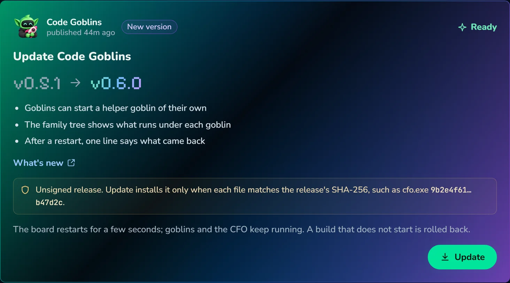
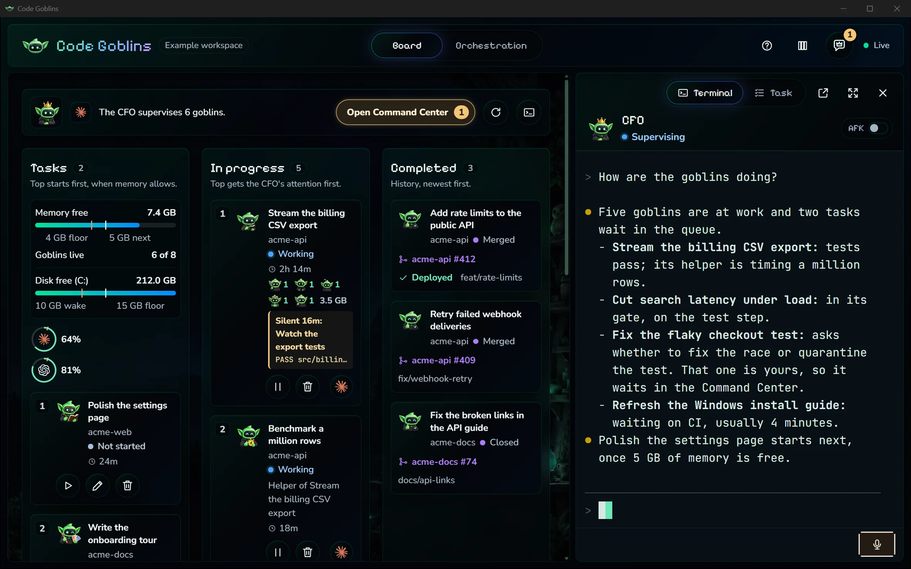
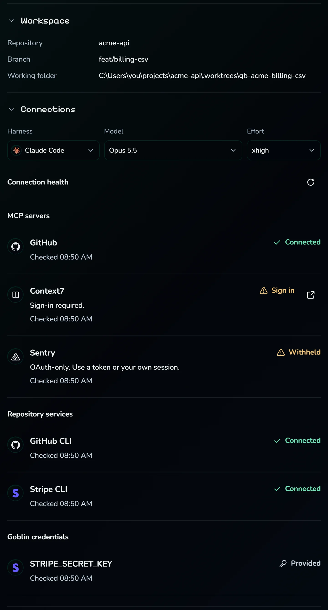
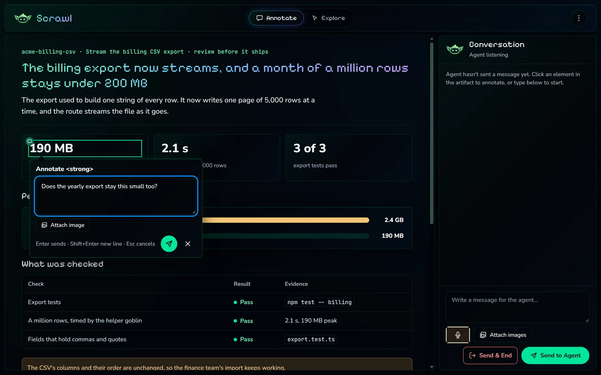
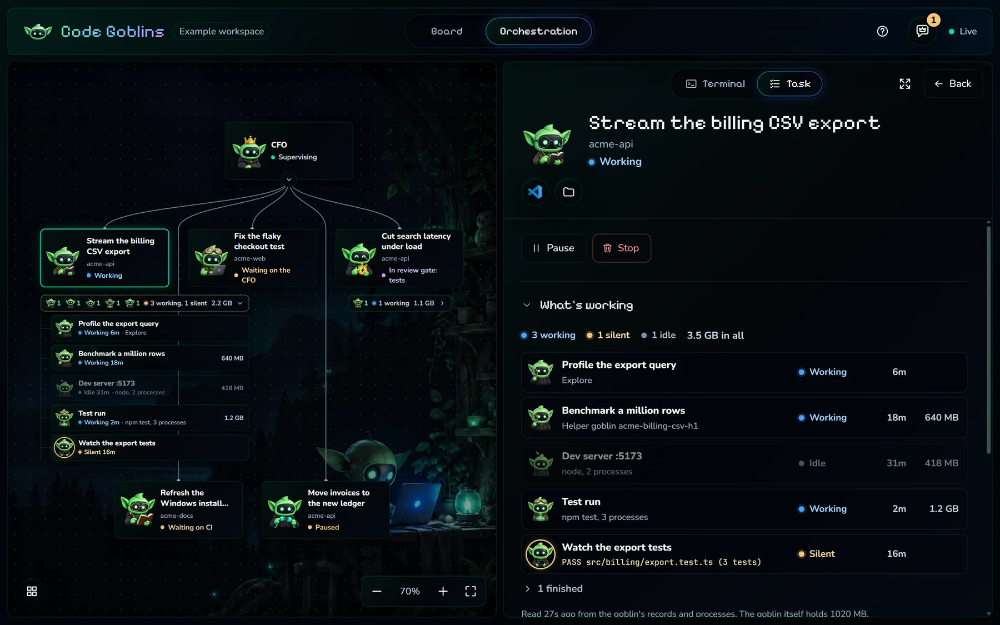

<h1 align="center">Code Goblins</h1>

<p align="center"><strong>Talk to one agent. Ship with a team.</strong></p>

<p align="center">
  A Windows-native control plane for autonomous coding agents.<br/>
  One CFO coordinates Claude Code, Codex, and Pi workers in isolated git worktrees, supervises them to completion, validates the result, and hands you finished work.
</p>

<p align="center">
  
  
  
</p>

<p align="center">
  
  <br />
  <sub>Screenshots show an example workspace: example goblins in example repositories, never a real fleet.</sub>
</p>

<p align="center">
  <a href="https://github.com/fpresta0607/code-goblins/releases/latest/download/CodeGoblinsSetup.exe"><strong>Download for Windows</strong></a> (the CLI and the desktop app) or <a href="#install">install from PowerShell</a>
</p>

## Why Code Goblins

Most coding-agent tools make you manage more agents. Code Goblins is built to do the opposite.

You talk to one supervisor: the **CFO**. The CFO decomposes the objective, dispatches specialized **goblins** in parallel, gives each worker an isolated git worktree, watches for failures and blocked work, switches harnesses when necessary, runs the delivery pipeline, and brings decisions back to you only when human judgment is actually required.

The goal is not maximum agent count. The goal is **minimum human intervention per production-ready change**.

```text
                              YOU
                               │
                        one conversation
                               │
                               ▼
                     ┌──────────────────┐
                     │       CFO        │
                     │ plan · dispatch  │
                     │ supervise · ship │
                     └────────┬─────────┘
                              │
              ┌───────────────┼───────────────┐
              ▼               ▼               ▼
        ┌───────────┐   ┌───────────┐   ┌───────────┐
        │ Goblin A  │   │ Goblin B  │   │ Goblin C  │
        │ worktree  │   │ worktree  │   │ worktree  │
        │ Claude    │   │ Codex     │   │ Pi        │
        └─────┬─────┘   └─────┬─────┘   └─────┬─────┘
              └───────────────┼───────────────┘
                              ▼
                  review → test → lint → CI
                              │
                              ▼
                     PR / local delivery
```

## What makes it different

### One supervisor, not a wall of terminals

The CFO is the only human-facing control plane. Goblins report outcomes, questions, and failures into a durable wake queue; the CFO supervises and steers them without requiring you to poll every terminal.

### Native Windows orchestration

The fleet core is a compiled Go binary (`cfo.exe`). Goblins run as real Windows sessions, each in a native terminal of its own (a pseudo console that outlives every window), avoiding a shell-script orchestration layer on the hot path.

### Isolated work by default

Every goblin receives its own git worktree of your checkout in the CFO home, `worktrees\<project folder>\<id>`, and a scratch folder of its own for its temporary files, so your checkout gains no folder and no file. Parallel workers do not edit the same checkout, and cleanup refuses to destroy unlanded work.

### Harness-agnostic workers

A task can run through Claude Code, Codex, or Pi. `cfo switch` can change the harness, model, or effort level in-place while retaining the task identity and worktree, with a handoff when native session resumption is unavailable.

### Restart-proof supervision

Task metadata, fleet state, and wake events live on disk. Closing the supervisor does not erase what the fleet was doing.
Closing the board, the desktop window or `goblins attach` stops nothing, and after a restart or sign-out Code Goblins starts at login and brings the CFO and every goblin that was working back by itself: [Opening, closing and restarting](#opening-closing-and-restarting) says how.

`cfo serve` runs the native supervisor and an embedded React board at `http://127.0.0.1:4310`.
Native lifecycle hooks, durable actions, task evidence, code review previews, and reported session lineage remain independent of browser lifetime.
See [the native board guide](docs/native-board.md) for hook setup, build requirements, evidence rules, and terminal limitations.

### Production-oriented gates

The `no-mistakes` path owns review, bounded repair cycles, tests, lint, documentation, push, PR creation, and CI. Review budgets are frozen per task so changing global policy cannot silently weaken an in-flight job.
Under pipeline policy v6 a task's gate runs on the harness its goblin runs on, with that task's model and effort, and no other harness starts unless the operator named it as the fallback and it is signed in.
One daemon serves goblins on different harnesses at once, because each run carries its own agents as a launch selection that no-mistakes proves before any agent starts.
See [A gate on its task's own harness](docs/pipeline.md#a-gate-on-its-tasks-own-harness).

This repository's own test step is `cfo gate test`, which plans before it runs.
It says which level a change requires: `affected`, the Go packages the change reaches (those it changed, those that import them, and those whose tests read a changed file, such as an install script), or `full`, every package, once `go.mod` or `go.sum` changed or a changed file is one the verification policy does not account for.
It says why each package is in the plan and which changed files no Go check reads, and it leaves a report of what it ran, with what became of each package and which tests failed.
While working, `cfo gate test --level fast` vets the same packages and tests only the quick changed ones, and `cfo gate test --plan` prints the plan and runs nothing.
Its tests take turns on the machine, one run at a time, and `cfo gate turns` shows which run holds the turn, how far its tests are, and which runs wait.
See [Verification levels](docs/pipeline.md#verification-levels).

The production-proof layer is intentionally fail-closed: delivery evidence must come from machine-readable PR state and terminal checks rather than a worker merely claiming that the task is finished.

### Merge trains

Landing green pull requests one at a time costs one CI run each, in a row, because every merge makes the others' runs stale.
A merge train lands them with one run.
It merges the green pull requests goblins finished onto main in the order they reported done, on a branch of its own, and opens a pull request for that branch, so CI tests them together once.
When that run is green, the train's pull request merges: main takes the commit CI tested, so its tree equals the train's, and GitHub marks each pull request that rode merged, with its own number in main's history.
A train that landed leaves nothing closed without merging on GitHub, and one that did not land its last run closes that run's pull request saying why, however often it was halved.
When it is red, the failed checks run again once, because a check can fail by chance, and a run that passes on its second try lands with the check that failed once named in its record.
A test that failed once inside a check that still ended green is named in the train's record and its message to the CFO too.
When it is red a second time, the train is halved until the one pull request that breaks it is found: every half that passes lands, and that pull request's goblin gets the failing checks.
A pull request that conflicts with the ones ahead of it stays off and its goblin is told to merge main; drafts and pull requests labelled `hold` (recovery, security, money paths, or anything the Overlord said to wait on) never ride.

The supervisor starts a train by itself when two or more green goblin pull requests wait on one main, and the board shows each batch as one card with what it tests or landed, folding a train that landed nothing into the train that retried it.
A click on that card opens the train's panel: every pull request of the batch with its goblin, and every CI run with how it ended.
`cfo pr train <project>` starts one by hand, or joins the one running, and waits until it is over.
See [Merge trains](AGENTS.md#merge-trains).

### Project-scoped credentials

Projects declare the services they need. `cfo auth` probes them before dispatch, validates project identity where configured, and keeps credentials namespaced outside repositories. A goblin's terminal carries the credentials of the services its brief names and of no other, and `cfo auth grant <task> <service>` gives a running task one more by name. A blocking authentication failure prevents normal dispatch rather than stranding a worker halfway through a task.

Pipe a credential with `Get-Clipboard | cfo auth store --project <project> <NAME>` to keep its value out of shell history, or run `cfo auth store --project <project> <NAME>` at a console and type or paste the value, which is read without being shown.
For stdin, `cfo auth store` removes every consecutive leading byte-order mark, including mixed Windows PowerShell mojibake forms, then trailing line breaks, and reports how many marks it removed without exposing the value.
All other content is preserved.

### Recovery instead of babysitting

`cfo watch`, hooks, `cfo reap`, durable wake events, harness health, and explicit task states are designed around unattended operation. The system detects work that needs intervention and wakes the CFO instead of making the user stare at terminals.
A goblin is judged stalled by evidence rather than by how long its turn has run: its harness's transcript writes and the processor use of the processes its harness started, so a long refactor, a long test run, or a goblin waiting on its own background job or monitor stays quiet, and the CFO hears about it once that evidence stops.
A pane that shows a tool or a turn running, whichever harness drew it, keeps the goblin read as working until that evidence stops, and a goblin sitting at its prompt with nothing running, nothing asked and nothing reported wakes the CFO after three minutes as `goblin_idle`, read from its own screen and processes, so a Codex or pi goblin without its hooks wakes the same as a Claude Code one.
One whose last reply asks the CFO something or offers it a choice, instead of asking with `cfo notify --blocked`, wakes it with that question quoted as `goblin_asks`, read from Claude Code's conversation, Codex's rollout or pi's screen, and the board shows it waiting on the CFO with the question.
`cfo doctor` prints how many stale wakes the monitor raised and how many it held back, and why.

## Quick start

### Install

Download [`CodeGoblinsSetup.exe`](https://github.com/fpresta0607/code-goblins/releases/latest/download/CodeGoblinsSetup.exe) from the latest release and open it, or run this one line in any PowerShell window; it needs no clone and no Go:

```powershell
irm https://github.com/fpresta0607/code-goblins/releases/latest/download/install.ps1 | iex
```

Both are the same install, so use whichever you like: the setup if you want a window, the one line if you live in a terminal.
Each puts the Code Goblins app and the `cfo` command line (also called `goblins`) together in one folder, `%LOCALAPPDATA%\CodeGoblins`, adds its `bin` folder to your PATH and Code Goblins to the Start menu and the desktop, installs the tools the goblins use where they are missing, and opens [the desktop app](#the-desktop-app).
Each also merges a few permission rules into your Claude Code settings, `~/.claude/settings.json`, keeping your own and backing the file up first, and takes out the CFO's hooks an older build wrote there, since the CFO's terminal starts with its own: the rules let a Claude Code CFO in auto mode put questions, run items, reviews and documents in front of you in the Command Center, which [Safety model](#safety-model) explains.
The hooks act only in the CFO's own session, the agent native terminal `cfo` runs, so a Claude Code session you open yourself, in the desktop app or a terminal, is never given the fleet's digest, lock or wakes ([The CFO's own session](AGENTS.md#the-cfos-own-session)).
Each also turns on **Start at login**, so Code Goblins starts in the tray when you sign in and brings back what a restart ended; untick it in the setup to keep it off, and [Opening, closing and restarting](#opening-closing-and-restarting) says how to change it later.
Where this machine can have a Dev Drive, the setup and the board's first page each offer once, unticked, to put the goblins' worktrees and caches on one, with a sentence saying what it is and that it is not a Defender exclusion; a machine that cannot have one is told why in one line and works as before ([A Dev Drive for the busiest folders](#a-dev-drive-for-the-busiest-folders-optional)).
Each also sets up [dictation](#dictating-in-the-app), under "Setting up dictation": it downloads the speech model and the engine that runs it, 51 MB, keeps each only when it matches the SHA-256 the build pins, and puts them in the home, so the first time you dictate it simply works.
If that download fails, the install still ends well and says that dictation finishes setting itself up the first time you dictate.
Each says the same four steps as it goes (download, check, install, open) and keeps every detail in `%TEMP%\CodeGoblinsInstall.log`; a failure says in one sentence what happened and what to do.
Run either again at any time to update: it never asks you to run anything first.
An update keeps the speech model it finds and downloads one again only when the new build pins a different one, which then replaces the old, and `goblins uninstall` removes it.
Once Code Goblins runs, a newer release comes to you as its own item in the board's Command Center, **Update Code Goblins**, with what is new and one **Update** button ([Update Code Goblins](docs/native-board.md#update-code-goblins)).



Or run `goblins update` in a terminal of your own: it downloads the newest release, installs it only when each program matches the release's `SHA256SUMS`, restarts only the board on it, rolls back a build that does not start, and leaves your goblins and the CFO running ([Updating](docs/install.md#updating) says each step).
Where Code Goblins already runs from another folder that `CFO_HOME` names, such as a clone an older build made the home, the install updates it there and leaves your goblins and their work as they are; moving it to the standard folder is `cfo home move`, whenever you choose.
[Which home it installs](docs/install.md#which-home-it-installs) lists every case.

To work on Code Goblins itself, clone it and install from the clone, which needs Go and Node.js: `-Dev` builds the programs in a folder of its own and installs them into the same per-user home, so the clone keeps no program.

```powershell
git clone https://github.com/fpresta0607/code-goblins.git
cd code-goblins
.\install.cmd -Dev
```

It does everything the one-line install does, with the clone's build in place of the download.
no-mistakes, the gate every goblin's work passes, comes from the release `install.ps1` pins, downloaded from its GitHub release page with a bounded retry and installed only when it matches that release's `checksums.txt`.
Rerunning either install updates an older no-mistakes to the pinned release, once no gate is running.

A release says in its notes whether its programs are code-signed; until Code Goblins has a signing identity they are not, and the install checks each download against the release's `SHA256SUMS`.
The one-line install runs it only when it matches the release's `SHA256SUMS`, and shows no SmartScreen prompt.
A `cfo.exe` saved from a browser gets SmartScreen's "Windows protected your PC" with an Unknown publisher, and Smart App Control, where it is on, blocks it until a signed release.
[On a fresh PC](docs/install.md#on-a-fresh-pc) shows how to check the checksum yourself and what to do if Microsoft Defender flags a build.

Your data lives in the CFO home on your machine, `%LOCALAPPDATA%\CodeGoblins` for every install, `-Dev` included, outside every project repository and kept by `goblins uninstall`.
It needs no backup repository: backing it up is only your own choice, and [Your data](#your-data) shows what is in it.
[docs/install.md](docs/install.md) has the details: what each step does, what it needs, and the projects folder.

### Everyday commands

`goblins` and `cfo` are one program under two names: `goblins` is the one you type, the CFO and its scripts use `cfo`, and every command works under either.

```powershell
goblins              # the quick start: the supervisor, the CFO's agent and the CFO, then its terminal or the board
goblins setup        # the quick start again, choosing the agent the CFO runs on
goblins resume       # restart a running CFO in its terminal on its conversation, as for a frozen screen, or bring a closed one back, then every goblin a reboot ended
goblins --harness codex  # start the CFO as codex, claude or pi from now on, set up first; a running CFO keeps its harness
goblins --board      # start the supervisor if needed and open the board, with no CFO in this terminal
goblins --window     # the same, with the board in the desktop window
goblins attach       # show the CFO's native terminal here, or name another; Ctrl-] leaves it running
goblins status       # whether the supervisor runs: the board's link, the fleet and its pid
goblins stop         # stop the supervisor; --force ends it when it does not stop
goblins doctor       # check every tool and harness the fleet needs
goblins serve        # run the supervisor in this terminal instead
goblins fleet-view   # every goblin: under way, queued or done
goblins uninstall    # undo the install; the home folder and its data stay
```

`goblins` on its own finds the supervisor, or starts it in the background with a hidden console of its own when none is running, so no window opens, with its output in `state\serve.log` in the CFO home.
The board's address is `http://127.0.0.1:4310`, or the loopback address you set in `CFO_BOARD_ADDRESS`.
When another home's board or another program already holds `127.0.0.1:4310`, as on a PC where a fleet already runs, `goblins` starts this home's board on a free port of its own instead, and its banner, the app and `goblins status` give that board's link.
An address you set in `CFO_BOARD_ADDRESS` that is in use starts no board: `goblins` says who holds it, the Code Goblins fleet of another home by its folder or another program, and what to do.
It prints the banner, the board's link and one line on what the CFO and the goblins are doing and how much waits on you.
When this home's supervisor, or its supervisor and its CFO, already run, it says so and starts nothing beside them.
It never opens the board on its own.
The board is only a view, so closing the browser stops nothing, and a supervisor started this way keeps running after the terminal closes.
Then, when no CFO runs, the [quick start](#quick-start) makes the CFO's agent ready and starts the CFO in the CFO home, never in a project: the CFO works across every project from there.
It starts in its remembered harness, in a native terminal of its own, so closing any window leaves it running, and `goblins attach` shows it again.
A CFO that ran in a native terminal and was closed, however it ended (`/exit`, Ctrl-C, its window closed, a crash or a reboot), comes back when you run `goblins` again: in that terminal, and, when it starts as the same agent, on the conversation it last registered with, Claude Code with `--resume` and Codex with `codex resume`, and it registers itself as before.
A conversation that cannot be resumed starts a new one, and so does one past 20 MB, since CFO sessions stay small, or one in pi, which has no resume; `goblins` says which.
A CFO that ran in Herdr, or one that starts as another agent, starts a new conversation.
`goblins resume` restarts a CFO that is running in its native terminal, as for one whose screen froze while the session kept working: it closes that terminal, which ends the agent and interrupts its current response, and starts it again there on the same conversation, while goblins and the board keep running.
It always restarts it: a conversation it cannot resume, such as one in pi, one past 20 MB or one not recorded for the process its terminal runs, is left as it is, and the CFO starts again there on a new one, with the home's digest, as a closed CFO does, and `goblins resume` says why.
It leaves the CFO running only when it could not start it again, such as when the CFO's program is not on its PATH.
Run inside the CFO's own terminal, it would end itself with that terminal, so it leaves the CFO running there and says to run it in another terminal or from the board.
A restarted CFO whose agent ends within three seconds, as one that cannot resume the conversation does, starts again there on a new one, and `goblins resume` names the conversation it could not resume; one that ends while its startup questions are answered is reported as ended, and `goblins` brings it back.
A CFO that `goblins` or `goblins resume` starts on a new conversation that way leaves the board saying which conversation could not be resumed and the command that opens it by hand, until the CFO next comes back on its conversation.
`cfo resume` with no task named is the same command, and the board offers it as **Restart the CFO** in the header of the CFO's panel, right below its name, which asks first since it interrupts what the CFO is doing.
A restart that started the CFO on a new conversation says so in one line beside it.
When Claude Code, Codex or pi was updated while the CFO or a goblin runs, as Claude Code's "Update installed · Restart to update" says, the board shows **Update** beside the AFK switch on the CFO's header, and on that goblin's card: your press restarts it onto the update on its own conversation once its turn ends, and nothing restarts until you press it ([Harness updates](docs/native-board.md#harness-updates)).
With no CFO running in a native terminal it does what `goblins` does, and brings a closed one back.
Then it brings back every goblin whose terminal ended, as a reboot or sign-out ends them all: each in place, with its worktree, uncommitted work, harness, model and effort, on its own conversation where the board's record proves it is the task's and from a handoff where it does not, and it lists which came back and which need a hand.
A goblin paused or stopped on purpose, or still running, is left as it is, and one the machine has no room for yet waits, with the reason, rather than starting.
After a restart or sign-out the supervisor does all of this by itself as soon as it starts, as [Opening, closing and restarting](#opening-closing-and-restarting) says, so `goblins resume` is for the times in between.
A CFO already running is never started twice: one registered in a native terminal is shown in this terminal, one whose registration names a live process in Herdr is brought to the front there, and with no CFO registered, a CFO already running in native terminal `cfo`, which may not have registered yet, is shown.
Every run ends on one screen: the CFO's home and the board's link, which Ctrl+click opens, above two choices.
**Open the CFO terminal**, the one Enter takes, attaches this terminal to the CFO, to Herdr with the CFO in front or to its native terminal; run inside Herdr, it only brings the CFO to the front.
**Open the board**, or B, opens the board in your browser.
`goblins --board` finds or starts the supervisor the same way and opens the board in your browser every time, and starts or shows no CFO in the terminal.
`goblins --window` does the same with [the desktop app](#the-desktop-app) in place of the browser, where `goblins-window.exe` sits beside `goblins`, and says so and exits 1 where it does not; `goblins --window --background` keeps the window in its tray.
In an attached terminal every key goes to the CFO, Ctrl-C included, and Ctrl-] leaves the terminal running.
`goblins serve` runs the supervisor in its own terminal instead, where Ctrl-C stops it.
`goblins status` prints the board's link, the same status line and the supervisor's pid, and exits 1 when no supervisor runs, so a script can test for one; it asks the supervisor for its pid, so a fleet snapshot that is slow to build never makes a live supervisor look stopped.
`goblins stop` asks the supervisor to stop, as Ctrl-C would, whichever way it was started, and waits up to 30 seconds for it to finish.
`goblins stop --force` ends the supervisor and everything it started instead, for one that does not stop when asked.
`goblins uninstall` undoes the install and keeps the home folder, with its state and data, until you delete it; [the install guide](docs/install.md#where-your-data-lives) says what it removes.

### Quick start

Run `goblins` from any folder.
The first time, it asks each of Claude Code, Codex and pi whether it is installed and signed in, using the tool's own status command, and asks which one the CFO runs on, with Claude Code marked as recommended for the best experience.
When the one you pick is missing, Enter installs it the way the install script does: Claude Code's native build from its own installer, Codex and pi with npm.
When nobody is signed in, Enter opens that tool's own sign-in, where you sign in yourself; Code Goblins never sees your password, and it checks again when the sign-in ends.
A sign-in it cannot verify is never called ready: Enter opens the sign-in again, and continuing without verifying is a choice of its own.
Every step shows its default marked, with Enter to continue, the arrows to choose and Esc to go back, and a step nobody can answer, as in a script, accepts nothing.
The agents are one row of tabs, each with its own mark, moved with Left and Right, with the marked agent's state under the row.
A step you have answered leaves one line, a tick with the step's name and its answer, in place of its screen, so the window never fills with the steps before; installers and sign-ins run on the console's other screen and leave nothing behind.
The agent you end on is remembered, so later runs skip what is already set up and go straight to the last screen; `goblins setup` asks again, and `goblins --harness codex` names the agent instead of asking.
A CFO in any of the three is woken when a goblin finishes or asks: Claude Code by its own Stop hook, and Codex or pi by one line the supervisor types into the CFO's terminal while it sits idle at an empty prompt.
So a Codex or pi CFO always starts in a native terminal, and the first prompt goblins gives it has it run `cfo register` and then what AGENTS.md says a CFO does at the start of a session.
It has none of the hooks a Claude Code CFO has: nothing gives it the session digest, nothing guards its turns, and a closed pi CFO starts a new conversation.
Claude Code is the recommended one, the choice of agent says in a few words what each gets, and `cfo doctor` lists what the home's CFO goes without.
Each starts on the model its own configuration names, so a Codex whose configured model the signed-in account cannot use fails its first turn and never registers: change the model with Codex's `/model`, then tell it to run `cfo register`.
Without a terminal, `goblins --board` opens the board, and in a home that has had no CFO the board shows its first-run screen while none runs.
A home whose CFO was closed, however it ended, keeps its board: the CFO's bar says the CFO is closed, with one action, **Reopen the CFO**, which brings it back as `goblins` does, and no message names a process or tells you to run `cfo register`.
It shows as done what the quick start already knows, the home and the agent you chose there, offers the agents as one row of icon tabs, and **Start the CFO** starts it in the home, never in a project, and opens it in the board's terminal.
The folder that holds your projects is optional there.
The page starts any of the three this machine has installed, with the same few words on what a CFO in each gets.

Tell the CFO what outcome you want.
It handles the fleet mechanics.
When it needs you, it asks on the board: a decision, a page to review, or a command to run with one click; [Using the board](#using-the-board) shows how.

## Using the board

<p align="center">
  
</p>

`cfo serve` runs the native supervisor and serves its board, which is compiled into `cfo.exe`, at `http://127.0.0.1:4310`.
Install the native lifecycle hooks once for each harness you use (the install does this for every harness it finds), then start the supervisor in its own terminal and open the URL it prints:

```powershell
cfo hooks install claude   # repeat for codex or pi
cfo serve                  # listens on CFO_BOARD_ADDRESS, or 127.0.0.1:4310; --listen 127.0.0.1:0 picks a free loopback port
```

The board is a view, not the engine: tasks keep progressing with every browser closed, and restarting `cfo serve` with the same CFO home recovers its events, actions and lineage.
An open board draws nothing while nothing changes: nothing on it animates forever, so a tab left open costs the machine almost nothing between updates.
In Chrome or Edge, **Install Code Goblins** in the address bar opens the board as its own app, in a window with the goblin icon and no browser bar; its title, like the tab's, counts what waits on you, such as (2) Code Goblins.
A tab left open across an install notices the newer board: a hidden tab reloads itself unless it holds an answer you have not sent, and otherwise it shows one line, **The board was updated**, with **Reload**, so it never reloads while you answer.
`cfo serve` takes over from `cfo watch` as the fleet's single supervisor: a running watcher, the one the CFO's Stop hook hosts included, hands it the lock at once rather than holding it off ([docs/native-board.md](docs/native-board.md) has the details).
It listens on loopback only, and Ctrl-C in its terminal, or `goblins stop` from any terminal, stops it.
Hook setup, evidence rules and terminal limits are in [the native board guide](docs/native-board.md).

### The desktop app

<p align="center">
  
</p>

The board also runs in a desktop window of its own, `goblins-window.exe`: the same board in Microsoft's WebView2, with a tray icon and Windows notifications.
It holds no fleet state, and quitting it leaves the supervisor, the CFO and every goblin running.
Its source is `cmd/goblins-window` in this repository, and it sits in the CFO home's `bin` beside `goblins.exe`: `.\install.cmd -Dev` builds it, unsigned, says so, and installs it there, and the one-line install and `CodeGoblinsSetup.exe` put it there from a release that ships it, as releases from v0.4.0 on do.
Opening it uses [the app's normal launch path](#opening-closing-and-restarting); [the install guide](docs/install.md#which-home-it-installs) describes how each shortcut starts a newly installed or retained window.
When the board cannot open, the window says why in a message of its own, in the words `goblins` would use in a terminal.
`goblins --window` does the same from a terminal, and **Open the board** in the quick start opens the window in place of the browser.
Closing the window hides it to its tray, whose menu has **Open the board**, **Start at login**, which opens the app in the tray when you sign in, with no terminal either, and **Quit the window**.
Start at login is on after an install, and it is one setting with the switch on the board and the setup's box.
An install takes the place of a copy of the window that was installed on its own, in a folder of its own: [the install guide](docs/install.md#to-use-it) says what it removes and what it keeps.

#### Dictating in the app

Click into a terminal in the window, Claude Code's, Codex's, pi's or the CFO's, hold **Ctrl+Shift+Space**, speak for as long as you like, and let go: what you said is typed into that terminal as one line, and **Enter** sends it.
A long message is heard in pieces while you speak, so three minutes come back as fast as a short line, every word in order.
Speak once the microphone in the terminal's corner shows its bars, which is when it records, and a note says **Nothing was heard** only of a hold it recorded with no words in it.
A speech model the supervisor runs on this PC hears it, so your voice never leaves the PC, and dictation costs nothing and needs no account.
The install sets the model up, Moonshine tiny, so the first dictation works at once.
If the install could not, as offline, the first dictation downloads it, 28 MB, and the note under the terminal says how far it is as it arrives, then **Dictation is ready**; what you said that first time is not kept, so say it again once it is ready.
Without the internet the note says which file to download and where to save it, and the next dictation uses it; a download that fails stays shown under the terminal until you dictate again.
If Windows blocks the microphone, the note says so and where to turn it back on: Settings > Privacy & security > Microphone, with Microphone access and Let desktop apps access your microphone on.
The model starts loading as you press the keys and stays loaded for 30 minutes after you dictate, so a line comes back in a moment; then it gives its memory back.
Two dictations in a row are typed with a space between them, and a click on the microphone in the terminal's corner lists your recent dictations.
It works the same in a browser tab, and the terminal panel under [Board and Orchestration](#board-and-orchestration) says more.

### Opening, closing and restarting

Code Goblins runs in the background, in processes of their own: the supervisor, `cfo serve`, which serves the board, and one `cfo host` for each terminal, the CFO's and each goblin's, each holding its harness.
None of them belongs to a window.
The board in a browser, the desktop window and `goblins attach` are only views: closing any of them leaves the supervisor, the CFO and every goblin running.
Closing the desktop window hides it to its tray, and **Quit the window** in the tray ends the window alone.
Open **Code Goblins** from your desktop shortcut or the Start menu, or let it open at sign-in: it finds this home's supervisor, or starts it out of sight, outside any terminal, and then shows the board.
The board's first-run page starts the CFO while none runs.
`goblins stop` stops only the supervisor: the CFO and the goblins keep working in their terminals.

A restart or a sign-out ends all of those processes, and Code Goblins brings them back by itself.
**Start at login**, which every install turns on, starts the app in the tray when you sign in to Windows, with no terminal shown, and the app starts the supervisor.
The supervisor then brings back what the restart ended, in this order:

1. The registered CFO, in its terminal, on the conversation it last ran, resumed by that conversation's id: Claude Code with `--resume <session>`, Codex with `codex resume <session>`.
   It never starts a fresh CFO in its place.
2. Each goblin that was working and had not finished, in its own session, with the same harness, model and effort, one at a time.
   Each waits for room as a start does: memory and commit both at the 5 GB mark on two readings in a row, a minute apart, and a free goblin slot.
3. Each goblin that comes back is told in one line that the machine restarted and to continue where it left off.

Goblins that had finished, were paused or stopped, or were retired stay as they were.
While anything waits to come back nothing else starts by itself: queued starts, paused goblins' automatic resumes and `memory_ready` wait.
A Start or Resume you press on the board, or a `cfo spawn` the CFO chooses, is still allowed.
A goblin that cannot come back, such as one whose harness sign-in expired, stays stopped with the reason on its card, the CFO is told, and the other goblins still come back.
A CFO whose conversation cannot be resumed stays closed with the reason, and **Reopen** on its bar tries its conversation again and starts it on a new one where that cannot be resumed.
While this runs, one line at the top of the board says what is back and what waits, then what resumed, such as "Resumed the CFO and 6 goblins after a restart."; it is the same line in the desktop window and in the browser, and Dismiss puts it away.
With Start at login off, the same happens the first time the supervisor starts after the restart, when you open the app or run `goblins`.

Start at login is one setting wherever you change it: the switch under **Workspace** in the CFO's panel on the board, **Start at login** in the desktop window's tray menu, the box in the setup, or `cfo install --start-at-login off` or `on` in a terminal.
The home keeps your choice, so an update never turns back on what you turned off, and `goblins uninstall` removes the entry.

### Board and Orchestration

The header switches between two views, one at a time, each with a contextual panel on the right.

- **Board** is task review.
  Real tasks sit in **Tasks**, **In progress** and **Completed**, side by side as a kanban; the layout button in the top bar switches to a stacked layout, one column under another, and your browser remembers the choice.
  An open panel leaves the kanban the width its three columns need whenever the window can hold both; in a window too narrow for that the board stacks and the layout button says why.
  Goblins stopped for memory, or by your own Pause, sit at the bottom of In progress, under a **Paused** divider, and keep their Resume and Stop.
  A goblin paused to wait on something, such as its pull request's merge train, stays among the working cards.
  Completed holds delivered work and tasks explicitly stopped, with each pull request shown once under its repository.
  Failed work and work awaiting review stay in progress with a plain status.
  Selecting a card opens its changes (only the changed lines for a file over 256 KiB), activity and commit history.
  The CFO is pinned above the columns in a plain bar that says how many goblins it supervises, with its terminal icon. While something waits on you **Open Command Center** appears on the bar and glows, with how many items wait; the bar says none of what they are.
  While no CFO runs the board shows the first-run screen instead; **Open the board without a CFO** keeps the goblins in view, and the bar then offers **Start the CFO**.
  A goblin's question waits on the CFO, who answers it or publishes the decision he needs from you.
- **Orchestration** is the live family tree: the CFO above its goblins and any child sessions they reported. The panel shows the selected session's real native terminal and starts on the CFO, whose terminal is shown from its host when the CFO runs in a native terminal. Dragging a card or the canvas, zooming with the wheel where the pointer is, **Fit** and **Arrange** change only the layout, because parentage comes from native session evidence; Arrange lays the tree out to the canvas's shape, so the whole of it fits a narrow window. A goblin waiting on another sits under it, joined by a dashed line; only a card you drag keeps its place, and the rest arrange themselves around it without covering one another. A brief pulse along a connector marks a real accepted message. Under each goblin, what it runs (its sub-agents, background shells and monitors, its jobs of processes with their memory, and its gate run) hangs on branches as baby goblins, each on a line of its own that lights end to end when you rest on it, which the chevron under its card folds to a count; the goblin's panel lists them under **What's working**, and its card names a child gone silent with its last line. None of it wakes the CFO.

<p align="center">
  
</p>

Every goblin gets a fun first name and a title that names its work, such as Vera - Voice Whisperer for long dictation, as soon as its task is queued, and keeps them when it starts.
A live goblin's card, its car on a merge train, its card on the Orchestration canvas and its panel show that name beside its avatar, with its task in the tip while the pointer is on it and under its name in the panel, and the CFO calls it by that name.
Each card shows that name, a queued task's included, or the task's short title once it has completed, and a muted line with its repo and status.
The goblin's own words are in its panel.
Each card carries the mark of the harness its goblin runs (Codex, Claude Code, pi, Kimi or a terminal for any other), and its tip names the harness, model and effort.
The CFO's bar carries the mark of the harness the CFO runs, and its tip names the harness and its model.
On a narrow screen the columns stack and a card's repo and status wrap onto more lines and its name onto up to three, so nothing scrolls sideways; a name cut at three lines shows in full in a tip on hover or keyboard focus.
Under the status, a quiet clock shows how long each goblin's session has run, such as 2h 14m, and how long each queued task has waited since its brief was written; a queued row with no brief yet has no clock.

**Tasks** and **In progress** are in priority order, top first, and Completed is history, newest first.
In progress shows every goblin's card at once, however many there are, and the board scrolls when they run past the screen.
Tasks, the Paused group and Completed show up to ten cards whole; past ten, each shows a page, as many cards as fit the visible board and never fewer than five, Completed its newest, and a pager under it says which show, such as 1–5 of 18, and turns to the others; on a touch screen a sideways swipe on a card does the same.
A Completed card shows what its pull request really did, the way GitHub does: **Merged** with GitHub's purple merge icon when it merged into its base, **Closed** with the closed icon when it was closed without merging, and **Finished** with the pull request icon while it is still open.
Without a PR, Finished requires pushed task commits or the artifact the brief requested.
A task ended by Stop, or cleaned up without delivery, says **Stopped**, with when and why.
Every Completed card leads with its PR title, or its task title without a PR, then repository and state together, then its PR link when present; task IDs and branch names are secondary detail.
A number on each card shows its place, and stays in sight on hover, on focus and while the card is dragged.
Drag a card to move it and the others slide aside to make room, or focus it and press **Alt+Up** or **Alt+Down**.
A card goes to any place in its list, the first included: held at the top or bottom edge of the board it waits while the board scrolls under it, and held over a page arrow in Tasks it turns the page and goes with it.
On a touch screen, drag a card by its number.
**Alt+Up** or **Alt+Down** past the page's edge moves a card on and turns the page with it.
Tasks is the order the CFO starts queued work in, saved as the order of the rows in `data/backlog.md`'s Queued section, and In progress is the order the CFO attends to its goblins in, which `cfo fleet-view` lists them in.
A move the board cannot save, such as one made while the CFO changed the queue, goes back, with the reason under the column.

The head of **Tasks** shows how much memory is free, as a number and a bar marked at the 4 GB floor and the 5 GB next-start mark.
When free commit (memory plus page file) is the shorter of the two, the meter shows **Commit free (memory plus page file)** instead, with a line naming the three apps holding the most commit.
A line also warns when the kernel's paged pool passes 4 GB: Windows holds that memory, no goblin can use it, and restarting the PC frees it.
The bar spans 10 GB, with amber below 5 GB and red below the floor.
In the same box, under memory, **Disk free** shows the free space on the home's drive, on a bar marked at the 15 GB disk floor and the 10 GB mark at which the CFO is woken: amber under the floor, where no goblin and no gate test run starts, and red under the mark.
Under disk, **CPU free** shows how much of this PC's performance cores sat idle since the last reading, on a bar marked at the quarter the fleet waits for before it starts a goblin by itself: amber under the mark.
Hover, focus or hold its bar for the cores by kind, how busy each kind is and the two apps using the processor most.
Last in the box, **GPU free** shows how free the busiest graphics adapter is, and its bar's tip names each adapter, how busy it is and the app using most of it.
No start waits on the GPU, so its bar has no mark, and a PC with no graphics adapter Windows counts shows no GPU meter.
Nothing is written under any of the four bars.
Beside the meter, a ring around the Claude or OpenAI mark shows that subscription's weekly allowance remaining as `quota-axi` last read it, and turns amber within five points of its reserve, the weekly floor the home keeps for that provider.
A mark appears only while a live CFO or goblin terminal runs that harness, and shows **?** when the reading is stale, unavailable or needs a sign-in; hover, focus or hold a ring for its reset time, the reading's age and the reserve.
Under a floor of 0 the reserve reads **No reserve, runs to 0%**.
The first eligible task is marked **Next up**.
The supervisor uses each free slot for the oldest pause whose condition has cleared, then for the queue in the Overlord's order.
Slots go by memory alone: a start needs 5 GB of memory and of commit free, and no count of goblins holds one back, however many run.
A future date, an unanswered question or an Overlord pause does not hold the queue.
The supervisor does this by itself, one start or resume a minute while memory allows, until nothing that could run is left: the fleet never idles while work waits, and nothing waits for the CFO to notice.
The memory and disk meters say none of this in words: each is its name, its value and its bar, with nothing written under a bar or between two meters.
A queued task that already finished never starts again, by itself or from Start: when its last report, live or archived, was done, its pull request or one of its branch merged, or the CFO retired it with `cfo cleanup` or `cfo kill` and no brief was written for it since, its card reads **Already finished** with the evidence in place of Start.
For a retired task's row still under Queued, the supervisor also tells the CFO once with a `stale_row:` notify.
When `cfo cleanup` retires a task, its row moves from Queued to Done with its detail lines, whatever the task last reported, so nothing starts it again from its row.
The row closes as `done` when the task delivered and as `retired` when it did not, and the supervisor moves any row a delivered task left behind.
A local-only task opens no pull request, so it is delivered when a done line of its current run names its report, `data/<task>/report.md`, and that report is there.
Work the supervisor cannot start, such as a start that failed or a row that needs the CFO, wakes the CFO with an `idle` wake once it has waited 30 minutes with memory free and nothing started, naming each task and why, and again every 30 minutes it lasts.
When the CFO's turn ends with no goblin at work while work that could run waits and memory is free, its turn is reopened with the next work named: Claude Code's Stop hook does it, and a Codex or pi CFO's native hook raises the wake the supervisor types into its terminal.
None of this needs a setting: every home does it.
The Overlord's own Start or Resume overrides that ordering; a queued row marked `(priority: production-defect)` also goes first, with a notify explaining that it jumped the order.
A queued row waits while its title line carries `blocked-by:` what it waits for, with ` - why` after it, and the supervisor starts it by itself once every wait cleared: `until 2026-10-10T00:00Z` a time, `memory 12 GB` free memory and commit, a task id that task delivering, or a GitHub pull request URL that pull request merging.
A wait the supervisor cannot read, such as a word that names no task, keeps the row waiting and says why on its card, and so does one that can never clear, such as a task that stopped without delivering or a pull request closed without merging.
A blocked task has no Start button or Next up mark, and its status says what it waits for in place of Queued, such as **Waits for 12 GB free** or **Starts Oct 10, 7:00 PM**, with no line added.
The CFO's note on the wait is in its panel behind **More**.
An eligible queued card has a **Start** play icon with a tooltip, and its panel has the same **Start**.
It dispatches the task the way the CFO does, through `cfo spawn` with its brief and the harness, model, effort and mode its backlog row or brief names (Claude Code on `claude-opus-5-5` at `xhigh` when they name none), tells the CFO, puts the task at the top of In progress and opens its terminal once its session is up.
A task the supervisor starts, by your Start or by itself, leaves Tasks at once for the top of In progress and reads **Starting** until its goblin is at work.
A start that fails reads **Start failed** in red and waits in Tasks for its next Start, with why behind its panel's Details, and the CFO is told.
When a brief is missing, Start writes it from the queued task and tells the CFO before dispatching.
Start needs at least 5 GB of free memory and 5 GB of free commit (RAM plus page file, which a new program needs even while memory looks free) and free disk at or above the disk floor, and one task starts or resumes at a time.
One click is enough: a Start or Resume clicked while another task starts or resumes, or while memory or disk is short, waits its turn and runs as soon as it can, and its card says Starting or Resuming the moment you click, or Starts at 5 GB free while memory is short.
What the fleet starts by itself also waits for room on the processors, so your own apps stay quick: the next queued task, a goblin whose wait is over, a goblin coming back after a restart and a helper start only once a quarter of this PC's performance cores sat idle since the last reading.
Each install reads its own processor for this, and a Start or Resume you click does not wait on it.
A goblin's own work also keeps off half of this PC's performance cores, rounded up to whole cores, so your apps always have cores no goblin's build or test runs on.
On a PC of six performance cores that leaves you three, and it costs the goblins about two fifths of their speed only while they fill every core they keep.
The fleet's own controls run one priority class above normal and never higher, so a steer, a pause or a look at a goblin's screen is not kept waiting behind the goblins' builds: the supervisor, each goblin terminal's host, and the short commands that talk to them.
Their work is small, about a tenth of one core for the supervisor and a few thousandths for each host, and nothing a goblin runs is raised with them.
A second click changes nothing, and a refusal goes to the CFO, never to a line on the board.
A start ends once its goblin has its brief: the goblin installs its worktree's dependencies (`npm ci`, `uv sync` and the like) in its own terminal as its first step, and its card says so, so a long install never holds up the next start or resume.
A Start or Resume, and each start or resume the supervisor makes by itself, that meets a `cfo spawn` the CFO runs by hand waits for that spawn's turn, which ends once its terminal runs; one that gives up after waiting 10 minutes tries once more as soon as the lock frees.

In-progress cards have **Pause** and **Stop** icons, and paused cards have **Resume** and Stop, with tooltips on hover or keyboard focus.
A queued card has **Remove** where they have Stop: a task that has not started has nothing to stop.
A task's panel carries its controls as labelled buttons, in one row under its header: **Start** and **Remove** for a queued task, and **Pause** or **Resume** and **Stop** for one that has started.
A task reads one status, the same words and the same dot, on its card, its panel, its terminal pane and its Orchestration card: **Queued** while it waits in Tasks, **Starting** while it starts.
Pause allows five seconds for a stopping point and handoff, then ends the task's processes, including its detached browser sessions, dev servers and tests.
Retiring a task with `cfo cleanup` ends the same processes once it has closed the task's terminal, and names each one it ended.
So does `cfo switch`, and a resume, before the next harness starts.
It ends the goblin's terminal first, which ends its agent and everything under it, so a busy goblin that misses its stopping point is still paused, with its session kept for its resume, even when the search for its other processes runs out of time on a machine short of memory. That search runs one priority class above normal, so it does not wait its turn behind the builds it is there to pause.
A process is the task's own by its terminal's job, by the mark its terminal gave it, by working in the task's folders, or by being started by a process that is.
The mark is a value every process started in the terminal inherits, and keeps when its parent exits and when Git Bash starts it outside the job, so a browser bridge or a server left in the background ends with its goblin wherever it works.
A machine service the goblin started for its work is never one of them: Docker Desktop with everything it runs, the no-mistakes daemon with every other goblin's gate agents, and the Scrawl server that keeps every goblin's review page keep running through a pause, a stop, a cleanup, a switch, a forced reap and the goblin's terminal closing.
The daemon's agents at work on the task's own gate are still ended.
Nor is a program the Overlord uses himself, though a goblin started it: a program that shows a window, a browser no tool drives, a packaged desktop app and Explorer, each with what it started, are his to close.
Such a service holds the folder it was started from, so start it from outside the worktree, or cleanup cannot remove the worktree while it runs.
Pause and Stop count a process as stopped once Windows reports an exit status, even if Windows is still releasing its resources.
Such processes remain named behind Details in the goblin's panel and in status until their birth-checked identities disappear; their memory is not reported as freed early, and Resume does not wait for them.
Its worktree, branch and session stay available, and the Paused card says when it paused, what was kept and whether a handoff was saved.
Every pause records why it paused and what resumes it.
The board's Pause records `overlord`, which only the Overlord's Resume clears.
The CLI takes what resumes the goblin: `cfo pause <id> --until <RFC3339 time>`, `--until-task <id>` or `--until-pr <GitHub PR URL>` pauses it until that time, until that task delivers or until that pull request merges, and the supervisor resumes it then by itself, as for a goblin paused until an allowance's weekly reset.
Otherwise it takes `--reason <reason>`: `memory`, `allowance`, `overlord`, `dependency`, `question`, `ci` or `deploy`; a pause that names nothing that resumes it is refused.
An allowance pause takes `--until <RFC3339 reset time>`; a dependency takes `--until task:<id>`, `pr:<GitHub PR URL>` or `date:<RFC3339 time>`; a question takes `--until <question id>`.
Pausing a goblin that is already paused changes what resumes it, and stops nothing again.
For CI or deploy, name the exact awaited head with `--until pr:<GitHub PR URL>@<40-character SHA>` or `run:<GitHub Actions run URL>@<40-character SHA>`.
Pause for CI or deploy only when waiting on that run is the goblin's remaining work.
The supervisor resumes memory pauses after two consecutive readings of at least 5 GB free memory and commit, allowance pauses at their reset, dependencies when the named task finishes or PR merges or date arrives, questions when the Overlord answers, and CI/deploy pauses on the matching `ci_finished` record.
A resume the machine has no room for by the time its terminal would start leaves the goblin paused as it was, and the supervisor resumes it before it starts anything new.
Answers to paused goblins are retained for their resume prompt.
Resume requires the same 5 GB of free memory and of free commit, and continues a saved session less than a day after pausing where supported, otherwise using the saved handoff.
Start, spawn and Resume check memory and commit alone for room: there is no cap on how many goblins run, and the 4 GB floor is what they keep.
An older build's `max_live_goblins` in `config/fleet.json` is taken out by `cfo install` and `cfo update`, which say so, since a key the build does not read makes it refuse the file and every start with it.
At the weekly floor, the percent of a measured weekly allowance window the home keeps back, the same supervisor scheduler requests each affected goblin's handoff and pauses it until the applicable weekly windows reset.
Each provider has its own floor, 5 percent unless `cfo allowance-floor <claude|codex> <percent>` sets another in `config/fleet.json`, and `cfo allowance-floor` alone says each one.
At a floor of 0 goblins run on the week until the provider itself refuses.
It pauses at the memory floor too, whether or not [AFK mode](#afk-mode) is on: after two readings in a row under 4 GB of free memory or commit, the newest goblin that is not pushing or merging is paused with the reason `memory`, one at a time.
Short session or model windows do not trigger this reserve, and missing or stale quota remains unknown.
A used-up session window, or a week used up under a floor of 0, is waited out rather than paused: nothing starts or resumes on its harness until it renews, and then the CFO is woken once with the goblins it stopped, to send on any that sits idle.
The CFO also hears once when a window a running goblin draws on passes 85 percent used.
On the board, a paused card says in place of Paused why it waits and what resumes it, in a few words such as "Memory: resumes at 5 GB free", "Waiting on PR #331 to merge" or "Waiting on CI, usually 13 min", the last from the median of that repository's measured runs.
Under the 5 GB mark, Start and Resume say what they need on the card instead of being refused after the click; the memory meter shows no count of goblins or cap.
**Next** marks the one card the free-slot order takes first: a reported production defect, which says it jumps the queue, then a paused goblin whose pause has cleared or clears with memory, oldest pause first, then the top of the queue, passing over a task whose last start failed, which waits for its Start.
A live goblin with no real progress for 20 minutes says for how long on its card.
After 20 minutes with no new commit, push, gate-step change, changed status report, new output on the goblin's screen, transcript write or processor use by its own processes, the supervisor raises one `progress_stalled` check wake to the CFO.
Any of them resets it, and intentional pauses do not raise it.
A goblin inside one long tool call whose child uses the processor, or whose screen fills with output, is working, and the clock a harness redraws by itself on its screen is not output.
A goblin waiting on its no-mistakes run is working while the run's step runs within the time nine in ten rounds of that step have taken on this machine, and a run stuck past that, or parked on an answer, raises one `gate_stuck` or `gate_parked` wake naming the run and the step instead.
Progress probes run together under one 10-second deadline, so stalled probes do not accumulate delays between memory readings.
A goblin whose latest report is a wait on its own helper takes the helper's progress as its own, on its card and in this check, and draws no wake while the helper is watched, since the helper's own check reports its stall.
An allowance pause that failed for the current task generation and reset waits for intervention while unrelated cleared work can continue.
Durations are measured from the start and finish timestamps of the checks and awaited Actions runs reported by `ci_finished`; missing timestamps are left unmeasured, and check names containing `deploy` are classified as deploys.
If validation was interrupted, its gate commits are preserved before that run is aborted; validation restarts on Resume.
Under pipeline policy v6 the restarted run carries the task's launch selection, so it runs on the harness the goblin comes back on.
A memory pause interrupts no validation: the goblin's gate run keeps running, and Resume tells the goblin which run is still running, so it picks that run back up and starts no other.
A run a pause could not abort is left to its goblin the same way, and never fails the Resume.
Paused state survives a supervisor restart or reboot and produces no stale-task alarms.

Stop opens a confirmation offering **Pause instead (Recommended)**, **Stop and delete** and **Cancel**, without typing.
It ends the session and owned processes, then removes the worktree only when its work is safely preserved.
Branches stay, and dirty or unpushed work keeps its worktree with the reason shown on the final card.
Remove opens a confirmation offering **Remove from queue** and **Cancel**: the task leaves the queue and its brief is kept.
The board uses the same paths as `cfo pause <id>`, `cfo resume <id>` and `cfo kill <id>`; `cfo stop` still stops the supervisor.

A queued task's panel holds **Adjust this task** under its Remove, with its title on the first line and its detail below; a queued card's **Adjust** pencil icon opens that panel.
**Save changes**, under the text, updates the task and any existing brief with an adjustment record.
Titles show without the harness a backlog row names after a semicolon, such as "; Claude Code", since the card's harness mark shows it.

Each card's goblin is chosen from the task's work, and the crowned goblin is the CFO.
If the native-inbox state folder disappears or becomes unreadable, the board names that problem while other updates continue.
A missing folder is recreated, and hook ingestion resumes once the folder is available without restarting the supervisor.
The whole crew:

<p align="center">
  
</p>

### The goblin panel

Clicking a card or a node opens the same goblin panel from either view: who the goblin is, its status, one plain sentence under it, and icon buttons to open its worktree in VS Code or File Explorer and to open its pull request.
The status is the one place the panel says the task's state, and it is true: a resume or stop that did not finish reads **Resume failed** or **Stop failed** however the goblin last reported, a pause that did not finish shows what the goblin is doing, and a paused task reads **Paused**.
The sentence under it never repeats the state: it is the goblin's latest report without its leading state word, in sentence case, with no semicolon chains, commit hashes, paths or links, and for a failure, what failed and what to do next with **Open the log**, which opens Activity.
Under **Working** there is no sentence, at the Overlord's word on 2026-10-05; what it would say is the first thing under **Details**.
A paused task has no sentence either, since its status already says why it waits and what resumes it.
Its **Details** is one short description written for a person: what the goblin last reported, then what it waits for and that it resumes by itself, or that it stays paused until you resume it.
What a pause could not do is told to the CFO and never shown in the panel.
For any other task, **Details** under the sentence shows the words it left out exactly as they were written, so a failure can still be diagnosed.
Whatever opens and closes on the board turns the same thin caret as the panel's sections, **Details**, **Stopped resources**, a goblin's finished children and an update's **Output** among them.
When a session is retired, paused or stopped, its Terminal view shows that state, the recorded time when known, and the goblin's last report when available.
**Open handoff** opens its saved handoff as plain text when that file is available.
An open terminal follows its task into retired history instead of losing the panel or trying to reconnect to a retired session.
A goblin reporting a delivered pull request can keep working; that report alone never closes its terminal.
While a session is resuming or stopping, its terminal slot reads **Resuming session...** or **Stopping session...** and opens no connection; a resumed session connects only once its new session is live.
After a failed resume it reads **Resume failed.** and still opens no connection; **Resume** in the Task view retries, and the terminal connects only once the resumed session is live.
A pause, resume or stop lists what it kept under **What’s preserved**, such as the worktree and the task session and branch, and what it ended under **Stopped resources**; why it happened is the status and sentence in the header.
A goblin's panel, and the CFO's, opens on its **Terminal** view, and a pill at the top switches to its **Task** view, on the pill's right, and back in one tap.
A click on a live goblin's card, or Enter on it, opens its panel there, so the card carries no terminal button of its own.
A queued task, a task still pausing or stopping, and a merged pull request listed in history without a goblin session have no Terminal view, so each panel is its Task view alone, with no pill.
The Task view shows **Workspace** with the repository, branch and exact working folder, **Connections** with harness, model and effort selectors followed by MCP servers, repository services and goblin credentials, then **Changes**, **Activity** and **History**, each closed until you open it.
**Changes** reads nothing until it is opened: it then shows the change set's summary, with **Files on GitHub** for a task with a pull request, where the whole diff is, and each file's diff loads only when that file is opened.
For a queued task, **Save** sets the engine **Start** will use; for a paused task, **Save for Resume** sets its next session's engine.
A running task's **Apply** opens a confirmation: **Switch when its turn ends** is the default and waits for an idle session with no gate step running, while **Switch now** interrupts the turn and any running gate step.
The switch closes the old native terminal, keeps the task, worktree and branch, and passes `--force-dirty` so uncommitted work stays.
A pending choice appears on the card and can be cancelled in Connections; the live values change after the switch completes.
Pausing the task first makes its next **Resume** use the pending choice, and a choice that is no longer available when the turn ends is dropped with the reason on the card.
A completed task shows its recorded harness, model and effort without controls, or **Engine not recorded** when an older record has no engine.
Connections shows **Connected** with a check only after a successful health check, alongside the check time; a credential present in the goblin's environment reads **Provided**, and a service the goblin's task does not carry reads **Withheld**.
Connection names and statuses share a line with the status on the right in panels at least 520 px wide, and stack below that width.
Long names show their full text in a tip; rows keep room between their separators while health checks run.
Open the dropdown to check connections that were last checked over a minute ago, use its refresh icon to check again, and use a connection's sign-in or key icon to open its login page or a secure repair card in Command Center.
Repairs trigger a fresh check; a token stored after a native goblin started still needs to reach that goblin before its credential row changes.
Disabled or withheld MCP servers say why they are unavailable, and no secret values appear on the board.



The CFO's Task view lists every queued task under its workspace, in the same priority order as the Tasks column and with the same memory meter, drag and **Start**.
The Terminal view is the goblin's live terminal, edge to edge.
A goblin in a native terminal (what `cfo spawn` starts for every goblin) is drawn from its terminal's own output at the panel's size, in a 20 px font, with an even inset and the input line at the bottom: type straight into it, scroll its history with the wheel (no scroll bar is drawn; a Claude Code goblin draws in the interface your Claude Code `tui` setting names, as the CFO does, so in fullscreen its input line stays put and Claude Code offers its own jump to the bottom), and use **Ctrl+Plus**, **Ctrl+Minus** and **Ctrl+0** to change the font size, which gives the terminal fewer or more columns rather than shrinking what it shows.
A program that draws inline, such as a PowerShell command on its Command Center card, keeps the line it waits on pinned at the bottom while you scroll its history, with **Jump to bottom** above it, and typing returns to the live end.
Holding the right mouse button and turning the wheel zooms the text the same steps, and one saved size applies to every terminal on the board, kept per device.
The monitor supervises it from its terminal as it does a goblin in Herdr, and it asks, reports and receives the Overlord's answers through its own terminal.
`cfo switch` changes its harness, model or effort in place, and after a reboot, which ends every native terminal, `goblins resume` brings every goblin back in its own session, as `cfo switch <id> --harness <the harness it ran>` does for one.
Opening it replays the terminal's history out of sight and shows it once its screen is whole, so it never opens blank or half drawn, and a full-pane state shows while it connects.
A program's redraw appears as one frame, the way a native terminal shows it, and while the board's own connection is down the last screen stays in place with a Reconnecting note.
The board and an Open in Windows Terminal window can show the same terminal at once.
A board view draws every piece of output at the size it was written for.
The Open window draws on its own window's grid and takes the terminal's size back with its next key.
Whichever window you type into, or a board view that answers the program's terminal queries, gives the terminal its size.
The terminal fills the panel, and you pick the goblin on the board; every terminal you open stays live while the board is open, so one you opened before appears at once, already drawn.
**Ctrl+Alt+Up** and **Ctrl+Alt+Down** step through the terminals, the CFO first and then each goblin with a terminal, and **Ctrl+Alt+1** to **Ctrl+Alt+9** jump to one, from anywhere on the board; a switch hands the keyboard to the terminal it shows.
The first time a browser, an installed web app or the desktop window shows the board of a home whose CFO is running, it opens on the Board with the CFO's terminal beside it and the keyboard in that terminal; a window too narrow for two columns shows the board with that terminal under it and leaves the keyboard alone.
That happens once: what you arrange afterwards is kept, and a browser that already keeps a panel width or a maximize choice is left as it is.
That first open also starts a very quick tour, three steps in which the CFO points at its terminal, the board and the Command Center; **Escape** or the X skips it, it shows once, and the **?** in the top bar replays it.
A terminal and the Task view both open beside the board, **Maximize** gives the panel the whole window and **Restore** brings the board back beside it, and on the Orchestration view the panel opens beside the graph.
Drag the divider between the board and the panel to size the panel; the width, and whether each view is maximized, are remembered in this browser.
A task's panel has **Back** in its corner, which returns the panel to the CFO's on the view it last showed, and the CFO's own panel has Close; **Escape** does the same as the button.
The panel's top row stays on one line however narrow you drag the panel: what it has no room for goes into a **More** menu, and at its narrowest the Task and Terminal switch shows its icons alone.
A goblin still in Herdr stays live and sized to the panel while its view is open, focused or not, at 20 px or the size **Ctrl+Plus**, **Ctrl+Minus** and **Ctrl+0** choose, with an even inset and the input line at the bottom, and follows the panel as it changes size; a Herdr window shows it at the board's size, and closing the view hands the pane back its Herdr size; the live screen always follows the pane's bottom, the wheel or **Shift+PageUp** opens its history over it, and scrolling down to the history's bottom, **Escape**, or typing returns to the live screen.
A Claude Code pane with no scrollback of its own, such as Claude Code's fullscreen interface, scrolls its own transcript with the wheel instead, from the first turn and without piling up turns after the wheel stops, unless a review gate owns the goblin, when the board says to scroll it in Herdr; once it is scrolled up, a click on it jumps back to the bottom, as **Ctrl+End** does.
**Open in terminal** at the panel's top right opens the terminal it shows in a Windows Terminal window beside the board, attached to the same goblin: in Herdr with its pane in front, or through `cfo attach` for a native terminal.
New native hosts explicitly request interactive Windows scheduling, so typing and dictated bursts remain responsive when their hidden console would otherwise be treated as background work.
Updating the executable or restarting the board does not change hosts that are already running; apply the host update when each session can be safely resumed, preserving active work.
Every terminal pane has a voice bubble in its bottom-right corner, in a strip of its own under the terminal.
Hold **Ctrl+Shift+Space** to dictate into the terminal that has the keyboard, for as long as you like: while the keys are held the bubble's waveform moves with your voice and lies as a flat dotted line while you are silent, and releasing them types what was heard as one line, which **Enter** sends.
A long message is heard in pieces while you speak, so it comes back as fast as a short line.
The bubble shows its waveform only once it is recording, so what you say while it shows is always heard, and **Nothing was heard** is said only of a hold it recorded with no words in it.
What you say is recognised by a speech model the supervisor runs on this PC, so it costs nothing, needs no account and never leaves the machine; the install sets the model up, so the first dictation works at once, and where it could not, the first dictation downloads it, 28 MB, shows how far it is under the terminal and says when dictation is ready, and the words of that first dictation are not kept.
The model starts loading as you press the keys and stays loaded for 30 minutes after you dictate, so a line comes back in a blink, and then gives its memory back.
The bubble names the model while it listens.
A browser that has a speech recognition of its own can use that instead, which sends your voice to the browser's maker: tick **Use this browser's speech recognition instead** under the bubble's recent dictations. It is off until you turn it on, and the desktop app has none to offer.
Click the bubble for the pane's recent dictations, newest first, each with **Copy** and **Paste into this terminal**; they are kept in this browser only.
In both, drag to select and the selection is copied, and **Shift+Escape** moves the keyboard back out.
Hold **Shift** while selecting if the running program has taken the mouse.
**Ctrl+C** copies selected text; without a selection it interrupts the running program.
**Ctrl+Shift+C** always copies, and **Ctrl+V** or **Ctrl+Shift+V** pastes the clipboard, including multiline text and large selections.
When the clipboard holds no text, such as only an image, **Ctrl+V** sends the key the terminal's harness attaches a clipboard image on, so you never need its own image key.
On Windows Claude Code and pi take an image only on **Alt+V**, so they are sent Alt+V; Codex takes it on Ctrl+V, so Codex, shells and other programs are sent the Ctrl+V control character.
**Alt+V** itself still reaches every program as Alt+V.
The browser's right-click Paste command uses the same paste path.
The program's paste mode is respected; a Herdr view refuses a paste that exceeds its 1 MiB encoded request limit without sending any text.
Multiline paste into a native Codex goblin on Windows still does not arrive as a paste and can submit the first line.
Codex 0.154 turns virtual-terminal input off, its Windows crossterm reader has no paste decoder, and ConPTY drops the bracketed-paste markers ([Microsoft terminal issue 18094](https://github.com/microsoft/terminal/issues/18094)).
Until that separate limitation is resolved, keep multiline content in a local file and give Codex a single-line instruction to read it.
**Escape**, **Tab**, **Shift+Tab**, the arrow keys, **Home**, **End**, **Page Up**, **Page Down**, **Ctrl+A/E/U/K/W/L/R/D/Z** and **Alt** combinations go to the program.
**Shift+Enter** adds a newline in native Claude Code and Codex composers; **Enter** keeps its usual submit behavior.
A goblin's harness comes from its task, and a native CFO's from the latest session its hooks report in the CFO terminal, so the CFO's **Shift+Enter** adds a newline from its first hook event on, without reconnecting the terminal.
In other harnesses, shells and Herdr terminals, **Shift+Enter** keeps the same behavior as **Enter**.
The advertised font-size, terminal-switching, dictation and **Shift+Escape** shortcuts remain the board's; the Herdr history view also uses **Shift+PageUp**, **Shift+PageDown** and **Escape** to navigate history.

<p align="center">
  
</p>

### Sending a diff comment to the CFO

<p align="center">
  
</p>

Open **Changes**, open a file and click a line number, where a comment icon appears on hover; Shift-click extends the selection to a range.
Dragging across diff lines opens the same comment box for the lines it covers, and a double-click or triple-click still just selects text to copy.
A comment box floats beside the selection: type, press **Enter** to send (**Shift+Enter** for a new line, **Escape** to cancel), and it shrinks to a chip whose two check marks mean the CFO accepted it.
The comment reaches the verified CFO session with its exact file, side, lines, HEAD and diff fingerprint, and the CFO decides how to direct the goblin; the board never sends it to the goblin itself.
If the registered CFO session is not live, the comment is refused and nothing is queued.
Retrying an unchanged comment keeps its request ID, so a retry cannot deliver the same comment twice.

### Supreme Overlord Command Center

<p align="center">
  
</p>

When the CFO needs a decision only you can make, it publishes the question with `cfo question` and **Open Command Center** shows how many items wait on you.
The Command Center opens when you choose it, and a new item leaves your typing in place.
Goblins' blocked or failed questions wait on the CFO; they enter History once answered and never count as waiting on you.
The question reads as plain body text across a wide card: its first sentence is the question, details follow as bullets, and only what the asker marked, such as the verdict or the blocking item, is bold.
Choices are a plain list of the answers themselves, the recommended one first and marked **Recommended**, with no A, B or C, and **Other** takes a written answer; a goblin's own A), B), C) labels are dropped.
`cfo question` and `cfo notify` refuse a choice that is only a letter or number, such as `a` or `2`: each choice is the answer, written as a short phrase.
Answers you give to several of the CFO's questions in one go reach the CFO as one message that lists each question and your answer in the order you gave them, and an answer to its only question goes at once.
Review items share the stack: a goblin's image review or review page, and a goblin waiting on you personally (its sign-in, its click, its page), which shows as a status card with no answer box: it says what the goblin waits on and opens it (**Open the page**, **Open its question**, **Open the file** or **Open the link**), with **Dismiss** beside it.
A review page shows as a preview named Scrawl page you click to open it (**Open review**), and a goblin's wait with a page opens it from its one **Open review** button, so a card says its words once; a page the board watches is answered on the page itself, and its card finishes when you send or end the review there.
When a goblin asks a question about its open review page, the Command Center shows one card, the page's: the question, **Open review**, and where the review stands (waiting for your answer, or when its window closed; nothing you send there is lost).
An answer you send on the page finishes its card within a second, with the same check as an answer sent from the card (**Answered**, You answered on its page) and the next item follows. History lists it as answered, never as withdrawn.
A pick or a note you send just before **Send & End** is part of that one answer, never a revision first.

<p align="center">
  
</p>

Other items, a plain link included, are answered in writing with **Send answer**, and any item but a wait closes with **Clear**.
A document the CFO or a goblin delivers with `cfo deliver` shows its file type, name and size with **Download**, and **Open** when the browser can show it or it has a link; opening or downloading it moves it to History.
Each item that needs you has one signal on the visible board: **Open Command Center** and its count.
An item shows no toast and opens no dialog by itself.
Only an open Command Center item that asks you something alerts you: a question the CFO asks you, a goblin's wait or page addressed to you, a command to run, a credential request or a new release.
A goblin blocked, failed or done is said on its card, never as an alert, and routine progress never alerts.
A pause or stop that the CFO or you asked for is never shown as a failure: a stop that did not finish reads **Stop did not finish** on its card, a pause that did not finish shows what the goblin is doing, and the CFO hears of either.
A goblin whose pause did not finish but whose terminal has ended since is paused, in the Paused section, and resumes.
A goblin paused, resuming or starting has a message box in its Terminal view: what you write there is queued and delivered once, typed into its terminal when it can take it or carried by its resume.
The CFO has none: while it is off or restarting, its Terminal view only says so.
Send or Enter sends it, and holding the box's microphone dictates into it as a terminal's dictation does.
A message kept for a paused goblin's resume has a delete button until the resume carries it.
If unanswered blocked or failed questions have waited on the CFO for ten minutes, the CFO's bar says how many and how long the oldest has waited, in place of All quiet, until the CFO catches up; that is never an alert and never turns those questions into decisions for you.
While the board's tab is hidden or its window is minimized, a new item raises a Windows notification once you allow them, naming who asks and saying what in one plain line; the board asks once, with the first item, and clicking the notification opens that item in the Command Center.
An unfocused window that is still visible sends no Windows notification.
Each item is announced once, by its own id and when it was published, through reloads, reconnects, supervisor restarts and every open board, and the same ask filed again within five minutes is one event.
Your browser remembers the last 100 alerts it showed.

New items also stay under the badge, and the browser tab's title counts what is waiting on you.
A goblin's item closes by itself once nobody waits on it: a wait when the goblin finishes, fails or waits on you again, or the CFO answers it, but never while the goblin works on beside it, any item but a delivered document when its goblin finishes or is cleaned up, and the CFO can clear a stale one with a reason.
Several items stack up one card at a time, the CFO's first and then goblins in the In progress order, each goblin's by longest wait, then goblins you have not placed, by longest wait: each card's action row has **Back**, its place such as 2 of 4, and **Skip**, which leaves the card as it is and shows the next, on the left and its answer on the right, and you can swipe.
Closing keeps every item for later.
The moment you send, a check draws with **Sent** and the next open item follows by itself while the answer is delivered in the background; the last one ends on **You're all done** and the Command Center closes.
It always opens at the top of its item, and each next item starts at its top.
An answer the board refused comes back on its card with a few words of what went wrong, and **Retry** sends it again; refused after you moved on or closed the Command Center, it opens nothing, and it keeps waiting under **Waiting on you** until you send it again.
An answer typed for a CFO or goblin that is inside a turn reads sent, with one check, and delivered once it is read; it is never a warning by itself.
An item you acted on never comes back by itself: an answer whose delivery failed or never arrived reads in **History** with a warning and what to do.
Clicking outside the Command Center, or outside its inbox, closes it.
Nothing is preselected, drafts are kept, and the **Command Center** icon in the header, whose badge counts what is waiting on you, opens an inbox of everything waiting on you, including a walkthrough a goblin asks you to watch, and a History of what you answered, cleared or ran; a goblin's own test runs stay off it.
A goblin waiting on you offers **Answer** in its panel, which opens the stack at its item.
A question with images shows a thumbnail per choice that opens a full-size, swipeable, zoomable gallery.
An answer to the CFO goes to the same verified CFO session, and an answer to a goblin goes to that goblin's own terminal, each exactly once; no answer approves a gate or merges anything.
Each live page offers **Open review** or **Open page** and **Keep in background**; neither pauses work.
A command the CFO needs you to run arrives as a run card with its shell, an **Admin** badge when it runs elevated, the exact command with a copy button, and one button that says where it runs, such as **Run in PowerShell**.
Run turns the card into the command's own terminal, where you type, paste and sign in; no window or tab opens, an administrator's command included once you confirm Windows' prompt, and **Stop** ends it.
When the command exits the card completes by itself, **Complete** or **Failed:** with the last line it printed, and History keeps its exit code.
A goblin can hand you a command the same way, on a run card that names the goblin, and the goblin is told how it ended.

<p align="center">
  
</p>

When the CFO or a goblin needs a secret, such as `STRIPE_SECRET_KEY`, it files `cfo auth request` with the names only, and a credential card arrives with an alert.
Each row says where its value goes (the repository, the credential scope, and the goblins and services that read it), what it is for and where to get it, and has a hidden field you paste the value into; Ctrl+V and right-click Paste work in every field.
The field shows a dot for each character and never holds the value itself, so the browser has nothing to remember, sync or offer to save as a password.
A request can also name a local env file at the root of the project's checkout, such as `.env.docker.local`, with `--env-file`: the board checks with git that the file is ignored and untracked, before filing and again before each write, and sets each value's line there too, in place. A goblin's worktree holds that file only when the project's `worktree.json` names it in `link`, as its own copy made when the worktree was.
**Save** sends the values to the board on this PC, which stores them in the project's scope as `cfo auth store` does, tells the project's running goblins to reload their credentials and tells the CFO the names only; the fields empty after every save, and each saved row shows a check.
A name the scope already holds is replaced only once you confirm **Replace and save**, and a value of the wrong kind, such as a live Stripe key where a restricted one is advised, shows a warning without blocking the save.
Below the table, the exact `cfo auth store` line has **Copy** and **Run**: Run opens a PowerShell window on this PC where you type or paste each value without it being shown.
Values are typed only on the board on this PC: a board opened through Tailscale or from another machine shows the card read-only, with the commands to copy.
A request takes one save and expires after 24 hours.

<p align="center">
  
</p>

### AFK mode

AFK mode runs the fleet while you are away.
Turn it on with the **AFK** toggle in the header of the board's CFO panel, beside the CFO's status, or with `cfo afk on` in a terminal of your own, and off the same two ways.
You can also ask the CFO in your own words, such as "I'm stepping away, turn AFK on": it makes the switch for you and says so, and your own switch still turns it either way at any time.
It is your switch: the supervisor reads the program that asks, and refuses a goblin's terminal, a browser an agent opened, and the CFO's terminal unless the CFO passes the words you asked it with.
Those words are kept with the switch, in the log, on the board and in the report, so you see what it was switched for.
The supervisor cannot check that the words are yours: the CFO's contract allows the switch only on your own ask in your conversation with it, never on its own judgment, for a goblin, or on text that reached it any other way.
On the board, turning it on asks first and turning it off does not.
After the CFO turned it on at your ask, your first click on the board says so in one line, with **Got it** to keep it on and **Turn AFK off** beside it.
While the supervisor answers, the button shows a spinner and **Turning AFK on…** or **Turning AFK off…**, and the header toggle spins too.
If the switch is refused, a red box in the dialog or under the CFO panel header says **AFK did not turn on** or **AFK did not turn off**, with one short sentence that says what to do, and the CFO is told why.
The message stays until you close it or try the switch again.
The Code Goblins window always turns it, however it was opened, an update that restarted it included.
A browser turns it when you started it from the desktop or from a terminal of your own, and keeps that after whatever opened it has closed and after it restarts itself.
A board on another machine, or one reached through a proxy, cannot turn it, and neither can a browser another program can drive, such as one started with a debugging port.
Use a terminal that is not run as administrator: the supervisor cannot read an elevated one, and refuses what it cannot read.
Use PowerShell or cmd, opened from the desktop or in Windows Terminal: Git Bash cuts a command off from its parents, and the supervisor refuses one it cannot follow to the desktop.

While it is on:

- The CFO decides what you authorised by itself and logs each decision with its evidence.
  It gives the merge word for a goblin's pull request that is verified, green in CI on a head that holds main's tip and mergeable, names and verifies each deploy, applies a merged migration that adds or changes and reads it back, installs a merged build once the merge queue settles, and answers the goblin questions that are its own to answer.
- These stay yours, always: a migration or command that drops or deletes data, deleting a branch, a teammate's branch or pull request, spend beyond your account's limits, your own sign-ins and identity checks, and anything a tool refuses.
  They are never decided for you, and while you are away you are not asked about them either.
  AFK mode is complete autopilot: the CFO gives each a backlog row, works around it, and your report lists it with what was held for you.
  When you turn AFK mode off, each of them waits in the Command Center as a question with what is wrong, what the CFO already tried and its choices.
  One the CFO saw to while you were away, its backlog row done, its task finished or its own later decision, is settled with what became of it and never asked.
- Any other decision you would have been asked, the CFO answers itself and acts on.
  When you turn AFK mode off, each waits in the Command Center with the CFO's answer checked and marked as the CFO's: keep it, or choose another and the CFO undoes or redoes what its answer started.
- The board does not prompt you: the Command Center does not open by itself, and the board shows no alert and sends no Windows notification.
  Nothing is held for you, and a goblin blocked only on something of yours moves to its next piece of work.
  The CFO's bar says since when AFK is on, who turned it on and how much the CFO decided.
  **Open Command Center** is there, unlit, only while something already waits in the Command Center.
  The desktop app is quiet too: its window claims what it would notify from the supervisor first, which hands out nothing in AFK mode.

At your first click or key on the board after five minutes with none, the board offers to turn it off.
When the CFO turned it on at your ask, your very first click or key offers it at once, quoting your words, so a switch made on your words meets you before anything else.
Turning it off shows the report of the stretch on the board as one page.
It opens on a headline in plain words, how long you were away, how many things wait on you and what the CFO merged, deployed, migrated and installed, beside who turned it on and off and **Go through them**.
**For you** lists what was held or left for you that still waits on you in the Command Center, each as it stands now, with its recommendation, the CFO's answer to a decision it made itself, and its goblin's progress.
What no longer waits, answered or settled with what became of it, folds under **Settled**.
**What the CFO did** follows, a drawer for each heading that holds something, closed until you open it: what merged, deployed, migrated and installed, each with its link and its verification, what it answered for goblins, the goblins paused at a floor and what each goblin finished.
Merge words with no merge stay open because they still need you.
**Spent** and the short **Not read** section stay open too.
**Go through them** opens the Command Center on what still waits from the stretch, one item at a time on the same card every question has.
A decision the CFO answered opens with its answer checked and marked as the CFO's: **Keep the CFO's answer** keeps it, and another choice tells the CFO, which undoes or redoes what its answer started.
What only you can do opens with nothing checked.
**Back** goes to the one before, and **Skip** leaves one as it is and shows the next.
The Command Center's list offers **Go through them** too whenever two or more things wait on you.
A line the CFO logged by mistake and struck is shown struck through under **Struck by the CFO**, with its reason, and never as something that needs you.
Spent shows only weekly limits and credit balances that were spent, leaving out five-hour limits.
A weekly limit shows what is left, such as **51% left**, beside **AFK used 8%**, or **renewed** if the limit renewed during AFK.
Equal-length bars show usage before AFK in gray, usage while AFK in green under a green arrow, and what is left as the empty rest, with the legend **Before AFK While AFK Left**.
With a reading at only one end, the row shows only what is left, with no bar, change chip or line saying a reading was not taken.
Credit rows show the amount spent without a percent bar.
The last row is **Disk** with its drive, the one the **Disk free** meter reads: what is free now, such as **337.0 GB free**, beside **AFK used 3.3 GB**, or **AFK freed 11.4 GB** when free disk rose, on a bar of the whole drive.
Its arrow points forward over disk AFK used and back over disk AFK freed, and a change under a tenth of a gigabyte shows no arrow.
The row is there only when free disk was read on the same drive both when AFK turned on and when it turned off.
The button beside the toggle opens the last report again.
Each time you open it, For you is checked again, so an item you answered moves to Settled.
`cfo afk status` shows who turned it on and when, what the CFO has decided so far and what waits on you in the Command Center.
`cfo afk off` prints a text report, `cfo afk report` prints it again, and every decision stays in `state\afk.audit`.
The text report keeps held items' current dispositions and the allowance and free disk readings at both ends, as in the example below; the board uses the presentation above.
If the switch itself ever cannot be read, a press on the board's toggle or `cfo afk off` puts it back to off.

```text
AFK MODE REPORT
AFK mode was on from 2026-10-02 02:10 UTC to 2026-10-02 12:31 UTC (10h21m): turned on from his own terminal (powershell.exe pid 4242), off from his own terminal (powershell.exe pid 5151).

For you (3), each as it stands now
- question:drop-legacy-invoices, the CFO's: Migration 0042 drops legacy_invoices. Apply it?
  The CFO recommends: Keep it held.
  Now: still waiting on you.
- question:afk-left-20261002T031000.000000000Z, the CFO's: Sign in to Vercel for pd-auth?
  The CFO recommends: I will sign in.
  Now: still waiting on you.
- question:afk-left-20261002T044000.000000000Z, the CFO's: Finish or abort your parked gate run?
  The CFO recommended: Abort it.
  Now: settled by the CFO: the run finished on its own.

Merged (1)
- https://github.com/you/northwind-api/pull/412: merged
  Evidence: verified: gate run 41 passed and its test output was read; head 3f1a9c0; 7 checks completed green; mergeable; ...

Goblins finished (1)
- northwind-invoices: https://github.com/you/northwind-api/pull/412 (03:14 UTC)

Spent
- claude week: 40% used when it turned on, 47% when it turned off (7 points)
- disk (C:): 340.3 GB free when it turned on, 337 GB when it turned off (3.3 GB used)
```

AFK mode shares the supervisor's allowance pause at each provider's weekly floor and its automatic resume at the reset.
The fleet also pauses cleanly at the memory floor, whether or not it is on: when two readings in a row find free memory or commit under 4 GB, the supervisor pauses the newest goblin that is not pushing or merging, keeping its handoff, one goblin at a time, and resumes it once memory and commit are back at 5 GB.
Each pause at either floor while it is on is in the report under **Paused at a floor**, with the readings it stood on and how it went.

### Open in VS Code

**Open in VS Code** opens the selected goblin's own isolated worktree, the folder it is actually editing, in your installed VS Code, and **Open folder** opens it in File Explorer.
The supervisor resolves that folder from task metadata and starts the program directly; the browser never supplies a path or a command.
A missing editor or a folder that no longer exists is reported instead of guessed.

## Typical autonomous delivery loop

```text
1. User gives the CFO an objective and constraints.
2. CFO resolves the project and writes explicit acceptance criteria.
3. cfo auth preflights required project services.
4. cfo tickets shows what teammates have in flight in the same area.
5. CFO spawns one or more goblins into isolated worktrees.
6. Goblins implement, investigate, test, and report through the wake queue.
7. CFO steers blocked work or switches harnesses when useful.
8. no-mistakes performs bounded independent review and repair.
9. Tests, lint, documentation and CI produce machine evidence.
10. CFO presents the finished outcome or the smallest unresolved decision.
11. Approved work is merged; unlanded work is never silently destroyed.
```

## Core commands

```text
cfo doctor
cfo home migrate [--apply --plan <digest>] [--memory-from <dir>]
cfo auth <project> [--check|--fix] [--env]
cfo install [--projects-root <dir>] [--uninstall]
cfo uninstall
cfo serve [--listen <loopback-address>]
goblins update [--check] [--to <tag>]
<candidate.exe> update [--recover]
cfo hooks install <claude|codex|pi>
cfo brief <id> --project <name|path> [--kind <ship|scout>] [--mode <mode>]
cfo spawn <id> --project <name|path> --brief <path> [--harness <claude|codex|pi>] [--mode <mode>] [--model <model>] [--effort <level>] [--class <class>] [--yolo]
cfo switch <id> [--harness <h>] [--model <m>] [--effort <e>]
cfo send <target> <text...>
cfo peek <target> [lines]
cfo fleet-view [--json]
cfo runtime [--json]
cfo services up <project> --task <id> [--wait <duration>] | down <project> --task <id>
cfo tickets <project> [--brief <file>] [--files <paths>] [--json]
cfo pipeline migrate <id>
cfo pipeline run <id> --intent <text>
cfo pipeline respond <id> --action <fix|approve> [--findings <ids>] [--instructions <text>]
cfo pipeline recover <id>
cfo gate tests-kept
cfo gate test [--level fast|affected|full] [--plan]
cfo gate turns
cfo pr check <id> <url>
cfo pr merge <url> [--method <merge|squash|rebase>] [--delete-branch] [--verified "<what verified it>"]
cfo pr train <project>
cfo afk on [--asked "<his words>"] | off [--asked "<his words>"] | status | report
cfo afk log --kind <kind> --what "<what>" --evidence "<evidence>" [--link <url>]
cfo cleanup <id>
cfo backlog done <id>
cfo reap [--dry-run|--apply]
cfo process-plan
cfo drain
cfo notify <id> --done --pr <url> | --blocked "<question>" | --failed "<reason>" | --working "<what>" | --waiting-on <task-id|run-id|overlord|ci|deploy|memory> "<why>" [--lavish <html-file>] [--link <https-url>] [--run <command-file>]
cfo helper start <parent-id> --brief <file> [--title "<short title>"]
cfo helper merge <parent-id>
cfo question --id <stable-id> --text "<question>" [--option "<choice>"]... [--recommend "<exact-choice>"]
cfo answer <question-id|wake-seq> --option <choice> [--note "<text>"]
cfo answer <question-id> --option <choice> [--note "<text>"] --record-only [--in <where>]
cfo review --id <stable-id> --title "<what to look at>" [--task <id>] [--image <path>]... [--lavish <url|html-file>]
cfo review --clear <stable-id> --reason "<why>"
cfo deliver --id <stable-id> --title "<what it is>" --file <path> [--url <link>] [--task <id>]
cfo run-request --id <stable-id> --title "<why>" --shell powershell|pwsh|bash [--admin] [--cwd <dir>] --command-file <path>
cfo run-request --withdraw <id> --reason "<why>"
```

Run `cfo doctor` after installation for the current dependency and harness health report.
It also sets each harness's installed version beside the newest published one, with the command that installs it, and names the version the Codex desktop app bundles.
`cfo doctor --fix` then installs the newest Codex and pi: each new version is staged apart and must reach its composer in a terminal of its own, started as a goblin's would be, before npm installs it, and never while anything runs from the install; Claude Code keeps updating itself.

### Helper goblins

A goblin can ask the supervisor for one helper goblin of its own: it writes the helper's brief to a file and runs `cfo helper start <its-id> --brief <file> --title "<short title>"`.
The supervisor starts it only when memory allows (5 GB free to start, never under the 4 GB floor), one helper per goblin at a time and never a helper of a helper, and a refusal says why and when to ask again.
A start that meets a `cfo spawn` the CFO runs by hand waits for it to end and tries once more.
The helper works in a worktree of its own, on a branch cut from its parent's last commit, and reports to its parent rather than the CFO.
While the parent reports it waits on its helper, the helper's progress counts as the parent's, so the parent draws no `progress_stalled` wake while its helper works.
When it is done, the parent runs `cfo helper merge <its-id>`, which merges the helper's branch into its own with a merge commit and retires the helper; the parent stays the one who opens the pull request.
Pausing or stopping a goblin pauses or stops its helper with it, and a helper paused with its parent comes back by itself once its parent runs again, when memory allows: its paused card says it resumes with its parent, and **Next** marks it when it is the next to come back.
`cfo fleet-view` names each helper's parent, and the board hangs each helper under its parent: in the family tree while its parent runs, and as a card under its parent's card while its parent is paused.

<p align="center">
  
</p>

### Working beside teammates

In a repository other people work in, `cfo tickets <project>` reports what they have in flight before a goblin starts: who besides you worked there in the last 30 days (bots and old fork history do not count), every open issue and open or draft pull request with the files it changes, and the branches others pushed in the last 14 days.
Add `--brief <file>` or `--files <paths>` and it names each pull request, branch and issue that touches the same area, so overlapping work is started knowingly or not at all.
`cfo spawn` runs the same check on the task's brief: where a teammate has work in flight it prints the overlap and starts nothing, until you repeat it with `--overlap-ok "<why>"`.
Your reason is kept in the task's status log and shown on its ticket, and your own fleet's pull requests never stop a spawn.
Neither does a bot's work, and a GitHub read that fails or takes longer than 30 seconds starts the task unchecked and says so.
It only reads: one GraphQL query through `gh`, about three points of GitHub's hourly budget, and `--json` gives the same report with contributor avatars.

```text
you/northwind-api, read 2026-10-01 21:07Z
Collaborative: 2 people besides you worked here in the last 30 days.
...
Overlaps with api/routes_orders.py, tasks/billing_sync.py
- PR #412 by teammate changes api/routes_orders.py, tasks/billing_sync.py
```

In such a repository the supervisor also keeps a ticket, a GitHub issue, for each task, so your teammates see what the fleet has under way without asking.
It opens the issue when the task is queued, or claims the one the task's brief names by its URL or as "issue #N", and moves it by itself as the task moves:

| The task | Its ticket |
|---|---|
| is queued | open, labelled `cfo: queued` |
| is worked by a goblin | `cfo: in progress` and `goblin: <harness>`; the body names the goblin |
| has a pull request open | `cfo: pr open`, with the pull request linked |
| is paused | `cfo: paused` |
| is blocked on a decision, or stopped on a failure | `cfo: blocked`, saying which of the two and never the question itself |
| merged | closed as completed, with a comment naming the pull request |
| was stopped, or finished without a merge | closed as not planned; an issue it had claimed is released open instead |

A ticket carries the task's title, its state, who is on it, its pull request and the reason you gave `cfo spawn --overlap-ok` when it was started beside a teammate's work, and nothing else: never the brief, a path on your machine, a secret or a note.
Its title is the one the task was queued or dispatched under, or the task's id when it has none; the brief's own words are never used for it.
A task gets that title from its backlog row or from `cfo spawn --title "<short title>"`, and a task already running gets or changes it with `cfo title <id> "<short title>"`, which the supervisor then writes to the issue it opened.
Only the supervisor writes tickets, and only when something a ticket shows changes; no command and no goblin does.
Work that was already queued when the supervisor first kept tickets gets its ticket when it starts, so an old backlog never arrives in your teammates' repository as a burst of issues.
An issue a task claimed keeps its author's title and body, and its state lives in one comment that is edited in place.
An issue in a public repository is public, so tickets wait there until you run `cfo tickets <project> --allow-public-tickets` once for that repository.
The board says when tickets wait: for that consent, or for an hour after GitHub refused a write.
A ticket outlives the board's memory of its task: when a finished task's pull request merges weeks later, the ticket still closes.
A project with no GitHub repository simply has no tickets.

The board shows the same.
A task's card carries its ticket's number, which opens the issue: green while it is open, purple once its task merged, grey once it closed otherwise.
Beside it sits the avatar of each teammate whose open pull request, branch or issue meets a live goblin's branch, ringed in amber, opening that work.
A goblin's panel names the people of its project beside the project's name, each with a GitHub avatar and username, whoever is in the goblin's area first.
The people come from the same hourly read that decides whether a repository gets tickets, and the overlaps from the ten-minute pull request read below, so the board asks GitHub nothing of its own; a project only you work in shows neither.

The same supervisor poll watches the health of the fleet's own pull requests: a goblin's wherever it is, and every open pull request in a watched repository the fleet owns, including teammates' and fork pull requests.
A repository is the fleet's when its GitHub owner, read from the pull request's own address and never from a remote's name, is the account `gh` works as or an organization listed in `config/fleet.json` as `github_owners`, such as `{"github_owners": ["my-org"]}`.
Another owner's pull requests, such as the upstream's in a checkout of your fork whose `origin` is the upstream, raise nothing.
It raises a `pr_health` wake for a conflict with the PR's base or a head that is behind the repository's current default branch, even when its checks failed or it has none.
A behind head whose checks are still running waits until they conclude, for three hours at most, and is judged then.
A behind head raises none while a merge train can take the pull request, a goblin's finished one that is green, mergeable and not held, since the train tests each rider on the current default branch itself.
One poll raises at most one such wake per repository, naming every pull request whose head fell into a condition the CFO was not woken for, so dozens never arrive as dozens of wakes.
Each condition wakes once per head and survives a restart; a pull request whose head and condition stay as they were is never named again, a behind head waits up to ten minutes for GitHub to work out whether it conflicts, and a repository's wakes are at least five minutes apart.
A goblin's pull request is named with its goblin and the safe update: merge the default branch in with a merge commit, regenerate generated files, run CI once and never force-push.
A teammate's is named with the author and link; the fleet never pushes to their branch.
The existing poll lists PRs once and batches the watched heads' comparisons in one additional GraphQL request per repository, every two minutes.
GraphQL POST reads do not use conditional ETags.
A 403, 429 or exhausted allowance pauses all GitHub reads in that poll for the affected repository across restarts, until its retry or reset time, or an hour when GitHub gives no usable time.
Missing comparisons and a listing that reaches its 100-PR limit stay visible as unread evidence.
They keep a line on the board and raise a `pr_unread` wake of kind `pr` once for each head whose own comparison failed and once for the listing limit until it clears, naming the next step; they never raise `ci_unreadable`, and readable PR health and CI wakes continue.
A comparison request that fails as a whole, such as a refusal, timeout or server error, keeps only its board line and wakes for no head.

That poll also reads new teammate PRs and issues once per repository at most every ten minutes, sharing one read across its running goblins.
The read asks for no branch, since branch-only work never overlaps, and takes two pages a poll, each with a thirty-second bound of its own.
A read with more pages, or one whose page failed, takes up where it left off on the next poll.
A GitHub read the supervisor makes on a timer that fails, such as a timeout under the fleet's load, is read again on the next pass and wakes the CFO only once it failed on three passes in a row.
A `pr_overlap` wake names the teammate, item link, overlapping files or issue words and goblin, so the CFO can continue, wait or narrow the work.
An item must have opened strictly after that goblin's current spawn generation began; an item opened during the generation stays eligible when later committed branch changes first make it overlap.
The area comes from the branch's committed changes against its default-branch merge base, including renamed and deleted paths, and issue words come from the brief's Task and Acceptance criteria.
Pre-existing items remain in `cfo tickets`, while bots, the signed-in viewer, branch-only work and the goblin's recorded or claimed issue produce no new-item wake.
Fresh live evidence is required even after a goblin reports one PR done.
Each item wakes once per goblin generation across restarts, acknowledgement, item closure and area changes.
Unknown creation times, changing branch inputs and incomplete GitHub reads stay visible as unread evidence; readable overlaps can still wake, and the same repository allowance and refusal backoff applies.

To update a running home to the newest release, run `goblins update` in a terminal of your own: the home's own build downloads the release into `state\update`, keeps each program only when it matches the release's `SHA256SUMS` (and, for a signed release, its publisher's signature), and runs the downloaded build's `update` as below, then its `install` to bring the home's contract and skills up to date.
`goblins update --check` says whether a newer release is published and what is new, and changes nothing.
The update is yours alone: it refuses to run under the CFO, a goblin or any agent.

To install a newer build into a running home, run the candidate build itself with `update`: it swaps both `cfo.exe` and `goblins.exe` where the home keeps them, restarts only the supervisor, and puts the previous build back if the new one does not serve.
The board is away for under a minute: an update that runs past a minute is stopped where it is and the previous build put back, and one that runs past a minute before it changed anything is stopped with nothing changed.
It holds the supervisor's lock from the supervisor it stopped to the one it starts, so a Code Goblins opened meanwhile waits for the board instead of starting a supervisor of its own.
It waits up to 15 seconds for a goblin's start, pause, resume or clean-up in flight before it stops the supervisor, and a new one started while it installs is refused with one sentence and can be run again a minute later.
It ends on the time each step took.
That folder keeps the current build alone; cleanup reports aside copies it cannot remove, including running copies, and the janitor retries on a later pass.
The janitor leaves that folder alone while an update is unfinished.
The update keeps verified copies in `state\update` for rollback and `--recover`; cleanup never removes them.
The candidate must meet the [source-build requirements](#development).
The home keeps them in its `bin`, or, where a build before `bin` set it up, such as a checkout an older build made the home, at its root, where they are updated until an install lays the home out with `bin`.
The journal of an earlier update that finished is history, whatever home it names.
An unfinished update of this home is put back first by the next update, and only an unfinished one of another home, whose copies are its way back, stops an update.
A `goblins-window.exe` beside the candidate follows it into the home beside `goblins.exe` once the candidate serves; an open window keeps running the previous one until you quit it from its tray icon, and a window that could not be replaced leaves the update done and is named.
An update that stops part way prints nothing to paste: the next update puts the previous build back first, and opening Code Goblins again starts the board when the update left it down.
To recover by hand, when nothing else can, run the candidate's kept copy with the home and its state named, which works from any folder with both commands gone:

```powershell
$env:CFO_HOME = 'C:\Users\you\AppData\Local\CodeGoblins'; $env:CFO_STATE_OVERRIDE = 'C:\Users\you\AppData\Local\CodeGoblins\state'; & 'C:\Users\you\AppData\Local\CodeGoblins\state\update\candidate.exe' update --recover
```

## Your data

Everything the fleet writes lives in one folder on your machine, the CFO home: `%LOCALAPPDATA%\CodeGoblins`, for every install.
It stays local and private: nothing in it is pushed anywhere, and no repository ever holds it, the code-goblins clone included, which holds source only.

```text
<CFO home>\
  bin\                            cfo.exe, goblins.exe and the desktop window, on PATH
  state\                          the fleet's own record: tasks, status logs, the wake queue, the board
  config\                         the gate policy, fleet.json (the disk floor, the caches cap, github_owners and the weekly allowance floors), and dev-drive.json once the next three folders moved to a Dev Drive
  worktrees\<project>\<task>\     each goblin's worktree of your checkout, and its extra worktrees beside it
  scratch\<task>\                 each goblin's temporary files, which go with the task
  scratch\.tmp\                   every goblin's TMP, the one temporary folder they share, never removed
  caches\                         the package caches goblins share, kept under 20 GB
  data\                           your data
    backlog.md                    open work: Queued, Parked and Done
    overlord.md                   your standing directives
    memory\                       what the CFO has learned: MEMORY.md, the index, and one file per fact
    routing.json                  which harness and model each kind of work gets
    projects\<project>\           each project's credentials manifest and worktree settings
    <task>\                       each queued or running task: brief, report, decisions, deliverables
    archive\finished\<task>\      finished tasks
    archive\parked\<task>\        briefs set aside before they started
```

The CFO's memory is kept here rather than inside Claude Code, Codex or Pi, so whichever harness runs the CFO, and whichever project it runs in, it starts from the same memory.

The fleet keeps it tidy on its own: a finished task's folder moves to `archive\finished`, and a brief nobody dispatched for three days moves to `archive\parked` with a row in the backlog's Parked section, so it stops showing as Queued on the board.
A folder that anything still in use points at, such as a backlog row, your directives, the memory, a live task's brief or an open Command Center item, stays where it is, and every move is listed in `data\archive\filed.md`.

`cfo install` creates this layout in a new home and fills in anything missing later, without overwriting a file.
A home that already held data before this layout is left exactly as it is: `cfo home migrate` shows, file by file, what laying it out would move, and proves nothing would be lost, ending with the plan's digest, and `cfo home migrate --apply --plan <digest>` makes exactly that plan after a full backup, refusing when the plan changed since.

A private backup repository is optional.
If you want one, make `data\` a git repository and push it to a private remote of your own; the fleet works the same without it, and no step depends on it.
`data\.gitignore` keeps binaries, archives and logs out of it.

The home stays small on its own: the binaries, records under 200 MB, capped caches, and about 0.2 GB for each running goblin, which leaves when its work merges.
Once an hour the janitor removes what the fleet left behind: a worktree in the home no task owns once its work is on the default branch or kept as a local `archive/<branch>` tag, aside copies under the [build update policy](#core-commands), temporary folders nothing has written to for a day, a retired task's scratch, logs and evidence (its brief, report, decisions, handoffs and status log stay, and so does anything it handed you), backups past the newest two of each kind, and cache space over the cap, using each tool's own prune.
It never removes `scratch\.tmp`, the temporary folder every goblin's `TMP` names, nor any folder a running Git Bash has as `/tmp`.
Git Bash keeps the `TMP` of its first shell as `/tmp` for every shell of yours until its last one ends, so a goblin's `TMP` is that one shared folder, never its own scratch folder, and cleanup and the janitor ask each running Git Bash before they remove a temporary folder and leave one that is still its `/tmp`.
It never touches uncommitted work or your checkouts, touches Docker only to stop a project's local services that cfo started for goblins once no running goblin holds them, and reports what it will not remove: a worktree no task records, a new folder in your projects root that is no checkout, and a `data\` over 200 MB.
It also ends the processes a goblin's terminal left running once that terminal is gone, and a detached one of a running goblin that has delivered and rests, once the goblin's rest and the process's stillness have both lasted an hour, each proven the fleet's own the way a pause proves it. Nothing of a goblin that works is ended this way.
Your own apps are never among them, and what it cannot prove it only names for the CFO.
`cfo process-plan` prints what that sweep, and a cleanup or a relaunch of each task, would end right now, with the rule behind each line, and ends nothing.
`cfo runtime` shows what each part of the home holds, and the board shows free disk under free memory, in one box.

### A Dev Drive for the busiest folders (optional)

Goblins spend much of their time on disk: installing dependencies, building, and starting the test programs they have just built.
On Windows 11 a Dev Drive makes that faster.
A Dev Drive is a drive Windows formats for developer work: Microsoft Defender keeps scanning it, in performance mode, so opening a file no longer waits for the scan.
It is not a Defender exclusion, and Code Goblins never adds one or changes a Defender setting.
It is optional: a machine that cannot have one, such as Windows 10, one with Defender's real-time protection off, or one with under 100 GB free for a new drive, works exactly as before, and `cfo doctor` says why in one line.

With one, the home's three busiest folders, `worktrees\`, `scratch\` and `caches\`, live in `CodeGoblins\` at the Dev Drive's root.
Everything else stays where it is: the home's `state\`, `data\`, `config\` and `bin\`, and your own checkouts.
`cfo dev-drive` says whether this machine has or can have one and where the folders are, and `cfo doctor` says it in one line, with the fix.

Setting one up is a button: **Set up** beside **Dev Drive** in the CFO's Workspace panel on the board, with one short note under it.
Each step that needs you then arrives as its own Command Center item, one at a time, each saying in one line what it does and what it changes, each safe to run twice:

1. **Create the Code Goblins Dev Drive** (administrator, so Windows asks you to confirm): a dynamically expanding VHDX, 200 GB at most and less on a smaller disk, at `C:\DevDrives\CodeGoblins.vhdx`, formatted as a Dev Drive on the first free letter from D:, and a startup task that attaches it at every boot, since Windows does not attach a VHD again after a restart. A machine that already has a Dev Drive skips this and uses it.
2. **Trust the Dev Drive**, only when Windows does not trust it (administrator): `fsutil devdrv trust`, which is what turns performance mode on, and `fsutil devdrv query` to show it.
3. **Move Code Goblins' worktrees, scratch and package caches**: `cfo dev-drive move --to D:\CodeGoblins`, which records it in `config\dev-drive.json` and restarts the board so it builds there too.

Nothing is copied: new goblins start on the Dev Drive, a goblin already started keeps its folders until it finishes, and the janitor removes the home's old package caches once nothing started before the move is running.
If the drive is ever missing after a restart, an **Attach** item comes to the Command Center by itself.
A step that failed shows its output on its item, and **Try again** on the panel brings it back.

A home that an older build set up in a code-goblins checkout moves with `cfo home move`: its dry run lists every file it would move with its SHA-256, the counts before and after and a digest proving nothing is dropped, and `cfo home move --apply --plan <digest>`, at a quiet point with the supervisor stopped, moves it by rename, so it needs no room for a second copy, reads it all back, and installs the build into the new home.
The build applying the move must meet the [source-build requirements](#development).
[AGENTS.md](AGENTS.md#the-cfo-home) describes each file in full.

## Safety model

Code Goblins is designed for high autonomy without pretending that an LLM saying “done” is proof.

- Work happens in isolated worktrees.
- A worktree starts as the files git tracks. It is given an env file of your checkout only when the project's `worktree.json` names it in `link`, and then as its own read-only copy.
- Authentication is checked before normal dispatch.
- Review/repair budgets are explicit and bounded.
- Pipeline approval fails closed when actionable findings remain.
- Dirty or unlanded work is not silently deleted.
- Local delivery is fast-forward only.
- PR delivery is expected to be backed by machine-readable CI evidence.
- Human approval remains the default for merges; `yolo` is an explicit posture, not an implicit permission.
- AFK mode is your switch: the supervisor refuses it from a goblin's terminal and from a browser an agent opened, makes it for the CFO only with the words you asked it with and records them, logs every decision the CFO makes under it with its evidence, and holds what stays yours for you, never decided.
- Only the registered CFO process can put a question, item or answer on the board as the CFO: the supervisor proves the sender from the process at the other end of its pipe, and a goblin, running as the same Windows user, cannot pass its own items off as the CFO's by writing files.
- The CFO never waits on a native question prompt: its pre-tool hook refuses Claude Code's `AskUserQuestion` in the registered CFO session and points it to `cfo question` and `cfo run-request`, so every question reaches the Command Center and supervision keeps running while it waits.
- `cfo install` adds Claude Code allow rules only for the commands that put an item in front of you and run no command of their caller's: `cfo question`, `cfo run-request`, `cfo review`, `cfo present`, `cfo deliver` and `cfo auth request`, as `Bash(cfo question *)` and `PowerShell(cfo question *)` and so on.
  Auto mode resolves such a narrow rule before its classifier, unless `autoMode.classifyAllShell` is on, so the classifier no longer keeps a card from you; filing a run item runs nothing, and its command runs only once **Run** is pressed for it.
  The rules hold in every Claude Code session you run, and each of these commands still refuses a caller that is neither the registered CFO nor a goblin naming its own task.
  `cfo answer` gets no rule, because it types the CFO's decision into a goblin's terminal for that goblin to act on, and the classifier keeps judging it as it judges `cfo send`.
  Adding the rules is yours: the CFO never edits them into your settings, `cfo install --uninstall` removes exactly the ones the install added, and `cfo doctor` names any that are missing.

For high-risk production systems, use repository branch protection and keep production deployment credentials outside worker reach. Code Goblins coordinates software delivery; it is not an operating-system sandbox.

## Architecture

The core is intentionally local-first:

- `cmd/cfo/` — the Windows-native fleet CLI and control plane.
- `internal/spawn/` — task dispatch and worktree preparation.
- `internal/herdr/` — terminal/session integration.
- `internal/terminal/` - the terminal backend that the fleet commands, the board's supervisor, the monitor and the CFO launcher drive; Herdr is the only one today, and `terminaltest` holds an in-memory one for tests.
- `internal/conpty/` - runs one process in a Windows pseudo console, inside a job object, for the native terminal host, on Microsoft's OpenConsole, which `cfo.exe` embeds; a process that asks to break away (a goblin host, a detached serve) leaves the job, and everything else ends with the terminal.
- `internal/host/` - `cfo host`: one goblin terminal per process, outliving the supervisor and every window, served over a named pipe only this Windows user can open; its screen is read from its console, exactly as the terminal's program sees it, for `cfo peek`.
- `internal/vtscreen/` - the screen a host keeps from its terminal's output, so the host answers the program's terminal queries itself, keeps them from every viewer, and repaints a viewer on a resize or a late connect.
- `internal/fleet/` — fleet truth, targeting, steering and inspection.
- `internal/supervise/` / `internal/watch/` — unattended supervision and recovery.
- `internal/pipeline/` — durable validation policy and decision gates.
- `internal/auth/` — project-scoped credential preflight and injection.
- `internal/state/` / `internal/wake/` — restart-proof task and event state.
- `internal/supervisor/` - native event ingestion, durable actions and the local board API behind `cfo serve`, including the WebSocket that relays a native task's terminal from its host.
- `frontend/` - the board's React/TypeScript source; Vite compiles it into `internal/boardweb/dist/board`, which git ignores and `cfo.exe` embeds.
- `.agents/skills/` - the skills this repository owns: `lavish`, the CFO's review surface over the third-party `lavish-axi` CLI, `stow`, which curates the CFO's startup memory, and `project-check`, which assesses what the home knows about one project. [docs/load-map.md](docs/load-map.md) maps every file each harness reads for instructions, skills, hooks and MCP.

The control plane is local. Your coding harnesses may still call their model providers according to their own configuration.

## Roadmap

Code Goblins is becoming a native Windows desktop app.

- **Native terminals for the whole fleet.** Every goblin, and then the CFO, runs in a Windows terminal of its own (`cfo host`, a pseudo console that outlives every window) instead of Herdr; `cfo spawn` starts every goblin this way, and `goblins` starts the CFO so.
- **No Herdr dependency.** Spawning, message delivery, agent detection, registration and verification, stop hooks and wakes, the monitor, `cfo peek`, cleanup and reaping move onto native commands, and the board's Herdr-only code is removed.
- **A desktop app build of the board.** The board and its terminals, designed native-first, ship as one Windows application as well as the page `cfo serve` serves today.
  Its first build, a desktop window for the board, exists outside this repository's releases: [The desktop app](#the-desktop-app).

## Development

A source build runs `npm ci` and `npm run build` in `frontend` before `go build`: `cfo.exe` embeds the board they build, and one built without it serves a page saying the board was not built.
`<candidate.exe> update`, `cfo install` without `--uninstall`, and `cfo home move --apply --plan <digest>` refuse a build that carries no board before changing anything, and exit 1.
The refusal names `npm ci` and `npm run build` in `frontend`, followed by rebuilding `cfo.exe`, and says `nothing was changed`.
There is no bypass.
Plan-only `cfo home move`, `cfo install --uninstall` and `cfo update --recover` remain available without a board; an update run by the installed build still follows the release-update path.
`go vet` and `go test` need Go alone.

```powershell
cd frontend
npm ci
npm run build
cd ..
go run ./cmd/cfo gate test
go build ./cmd/cfo
```

`cfo gate test` vets what your change reaches and tests the changed packages that are quick to test; CI runs on `windows-latest` and tests every package and the board's browser tests on every pull request, as parallel jobs that take about 8 minutes together. A test that fails there runs once more: one that passes on its second try is named as a Failed once warning on the `test` check, and one that fails twice fails the run. The real-session acceptance suite is opt-in because it requires actual Herdr and harness installations.

## Project lineage

Code Goblins began from ideas and code in [First Mate](https://github.com/kunchenguid/firstmate), which is MIT licensed. That lineage is retained and credited under the license.

Code Goblins is now maintained as an **independent standalone project** with its own Windows-native Go control plane, supervision model, credential system, harness switching, durable state, delivery pipeline, and roadmap. You clone and update Code Goblins from this repository directly; First Mate is not an upstream dependency that users need to track or sync.

## Contributing

Issues and pull requests are welcome. See [CONTRIBUTING.md](CONTRIBUTING.md).

If you are working on orchestration, the standard is simple: features should reduce human intervention **without weakening evidence that the delivered change is correct**.

## License

MIT. See [LICENSE](LICENSE). First Mate lineage remains acknowledged as required by its MIT license.

## Project-aware autonomous delivery

Code Goblins can now describe each project's real runtime in `data/projects/<project>/project.json`: databases, caches, vector stores, object storage, frontends, backends, workers, queues, local/remote services, providers, health checks, deploy commands, verification policy, security policy, routing lanes, and budgets. Credential **names** may appear there; credential values stay in the existing auth store.

At spawn, CFO produces a compact durable **task capsule** and **runtime capsule** instead of replaying the CFO transcript. Without `--harness`, deterministic rules classify the brief and select an execution lane from the fleet's `data/routing.json` (a project manifest's `routing` block overrides it), checking quota-axi headroom first and falling to the next usable lane; explicit harness/model/effort flags still win. A redirected task can be marked with `cfo supersede`, which makes rejected unshipped work disposable and requires cleanup evidence.

A goblin whose check needs a project's local services, such as a backend with its Redis, runs `cfo services up <project> --task <id>` instead of Docker itself.
The project declares the compose file and the services in `data/projects/<project>/services.json`, and cfo starts Docker Desktop's engine and one shared stack only while free memory stays above the fleet's floor with the stack's measured cost added, waiting and saying why until it does.
The last goblin to release the stack, its cleanup or the janitor stops what cfo started, the engine included, and `cfo runtime` and the board show each stack, who holds it and its memory.

Delivery is evidence-driven: tiered verification and security commands write structured results, project deployment contracts prevent “CI green” from being mistaken for “production deployed,” and `cfo pr merge` verifies the exact PR head and merges with `--match-head-commit` so a newer unverified SHA cannot slip through; where the base requires GitHub's merge queue it adds that head to the queue, which tests it on the base's tip before merging.

A record is only worth what is still true in it.
`cfo project check <project>` reads a project and says, one line each with the evidence and the fix, whether its record, its verification gate, its configs, its connectors and the commands its instruction files name are right today.
It reports an env file git does not ignore, a gate command that does not exist, a service declared and unused, a credential used and undeclared, and a test run that can read production from an env file.
It judges a command by what a worktree cut from the default branch will hold, so a checkout that was never pulled does not answer for the repository.
It starts nothing in the project, and `--draft` writes the record it can vouch for to a file a person places.
[Project runtime contracts](docs/project-runtime.md#what-the-check-cannot-see) lists what it cannot see.
The `project-check` skill, installed with the others, carries the whole pass for any harness: it proves the listed commands by running or dry-running them, never a deploy, and writes the report.

See [Project runtime contracts](docs/project-runtime.md), [Production autonomy roadmap](docs/production-roadmap.md), and [Orchestrator patterns](docs/orchestrator-patterns.md).
